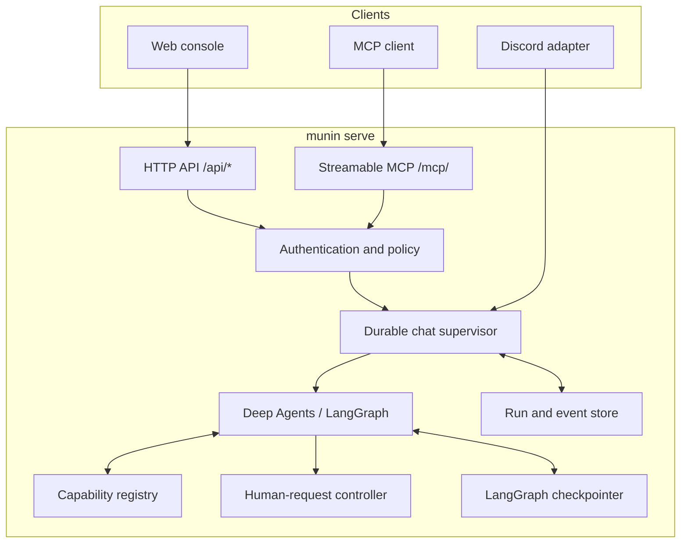
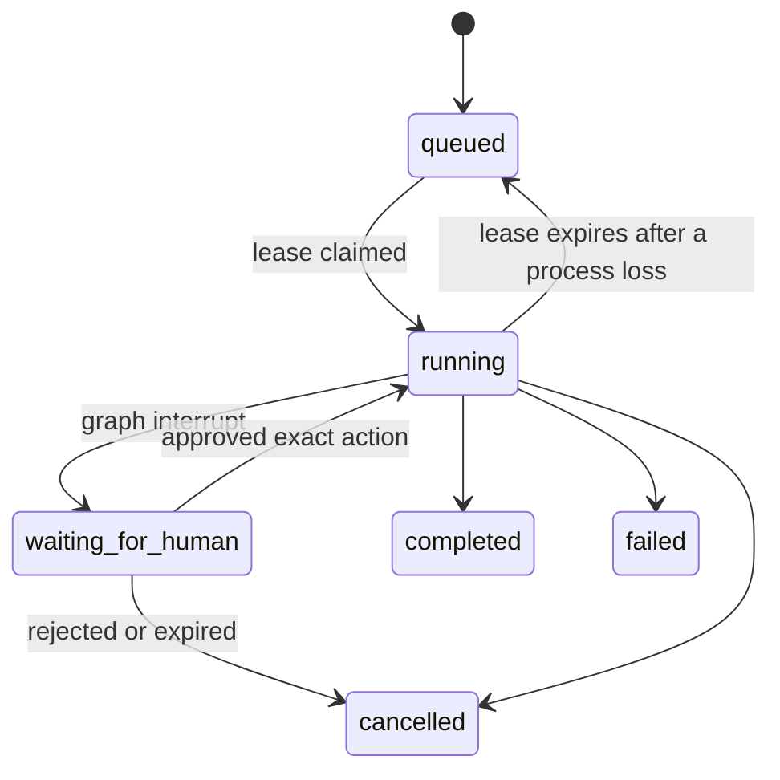

# Munin architecture

Munin is one governed runtime with several entry points. The server owns
identity, policy, durable state and capability composition; web, MCP and
Discord are adapters around that authority boundary.

## Components

The production API is rooted at `/api/*`; streamable MCP is served at `/mcp/`.
`munin mcp` remains available for local stdio clients. A bare `/mcp` redirects
to `/mcp/`.

## Run lifecycle

Each conversation has a stable LangGraph `thread_id`. A running lease is
renewed while the executor is healthy. If it expires, recovery may queue the
run and resume from its checkpoint using that same thread. `waiting_for_human`
is never auto-executed by recovery.

## Event stream and replay

The server persists the canonical event log. A live client receives the same
envelopes as a reconnecting client; replay reads durable events instead of
calling the provider again.

Important event families are assistant text, provider-emitted reasoning,
operational activity, tool lifecycle and output, subagent lifecycle, artifacts,
human requests and terminal run state. Provider reasoning is kept distinct from
final text only when the provider explicitly sends it.

`GET /api/chat/{conversation_id}/stream` restores the selected conversation's
timeline. The chat API uses idempotency and replay to make a refresh or network
loss a viewer problem, rather than a request to duplicate an operation.

## Capability composition

At run start, the runtime composes permitted context from the conversation,
checkpoint, evidence and live registry. The registry includes enabled native
tools, generated `gen__*` capabilities and bounded specialist profiles. A
copied client-side tool list is never authoritative.

Generated capabilities are not trusted merely because source code exists. They
need an explicit contract, validation, registration and the same invocation
policy as native tools. A capability may be discoverable without being
permitted for a particular scope or operator.

Hugin-derived skills are research context, not executable capabilities. Their
source and Hugin identifiers should remain attached to any retrieved material;
selection is narrow and demand-driven rather than wholesale prompt injection.

## Human-in-the-loop protocol

An approval-worthy action interrupts the graph and creates a durable
`waiting_for_human` request. The server binds the request to the conversation,
actor, target action, arguments and expiry. Approval resumes the saved
interrupt; rejection closes it. A decision cannot be reused for a different
action, client or later run.

This protocol is server-side. Web and Discord present the request, but cannot
bypass identity or policy checks.

## Checkpoints, compaction and durable records

| Mechanism | Preserves | Does not replace |
| --- | --- | --- |
| LangGraph checkpoint | Executable graph state for the stable thread | Durable audit events or evidence artifacts |
| Context compaction | A smaller model context for long conversations | The checkpoint or original evidence records |
| Run/event store | Operator-visible timeline, calls, outputs and decisions | The graph's executable state |

The system keeps these concerns separate so a long conversation can stay within
the model window without discarding the evidence an operator needs to review.

## Storage topology

The local SQLite store handles low-latency transactional state. The persistent
checkpoint database stores graph state. A libSQL/Turso archive can mirror
durable records. For recovery after restart, operators must persist the hot
store and checkpoint paths as well as configure any remote archive.

## Invariants

1. Web, MCP and Discord share the same server policy and capability state.
2. A browser disconnect does not cancel a server-side run.
3. Replay does not ask the model to regenerate historical output.
4. Unresolved approvals never execute during recovery.
5. The live registry, not a static prompt list, determines discoverable
   capabilities.
6. Explicit provider reasoning is observable without fabricating hidden model
   deliberation.

For concrete deployment and recovery steps, see the [operator guide](docs/operator-guide.md)
and [persistence architecture](docs/architecture-persistence.md).
