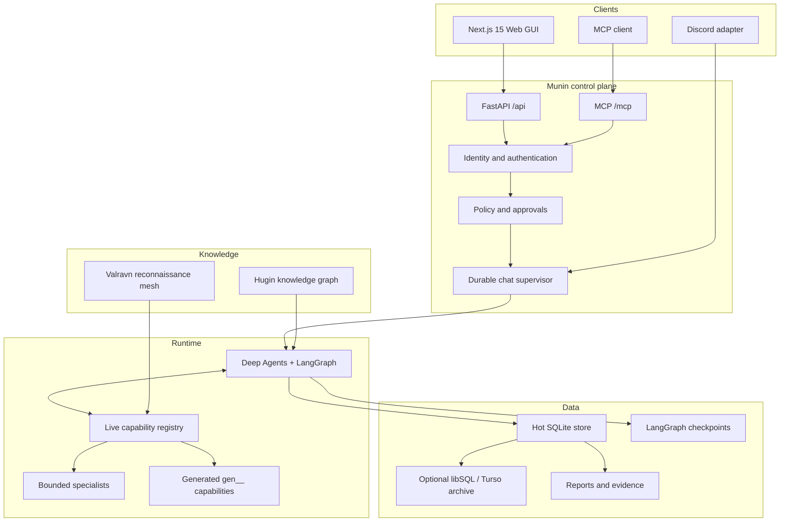
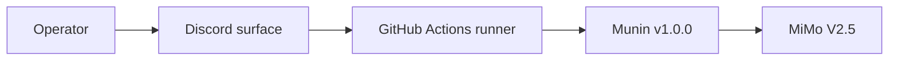

# Munin system map

This is the current v1.0.0 map. Runtime discovery remains authoritative for
exact capabilities, schemas and enabled providers.

## Control surfaces

| Surface | Role |
| --- | --- |
| Discord | **Stable v1.0.0 operator surface** — presence, commands, threads and approvals |
| Web GUI | Target long-term interface; under repair after live-session frontend bugs |
| `/api/*` | Authenticated application and integration API |
| `/mcp/` | Live MCP discovery and invocation under server policy |

## Runtime invariants

- The server owns policy and authority.
- A disconnect does not erase or duplicate a run.
- Replay reads durable events instead of regenerating history.
- Human approval is bound to one exact action and argument set.
- Checkpoints preserve executable state; events preserve the audit story.
- Skills, Hugin and Soul provide context, not permission.
- The bundled CTF Soul is optional and not a default deployment profile.

## Verified v1.0.0 path

See [docs/README.md](docs/README.md) for the complete multilingual documentation.
