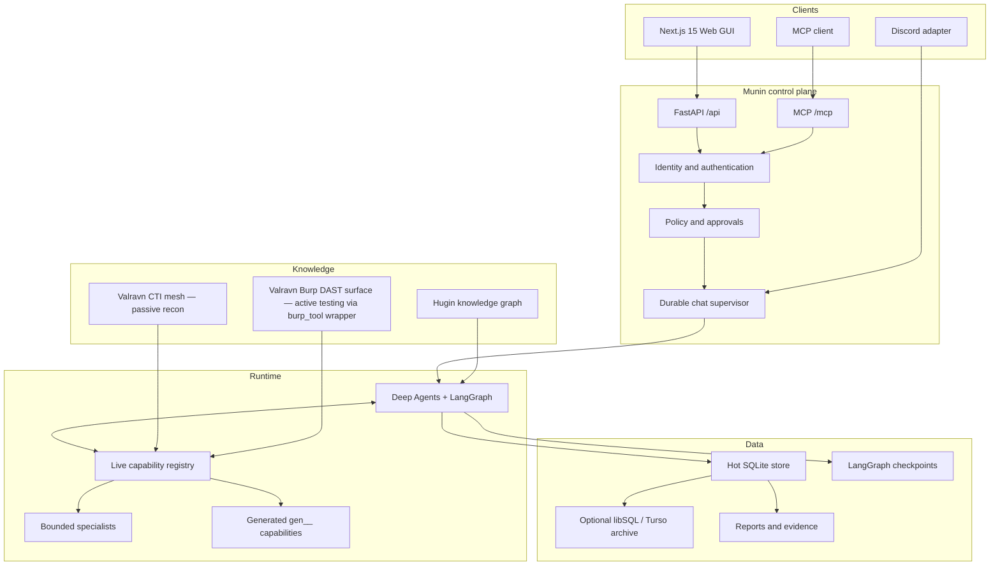
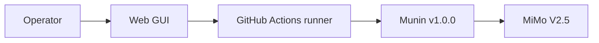

# Munin system map

This is the current v1.0.0 map. Runtime discovery remains authoritative for
exact capabilities, schemas and enabled providers.

## Control surfaces

| Surface | Role |
| --- | --- |
| Web GUI | Conversations, timeline, approvals and artifacts |
| `/api/*` | Authenticated application and integration API |
| `/mcp/` | Live MCP discovery and invocation under server policy |
| Discord | Optional remote window into the same server-owned operation |
| `valravn/` Burp extension REST API (`127.0.0.1:8111`) | Optional Burp DAST surface; Munin reaches it via the resilient `burp_tool` wrapper and degrades gracefully when Burp is absent |

## Capability surfaces — the Valravn mesh

Munin owns two Valravn layers, both reachable through the live registry:

- **Passive CTI** — `munin/valravn/` (Python, no Burp/Java/CloakBrowser at
  runtime). Exposes `valravn_*` tools via `munin/mcp/tools/valravn_tool.py`.
  Safe to invoke in CI / dev without external binaries installed.
- **Active Burp DAST** — `valravn/` (Burp extension Java + MCP server Python).
  Exposes `burp_*` tools via `munin/mcp/tools/burp_tool.py` (resilient HTTP
  bridge, lazy init, never raises). Requires Burp Suite + Java 21 + uv on the
  operator's host. CI validates Python AST, KB JSON shape, NOTICE
  Apache-2.0 §4(d) attribution, and the wrapper's graceful-degradation contract
  — but does NOT claim behavioral equivalence with the upstream MCP server.
  Failure modes documented in the `valravn-diagnostic` skill.

Both layers share the `.valravn-intel/<domain>/` target intel store, the
extension scope policy, and the audit log at `.valravn-intel/_audit.log`.

## Runtime invariants

- The server owns policy and authority.
- A disconnect does not erase or duplicate a run.
- Replay reads durable events instead of regenerating history.
- Human approval is bound to one exact action and argument set.
- Checkpoints preserve executable state; events preserve the audit story.
- Skills, Hugin and Soul provide context, not permission.
- The bundled CTF Soul is optional and not a default deployment profile.

## Verified v1.0.0 path

See [docs/README.md](docs/README.md) for the complete multilingual documentation.
