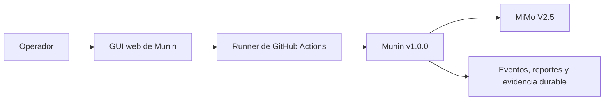
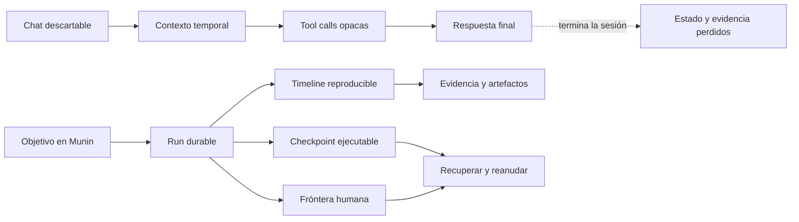
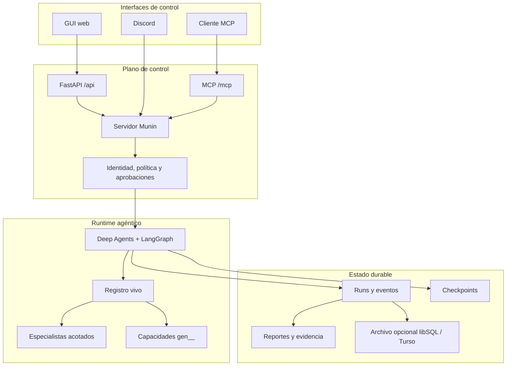
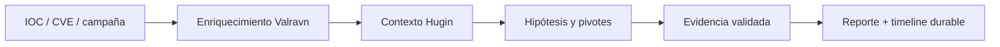
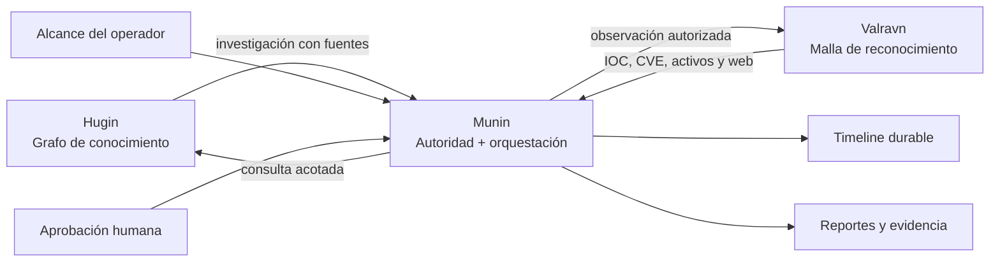

<p align="center">
  
</p>

<h1 align="center">Munin</h1>

<p align="center"><strong>Un runtime durable, gobernado por operadores, para operaciones autónomas de seguridad.</strong></p>

<p align="center">Threat intelligence, red team autorizado, captura de evidencia, aprobación humana y ejecución prolongada de agentes en un único plano de control.</p>

<p align="center">
  <a href="README.md">English</a> · <strong>Español</strong> ·
  <a href="README.pt-BR.md">Português (BR)</a> ·
  <a href="README.zh-CN.md">简体中文</a> ·
  <a href="README.ru.md">Русский</a> ·
  <a href="README.ko.md">한국어</a>
</p>

<p align="center">
  
  
  
  
  
  
</p>

> [!WARNING]
> **Solo para uso autorizado.** Munin está diseñado para investigación legítima de seguridad, inteligencia de amenazas y operaciones controladas de red team. El operador es responsable de obtener autorización, definir alcance, proteger credenciales, evaluar impacto y cumplir la legislación aplicable.

## Configuración verificada de v1.0.0

> [!IMPORTANT]
> La configuración probada y verificada para **Munin v1.0.0** es la **GUI web ejecutada mediante GitHub Actions usando MiMo V2.5** como modelo.
>
> Otros proveedores, modelos, destinos de despliegue e interfaces pueden funcionar, pero no forman parte de la configuración verificada de v1.0.0 salvo que se documenten explícitamente.

| Componente | Configuración verificada |
| --- | --- |
| Versión | **Munin v1.0.0** |
| Interfaz | **GUI web** |
| Entorno de ejecución | **GitHub Actions** |
| Modelo | **MiMo V2.5** |



## Por qué existe Munin

La mayoría de los agentes están construidos alrededor de una ventana de chat temporal. Las operaciones de seguridad no funcionan así: duran horas o días, cruzan herramientas y modelos, necesitan aprobaciones, evidencia, recuperación y una explicación confiable de lo que el agente hizo.

**Munin convierte una conversación con un agente en una operación durable, inspeccionable y recuperable.**

| Agente descartable | Operación con Munin |
| --- | --- |
| El contexto desaparece al cerrar la sesión | Conversaciones estables, checkpoints y eventos reproducibles |
| Las tool calls se reconstruyen desde logs sueltos | Intención, salida, artefactos y fallos son eventos de primera clase |
| La aprobación es una frase dentro del prompt | Las acciones sensibles se detienen en fronteras durables |
| Las capacidades viven en contexto estático | Un registro vivo compone tools y especialistas en runtime |
| Reconectar puede duplicar ejecuciones | Estado persistido y leases protegen continuidad |
| El trabajo largo se vuelve opaco | El operador sigue el progreso desde GUI, MCP o Discord |



## Qué es Munin — y qué no es

| Munin es | Munin no es |
| --- | --- |
| Un runtime gobernado por operadores | Un hacker autónomo sin permisos |
| Una capa durable de orquestación y evidencia | Solo otra interfaz de chat |
| Un sistema de delegación acotada | Una garantía de que todo modelo actuará bien |
| Una frontera de política y aprobación | Un reemplazo de la autorización escrita |
| Un registro vivo de capacidades | Una carpeta donde todo archivo se vuelve ejecutable |
| Un proyecto source-available | Open source sin restricciones comerciales |

## Capacidades principales

### Operaciones autónomas durables

LangGraph conserva estado ejecutable mientras una timeline separada registra mensajes, herramientas, resultados, aprobaciones, artefactos y decisiones del operador. Reconectar vuelve a la misma operación.

### Control humano real

Las acciones sensibles se pausan mostrando la capacidad y los argumentos exactos. Aprobar reanuda esa acción; rechazar o dejar expirar no puede transformarla silenciosamente en otra cosa.

### Un runtime, varias interfaces

GUI web, MCP y Discord comparten identidad, política, estado y aprobaciones del lado del servidor. Son ventanas de una misma operación, no ejecutores separados.

### Composición viva de capacidades

Munin compone tools nativas, skills revisadas, capacidades generadas y especialistas acotados. Las tools generadas usan el namespace `gen__*` y atraviesan validación, registro, política y aprobación.

### Observabilidad basada en evidencia

Mensajes, razonamiento emitido por el proveedor, ciclo de vida de tools, output en streaming, delegaciones, artefactos y solicitudes humanas permanecen como eventos separados y auditables.

## Arquitectura



| Capa | Responsabilidad |
| --- | --- |
| **Conocimiento** | Contexto, relaciones, referencias e hipótesis |
| **Autoridad** | Alcance, identidad, aprobación y política |
| **Ejecución** | Tools, delegación, capacidades y estado agéntico |
| **Evidencia** | Eventos, outputs, artefactos, decisiones y recuperación |

## Casos de uso

### Investigación de threat intelligence

Partí de un IOC, CVE, campaña u organización. Munin puede coordinar enriquecimiento, mantener hipótesis, delegar investigación acotada, preservar fuentes y producir un reporte sin perder la historia de la investigación.



### Operación de red team autorizada

Definí alcance, objetivos y requisitos de aprobación. Munin puede planificar, delegar especialistas, ejecutar capacidades permitidas y detenerse antes de acciones sensibles.

### Objetivos autónomos de larga duración

GOAL y BEAST permiten trabajo que debe sobrevivir refresh, transición de runners o reinicio del proceso, conservando TODOs, checkpoints y contexto operativo.

### Investigación centrada en evidencia

Capturá intención, output, screenshots, artefactos, observaciones del modelo y decisiones humanas como eventos independientes.

### Prototipado de capacidades

Creá tools pequeñas y específicas, validalas, registralas con procedencia visible y exponelas bajo los mismos controles que una tool nativa.

## Ecosistema Munin



- **Hugin** aporta conocimiento pasivo y trazable.
- **Valravn** aporta observaciones externas y reconocimiento.
- **Munin** controla orquestación, estado, política, aprobación y continuidad.

## Modos operativos

| Modo | Mejor para | Aprobaciones |
| --- | --- | --- |
| **Standard** | Operaciones interactivas cuidadosas | Aprobación por acción |
| **YOLO** | Trabajo rápido en un entorno confiable y acotado | Omite aprobaciones rutinarias; protege acciones críticas |
| **GOAL** | Objetivos persistentes | Objetivo y TODO durables con reevaluación |
| **BEAST** | Planificación profunda y delegación | Más presupuesto con alcance explícito y controles anti-runaway |

Los invariantes duros —preflight, aprobación crítica, auditoría y redacción de tokens— permanecen en todos los modos.

## Inicio rápido

```bash
cp .env.example .env
poetry install
poetry run munin serve --host 127.0.0.1 --port 8787
```

En otra terminal:

```bash
cd app
npm ci
npm run dev
```

Abrí `http://localhost:3000`. Los clientes MCP se conectan a `http://127.0.0.1:8787/mcp/` usando el bearer token configurado.

## Antes de una operación

- Confirmá `/health` y acceso autenticado a la GUI.
- Verificá una ronda completa de tool calling con el modelo elegido.
- Inspeccioná las capacidades vivas.
- Confirmá autorización escrita y alcance.
- Definí quién puede aprobar, rechazar y cancelar.
- Persistí tanto el almacenamiento activo como los checkpoints.
- Revisá capacidad y argumentos antes de ejecuciones sensibles.

## Validación

```bash
poetry run pytest
cd app && npm run build
```

## Preguntas frecuentes

### ¿Munin es completamente autónomo?

Puede ejecutar objetivos prolongados y delegar trabajo, pero la autoridad sigue limitada por alcance, política y aprobaciones.

### ¿Es open source?

El código es público, pero la licencia PolyForm Noncommercial restringe uso comercial. Es source-available.

### ¿Una empresa puede usarlo internamente?

No bajo la licencia no comercial cuando existe una aplicación comercial. Requiere licencia separada.

### ¿Una skill obtiene tools automáticamente?

No. Una skill aporta contexto e instrucciones. Tool access, alcance y aprobación son controles separados.

### ¿Puedo usar otro modelo?

Posiblemente, pero la configuración verificada de v1.0.0 es GUI + GitHub Actions + MiMo V2.5.

## Licencia

Munin se distribuye bajo la [PolyForm Noncommercial License 1.0.0](LICENSE). Se permiten usos no comerciales admitidos; cualquier uso comercial requiere una licencia separada del titular.

Por restringir uso comercial, Munin es **source-available**, no open source según la Open Source Initiative.

---

<p align="center"><em>Знание переживает битву.</em></p>
<p align="center"><sub>El conocimiento sobrevive a la batalla.</sub></p>
