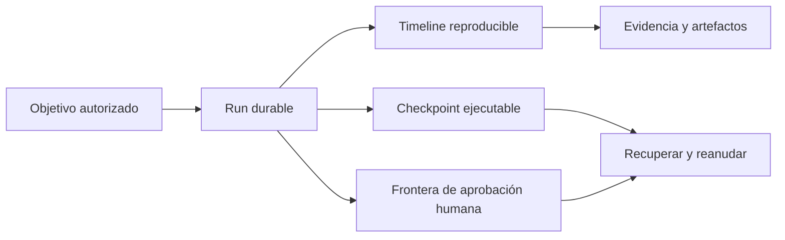
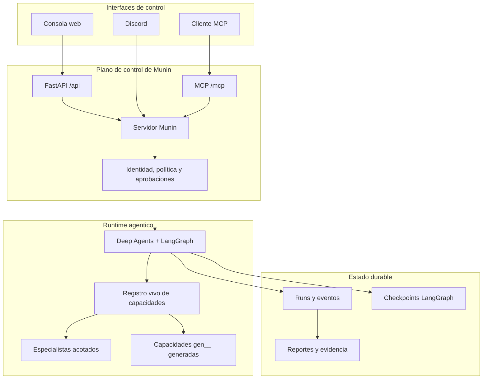
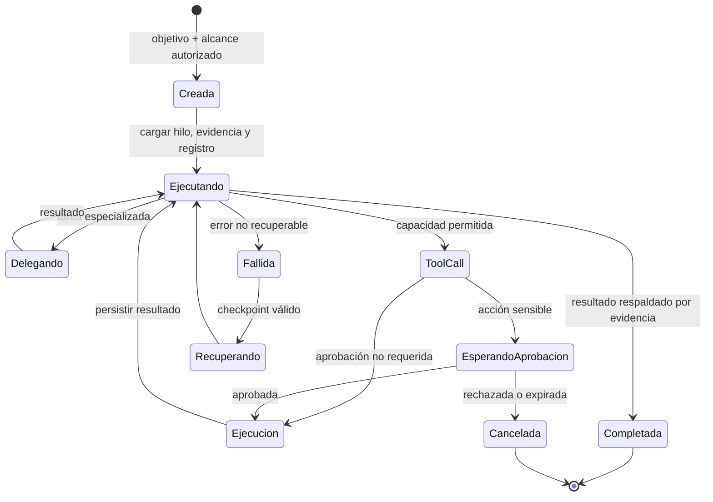

<p align="center">
  
</p>

<h1 align="center">Munin</h1>

<p align="center"><strong>Un runtime durable, gobernado por operadores, para operaciones autónomas de seguridad.</strong></p>

<p align="center">
  <a href="README.md">English</a> ·
  <strong>Español</strong> ·
  <a href="README.pt-BR.md">Português (BR)</a> ·
  <a href="README.zh-CN.md">简体中文</a>
</p>

> **Solo para uso autorizado.** Munin está diseñado para investigación legítima de seguridad, inteligencia de amenazas y operaciones controladas de red team. El operador es responsable de obtener autorización, definir el alcance, proteger credenciales, revisar el impacto y cumplir la ley aplicable.

> **Configuración verificada para Munin v1.0.0:** interfaz gráfica web (**GUI**) ejecutada mediante **GitHub Actions**, usando **MiMo V2.5** como modelo. Otras combinaciones pueden funcionar, pero no forman parte de la configuración verificada de la versión 1.0.0.

## Por qué existe Munin

La mayoría de los agentes están construidos alrededor de una ventana de chat temporal. Las operaciones de seguridad no funcionan así: duran horas o días, atraviesan herramientas y modelos, requieren evidencia, aprobaciones, recuperación y trazabilidad.

**Munin convierte ese trabajo en una operación durable, no en una conversación descartable.**

| Agente descartable | Operación con Munin |
| --- | --- |
| El contexto desaparece al cerrar la sesión | Conversaciones estables, checkpoints y eventos reproducibles |
| Las tool calls se reconstruyen desde logs | Intención, salida, artefactos y fallos son eventos de primera clase |
| La aprobación es solo una instrucción en el prompt | Las acciones sensibles se detienen en interrupciones durables |
| Las capacidades se copian a un prompt estático | El registro vivo compone tools y especialistas en runtime |
| Reconectar puede duplicar ejecuciones | Leases renovables y estado persistido protegen la continuidad |



## Capacidades principales

- **Operaciones durables:** LangGraph conserva el estado ejecutable y una timeline separada registra mensajes, herramientas, resultados, aprobaciones y artefactos.
- **Control humano real:** las acciones sensibles se pausan con la capacidad y argumentos exactos antes de ejecutarse.
- **Un runtime, múltiples interfaces:** GUI web, MCP y Discord comparten política, identidad, estado y aprobaciones.
- **Registro vivo de capacidades:** herramientas nativas, skills revisadas, subagentes y capacidades generadas `gen__*` se componen en runtime.
- **Observabilidad basada en evidencia:** razonamiento emitido por el proveedor, tool lifecycle, delegaciones y artefactos permanecen separados y auditables.

## Arquitectura



## Ciclo de una operación



## Modos operativos

| Modo | Uso principal | Aprobaciones |
| --- | --- | --- |
| **Standard** | Operaciones interactivas cuidadosas | Aprobación por acción |
| **YOLO** | Trabajo rápido en un entorno confiable y acotado | Omite aprobaciones rutinarias; protege acciones críticas |
| **GOAL** | Objetivos persistentes que sobreviven refresh y reinicios | Objetivo y TODO durables, con reevaluación |
| **BEAST** | Planificación profunda y delegación | Más presupuesto con alcance explícito y controles anti-runaway |

Los invariantes duros —preflight, aprobación crítica, auditoría y redacción de tokens— se mantienen en todos los modos.

## Hugin y Valravn

[Hugin](https://github.com/PrinceOfPwn/Hugin) es el componente de conocimiento: un grafo pasivo de investigación de seguridad con fuentes y relaciones.

[Valravn](munin/valravn/) es la malla de reconocimiento externo: enriquecimiento IOC/CVE, búsqueda de activos, pivotes históricos, RPKI, dark web y captura de evidencia mediante herramientas `valravn_*`.

Ni el conocimiento ni una herramienta disponible conceden autorización. El alcance y la aprobación siguen siendo controles independientes.

## Inicio rápido

```bash
cp .env.example .env
poetry install
poetry run munin serve --host 127.0.0.1 --port 8787
```

En otra terminal:

```bash
cd app
npm ci
npm run dev
```

Abrí `http://localhost:3000`. Los clientes MCP se conectan a `http://127.0.0.1:8787/mcp/` con el bearer token configurado.

## Validación

```bash
poetry run pytest
cd app && npm run build
```

## Licencia

Munin se distribuye bajo la [PolyForm Noncommercial License 1.0.0](LICENSE).

Se permite inspeccionar, estudiar, investigar, experimentar y modificar el código para los usos no comerciales admitidos. El uso comercial —incluyendo productos o servicios pagos, consultoría, operaciones internas comerciales o aplicaciones con expectativa comercial— requiere una licencia separada del titular.

Por restringir el uso comercial, Munin es **source-available**, no open source según la definición de la Open Source Initiative.

---

<p align="center"><em>Lo que una vez fue visto, nunca se olvida.</em></p>
