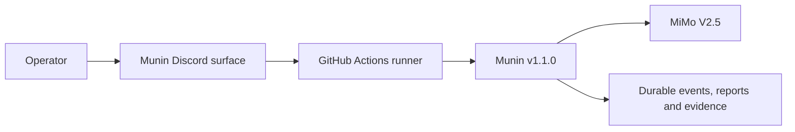
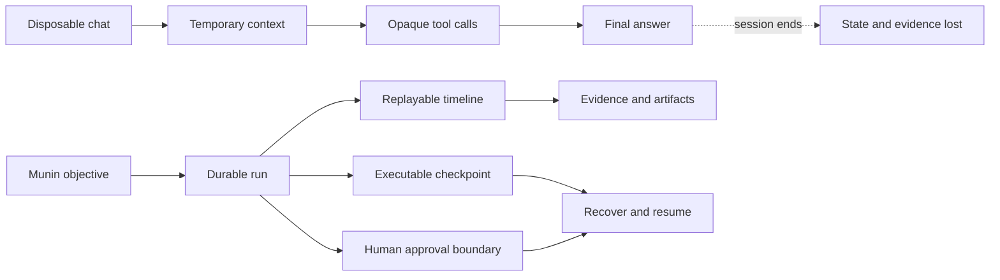
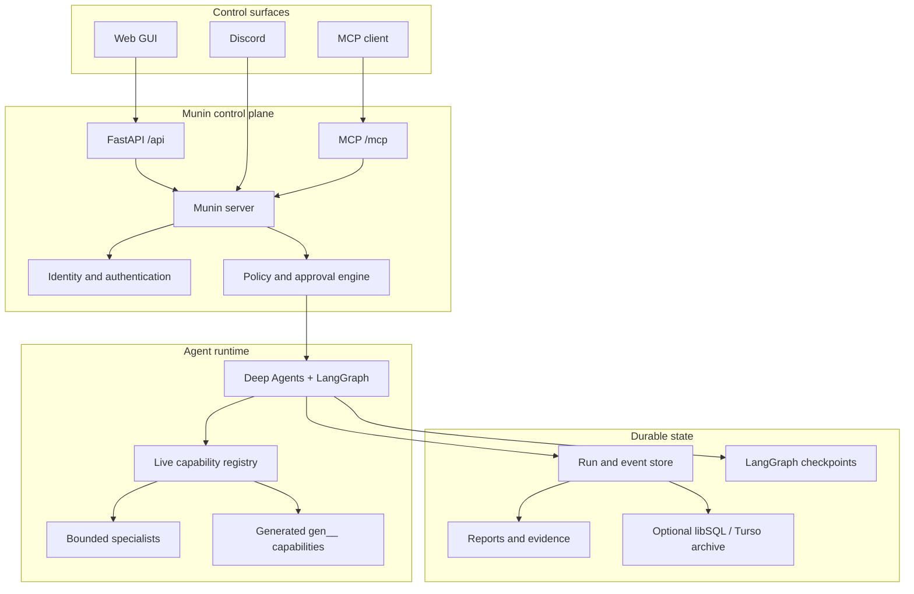
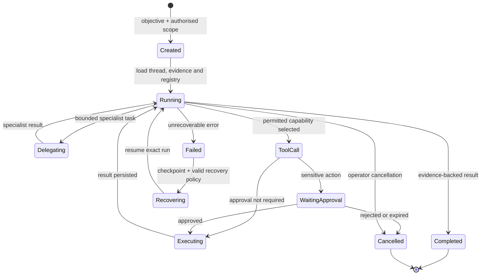
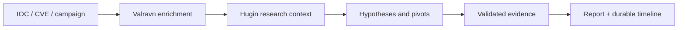
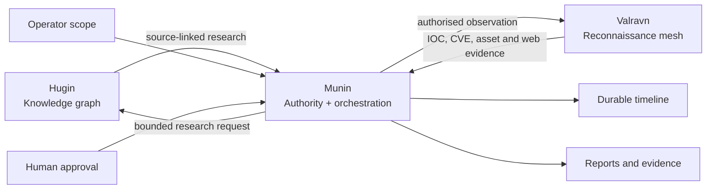
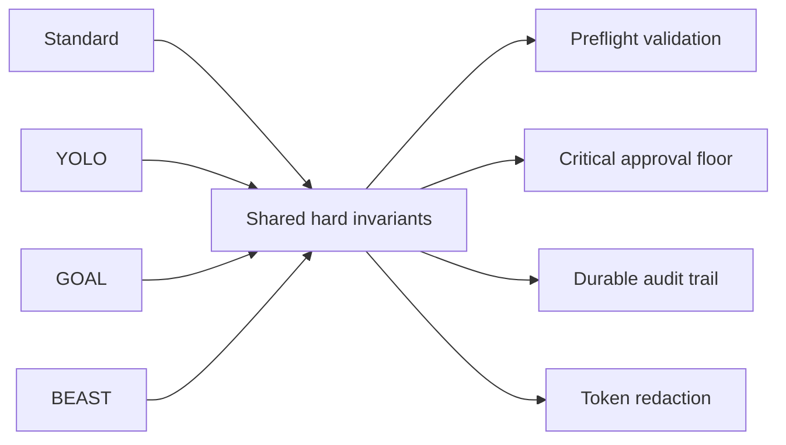
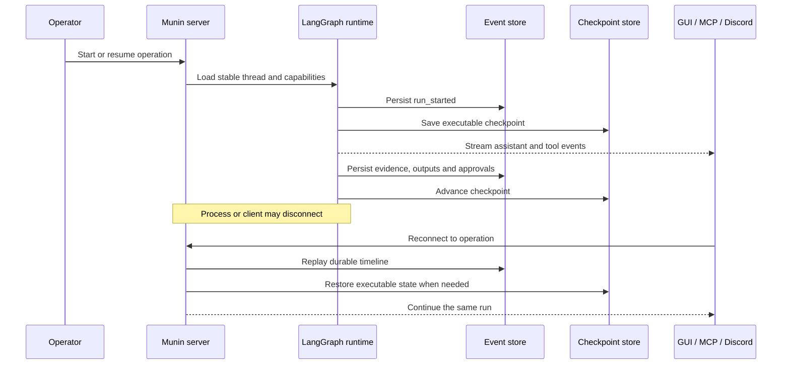
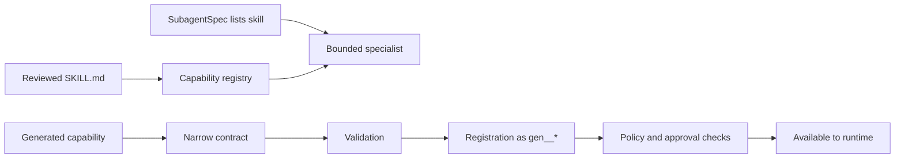

<p align="center">
  
</p>

<h1 align="center">Munin</h1>

<p align="center">
  <strong>자율 보안 운영을 위한 작업자 관리형 지속성 런타임.</strong>
</p>

<p align="center">
  위협 인텔리전스, 승인된 레드팀 작업, 증거 수집, 승인 절차 및 장기 실행 에이전트 실행을 단일 제어 평면에서 제공합니다.
</p>

<p align="center">
  <a href="README.md">English</a> ·
  <a href="README.es.md">Español</a> ·
  <a href="README.pt-BR.md">Português (BR)</a> ·
  <a href="README.zh-CN.md">简体中文</a> ·
  <a href="README.ru.md">Русский</a> ·
  <strong>한국어</strong>
</p>

<p align="center">
  <a href="https://www.python.org/"></a>
  <a href="https://fastapi.tiangolo.com/"></a>
  <a href="https://langchain-ai.github.io/langgraph/"></a>
  <a href="https://modelcontextprotocol.io/"></a>
  <a href="https://nextjs.org/"></a>
  <a href="https://www.typescriptlang.org/"></a>
  <a href="https://www.sqlite.org/"></a>
  <a href="LICENSE"></a>
</p>

<p align="center">
  <a href="#verified-v100-configuration"><strong>검증된 구성</strong></a> ·
  <a href="#why-munin"><strong>Munin을 사용하는 이유</strong></a> ·
  <a href="#architecture"><strong>아키텍처</strong></a> ·
  <a href="#use-cases"><strong>사용 사례</strong></a> ·
  <a href="#quick-start"><strong>빠른 시작</strong></a> ·
  <a href="#faq"><strong>자주 묻는 질문</strong></a>
</p>

> [!WARNING]
> **승인된 용도로만 사용 가능합니다.** Munin은 합법적인 보안 연구, 위협 인텔리전스 및 통제된 레드팀 운영을 위해 설계되었습니다. 권한 확보, 범위 정의, 자격 증명 보호, 영향 검토 및 관련 법률 준수에 대한 책임은 사용자에게 있습니다. 작동 중인 배포나 성공적인 툴 호출이 승인을 의미하지는 않습니다.

## Verified v1.1.0 configuration

> [!IMPORTANT]
> **Munin v1.1.0**의 테스트 및 검증된 운영 구성은 **MiMo V2.5**를 모델로 사용하여 **GitHub Actions를 통해 실행되는 Discord 어댑터**입니다.
>
> **Discord가 현재 안정적인 운영자 표면입니다.** 웹 GUI는 장기 목표 인터페이스이지만
> 라이브 세션 테스트에서 발견된 프론트엔드 버그가 아직 수리 중입니다. 수리 루프가
> 통과할 때까지 Discord가 전체 운영의 기준 표면입니다.
>
> 다른 제공업체, 모델, 배포 대상 및 제어 인터페이스도 작동할 수 있으나, 명시적으로 문서화되지 않은 한 검증된 v1.1.0 구성의 일부가 아닙니다.

| 구성 요소 | 검증된 구성 |
| --- | --- |
| 버전 | **Munin v1.1.0** |
| 인터페이스 | **Discord 어댑터** (웹 GUI 수리 중) |
| 실행 환경 | **GitHub Actions** |
| 모델 | **MiMo V2.5** |



## Why Munin

대부분의 에이전트 시스템은 임시 채팅 창을 중심으로 구축됩니다. 그러나 보안 운영은 그렇지 않습니다. 보안 운영은 수시간 또는 수일 동안 지속되고, 여러 도구와 모델을 넘나들며, 증거와 승인이 필요하고, 연결 끊김, 프로세스 재시작 및 작업자 컨텍스트 변화에도 견뎌내야 합니다.

**Munin은 에이전트 대화를 지속 가능하고 검사 가능한 운영으로 전환합니다.**

| 일회성 에이전트 루프 | Munin 운영 |
| --- | --- |
| 세션이 종료되면 컨텍스트가 사라짐 | 안정적인 대화, 체크포인트 및 재생 가능한 이벤트 |
| 단편적인 로그에서 도구 활동을 재구성함 | 의도, 출력, 아티팩트 및 실패가 1급 이벤트로 다뤄짐 |
| 승인은 프롬프트 내의 비공식적인 문장에 불과함 | 민감한 작업은 지속 가능한 실행 경계에서 일시 정지됨 |
| 기능이 정적 컨텍스트로 복사됨 | 라이브 레지스트리가 런타임에 도구와 전문가를 구성함 |
| 재연결 시 중복 실행 위험이 발생함 | 영구 저장된 상태와 갱신 가능한 리스로 연속성을 보호함 |
| 장기 작업의 진행 과정이 불투명해짐 | 작업자가 GUI, MCP, Discord 전체에서 진행 상황을 추적함 |
| 최종 답변이 프로세스를 가림 | 증거, 결정 및 아티팩트가 독립적으로 감사 가능한 상태로 유지됨 |



## What Munin is — and what it is not

| Munin인 것 | Munin이 아닌 것 |
| --- | --- |
| 작업자 관리형 런타임 | 권한 없는 자율 해커 |
| 지속 가능한 오케스트레이션 및 증거 레이어 | 단순한 또 다른 채팅 UI |
| 범위가 제한된 위임 시스템 | 모든 모델이 올바르게 작동한다는 보장 |
| 정책 및 승인 경계 | 서면 승인을 대체하는 수단 |
| 라이브 기능 레지스트리 | 모든 파일이 실행 가능해지는 폴더 |
| 소스 공개(source-available) 연구 프로젝트 | 상업적 제한이 없는 오픈 소스 |

## Core capabilities

### Durable autonomous operations

LangGraph 체크포인트는 실행 가능한 상태를 보존하고, 별도의 이벤트 타임라인은 메시지, 증거, 도구, 아티팩트, 승인 및 작업자 결정을 기록합니다. 재연결 시 새 작업을 자동으로 시작하는 대신 동일한 작업으로 돌아갑니다.

### Human control at the execution boundary

승인은 프롬프트 내부의 제안이 아니라 런타임의 일부입니다. 민감한 작업은 정확한 기능 및 인수와 함께 일시 정지됩니다. 승인 시 해당 작업이 재개되며, 거부되거나 만료된 작업이 다른 형태로 암묵적 변형되지 않습니다.

### One runtime, multiple control surfaces

웹 GUI, MCP 클라이언트 및 Discord는 동일한 서버 측 ID, 정책, 상태 및 승인 레이어에 접근합니다. 이들은 별도의 실행기가 아니라 하나의 운영을 바라보는 창입니다.

### Live capability composition

Munin은 런타임 시 기본 도구, 검토된 스킬, 생성된 기능 및 범위가 제한된 전문가를 구성합니다. 생성된 도구는 `gen__*` 네임스페이스를 사용하며 검증, 등록 및 기본 기능과 동일한 정책 검사를 통과해야 합니다.

### Evidence-first observability

어시스턴트 메시지, 제공업체에서 생성한 추론, 도구 수명 주기, 스트리밍 출력, 위임, 아티팩트 및 작업자 요청은 별도의 재생 가능한 이벤트로 유지됩니다. Munin은 숨겨진 추론을 조작하거나 운영을 모호한 상태 줄로 축소하지 않습니다.

## Architecture



Munin은 네 가지 핵심 영역을 분리하여 관리합니다:

| 레이어 | 역할 및 책임 |
| --- | --- |
| **지식** | 연구 컨텍스트, 관계, 참조 및 가설 |
| **권한** | 범위, 식별, 승인 및 정책 적용 |
| **실행** | 도구, 위임, 생성된 기능 및 에이전트 상태 |
| **증거** | 이벤트, 아티팩트, 출력, 결정 및 복구 기록 |

## Operation lifecycle



## Use cases

### Threat intelligence investigation

IOC, 취약점, 캠페인 또는 조직에서 조사를 시작합니다. Munin은 조사의 타임라인을 유지하면서 데이터 보강을 조정하고, 출처가 명시된 증거를 수집하며, 가설을 유지하고, 범위가 제한된 연구 작업을 위임하고, 보고서를 생성할 수 있습니다.



### Authorised red-team operation

범위, 목표 및 승인 요구 사항을 정의합니다. Munin은 계획을 수립하고, 전문가를 위임하며, 허용된 기능을 호출하고, 민감한 작업을 수행하기 전에 인간 승인 경계에서 정지할 수 있습니다.

### Long-running autonomous objective

브라우저 새로고침, 러너 전환 또는 프로세스 재시작 시에도 유지되어야 하는 작업에는 GOAL 또는 BEAST 모드를 사용하세요. 지속 가능한 TODO 상태와 체크포인트가 운영의 일관성을 유지합니다.

### Evidence-heavy security research

도구 의도, 스트리밍 출력, 스크린샷, 아티팩트, 모델 관찰 및 작업자 결정을 나중에 재생하고 검토할 수 있는 별개의 이벤트로 캡처합니다.

### Capability prototyping

소규모 생성 도구를 만들고, 검증하며, 투명한 출처로 등록하고, 기본 도구와 동일한 정책 및 승인 통제를 통해서만 노출합니다.

## The Munin ecosystem



- **Hugin**은 출처가 라벨링된 수동적 지식을 제공합니다.
- **Valravn**은 외부 관찰 및 정찰 증거를 제공합니다.
- **Munin**은 오케스트레이션, 상태, 정책, 승인 및 증거 연속성을 관장합니다.

지식이나 도구의 사용 가능 여부가 실행 권한을 부여하지는 않습니다.

## Operation modes

| 모드 | 최적의 사용처 | 승인 동작 |
| --- | --- | --- |
| **Standard** | 신중한 대화형 운영 | 작업당 승인 |
| **YOLO** | 신뢰할 수 있는 제한된 환경에서의 빠른 작업 | 일상적인 승인 건너뜀 (단, 핵심 작업은 보호됨) |
| **GOAL** | 새로고침이나 재시작 시에도 유지되는 지속적 목표 | 지속 가능한 목표, TODO 상태 및 예약된 재평가 |
| **BEAST** | 심층 계획 수립 및 전문가 위임 | 명시적 범위 및 폭주 방지 통제가 적용된 확장된 예산 |



## Persistence and recovery



SQLite는 활성 대화, 실행 및 이벤트를 저장합니다. LangGraph 체크포인트는 기본적으로 영구 SQLite를 사용합니다. libSQL 또는 Turso 아카이브는 더 긴 수명의 연속성을 위해 지속 기록을 미러링할 수 있습니다.

## Quick start

### Requirements

- Python 3.11+
- Poetry
- Node.js 및 npm
- OpenAI 호환 모델 엔드포인트

### 1. Configure

```bash
cp .env.example .env
```

강력한 `MUNIN_MASTER_KEY`, `MUNIN_MCP_AUTH_TOKEN`, 허용된 로컬 오리진 및 모델 제공업체 구성을 설정합니다.

### 2. Start the server

```bash
poetry install
poetry run munin serve --host 127.0.0.1 --port 8787
```

### 3. Start the GUI

```bash
cd app
npm ci
npm run dev
```

`http://localhost:3000`을 엽니다. MCP 클라이언트는 설정된 베어러 토큰을 사용하여 `http://127.0.0.1:8787/mcp/`에 연결합니다.

> [!TIP]
> 보호된 역방향 프록시, 명시적 오리진 정책, 인증 및 영구 저장소가 구성되지 않은 경우 Munin을 루프백(loopback)에 바인딩된 상태로 유지하세요.

## Before an operational session

- `/health` 상태 및 인증된 GUI 접근을 확인합니다.
- 선택한 모델이 구조화된 도구 호출(tool-call) 왕복을 완료하는지 확인합니다.
- 복사된 목록에 의존하는 대신 라이브 기능 목록을 점검합니다.
- 서면 승인 및 대상 범위를 확인합니다.
- 민감한 작업을 승인, 거부 및 취소할 수 있는 주체를 결정합니다.
- 핫 상태(hot state) 및 체크포인트 저장소를 모두 지속 저장하도록 설정합니다.
- 영항력이 큰 실행 전에 정확한 기능과 인수를 검토합니다.

## Skills and self-extension



`SKILL.md` 파일은 지침과 컨텍스트를 제공하며, 단순히 디스크에 존재한다는 이유만으로 실행 가능한 권한이 부여되지는 않습니다.

## Validation

```bash
poetry run pytest
cd app && npm run build
```

## Documentation

| 가이드 | 목적 |
| --- | --- |
| [Architecture](ARCHITECTURE.md) | 시스템 경계 및 불변성 |
| [Runtime architecture](docs/architecture.md) | 실행 및 이벤트 계약 |
| [Persistence](docs/architecture-persistence.md) | 복구 및 저장소 역할 |
| [System guide](docs/munin-system-guide.md) | 실행 프레이밍 및 추적 |
| [Operator guide](docs/operator-guide.md) | 배포 및 운영 실무 |
| [Capability reference](docs/tools_reference.md) | 도구, 스킬 및 생성된 확장 기능 |
| [Provider contract](docs/llm-providers.md) | 모델 엔드포인트 기대 사항 |
| [Security notes](docs/security-notes.md) | 경계 및 검토 체크리스트 |
| [GitHub Actions guide](docs/github-actions-tutorial.md) | 임시 라이브 세션 |
| [Valravn](docs/VALRAVN.md) | 정찰 메시 및 제공업체 |

## FAQ

### Is Munin fully autonomous?

장기 목표를 실행하고 작업을 위임할 수 있지만, 권한은 작업자 범위, 정책 및 승인 요구 사항에 의해 제한됩니다.

### Is Munin open source?

소소는 공개되어 있지만 PolyForm Noncommercial 라이선스가 상업적 사용을 제한합니다. 따라서 OSI 정의에 따른 오픈 소스가 아닌 소스 공개(source-available) 프로젝트입니다.

### Can companies use Munin internally?

상업적 적용 요소가 있는 경우 비상업적 라이선스로 사용할 수 없습니다. 별도의 상업용 라이선스가 필요합니다.

### Does a skill automatically gain tool access?

아닙니다. 스킬은 컨텍스트와 지침을 제공합니다. 도구 접근, 범위 및 승인은 별도의 런타임 통제 항목입니다.

### Can I use a model other than MiMo V2.5?

가능합니다. 다만, 검증된 v1.1.0 구성은 MiMo V2.5를 탑재한 GitHub Actions 상의 Discord 어댑터입니다.

### Does Munin replace analyst judgement?

아닙니다. 분석가가 운영을 보다 효과적으로 검토하고 통제할 수 있도록 증거, 상태 및 결정을 보존합니다.

## License

Munin은 [PolyForm Noncommercial License 1.0.0](LICENSE)에 따라 배포됩니다.

허용된 비상업적 목적에 한해 소스 코드를 검사, 연구, 조사, 실험 및 수정할 수 있습니다. 유료 제품이나 서비스, 컨설팅 업무, 내부 상업 운영 또는 예상되는 상업적 적용을 포함한 상업적 사용에는 저작권자의 별도 상업용 라이선스가 필요합니다.

상업적 사용이 제한되어 있으므로 Munin은 Open Source Initiative 정의에 따른 오픈 소스가 아닌 **source-available** 상태입니다.

---

<p align="center"><em>Знание переживает битву.</em></p>
<p align="center"><sub>지식은 전투보다 오래 남는다.</sub></p>
