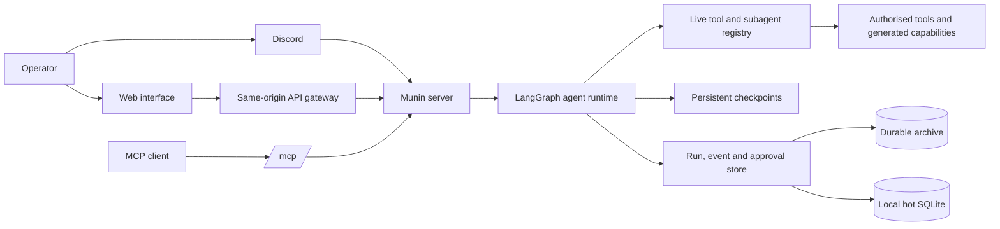

<p align="center">
  
</p>

# Munin

> What was once seen is never forgotten.

Munin is an operator-governed system for authorised security research,
threat-intelligence work and controlled red-team exercises. It combines a
durable agent runtime, an extensible tool registry, approval checkpoints and
web, MCP and Discord control surfaces.

The operator remains the authority for target scope, credentials, high-impact
actions and publication. Munin is not intended for unauthorised access.

> 🧭 **The short version:** Munin keeps one investigation coherent from the
> first request to the final evidence package. The browser, MCP and Discord are
> different windows into that same governed run — not separate agents.

## What Munin is responsible for

Munin is not a collection of security scripts behind a chat box. It is a
control system that keeps one investigation together: objective, context,
actions, evidence, artifacts, decisions and recovery state.

| Concern | What Munin does | What the operator still decides |
| --- | --- | --- |
| Investigation | Groups conversation, objective, evidence and artifacts. | Whether the target and scope are authorised. |
| Agent work | Selects capabilities, delegates bounded tasks and resumes checkpoints. | Whether a proposed action is acceptable. |
| Tools | Discovers active native and generated capabilities at runtime. | Scope, credentials, impact and timing. |
| Long-running work | Persists events, supports replay and recovers a process failure. | Whether work should continue, stop or wait for approval. |
| Self-extension | Proposes focused tools or specialist subgraphs for a real gap. | Review, publication and the exact system-changing action. |
| Interfaces | Provides web, MCP and optional Discord surfaces. | Which users, channels and clients may control the system. |

### Terms used throughout the documentation

- **Conversation**: the durable operator workspace for one investigation.
- **Run**: one execution started by a conversation message.
- **Thread**: the stable LangGraph identity used to load the right checkpoint.
- **Capability registry**: the current server-side inventory of enabled tools and
  specialists.
- **Timeline**: the ordered, replayable sequence of text, activity, calls,
  results, subagents and HITL decisions.
- **Human request**: a persistent pause requiring a decision about one exact
  action before the runtime can continue.

## Runtime model



One `munin serve` process hosts the authenticated HTTP API and MCP server. The
production API is rooted at `/api/*`; the streamable MCP endpoint is `/mcp/`.
The server redirects a bare `/mcp` to the trailing-slash form. `munin mcp` is
retained for local stdio clients.

## How a run works

1. The operator creates or selects a conversation and submits a message.
2. The server creates a durable run, assigns the conversation's stable
   LangGraph `thread_id`, and starts execution directly.
3. The runtime loads Soul, relevant state, the checkpoint and the *current*
   capability registry. It can answer, call an authorised tool, delegate a
   bounded task, ask for approval or stop with an evidence-backed result.
4. Operator-visible events are appended as the run progresses: assistant text,
   explicit provider reasoning when emitted, operational activity, tool
   lifecycle, subagent lifecycle and approval requests. The UI renders these
   as separate timeline parts.
5. A completed result, failure, cancellation or approval wait is persisted.
   A reconnecting browser replays the same event log instead of creating a
   second run.

Browser disconnection detaches the viewer; it does not cancel a running
operation. Long-running work is protected by renewable fenced leases. After a
process restart, expired running leases are queued for recovery with the same
thread and checkpoint. A waiting approval is never executed automatically.

### Example investigation flow

Suppose an operator asks Munin to review a web service inside a written scope.
Munin first loads known findings and artifacts from the conversation. It may
consult passive knowledge, review an earlier result or delegate a comparison to
a specialist. If an active probe is appropriate, the server checks scope,
preflight and permissions before running it. The timeline records intent,
start, result and returned evidence.

If the next step has greater impact, the runtime creates a `waiting_for_human`
request containing the exact tool, target and arguments. The interface shows
that request; the server validates the decision and only then resumes the
checkpoint. Rejection cannot silently become an alternate tool call.

If the browser closes during the probe, the work continues on the server. When
the operator reopens the conversation, the stream replays the stored events. If
the process dies, another instance can recover a run whose lease expired and
continue from its checkpoint. A pending approval remains paused throughout
that recovery.

## Human approval

> 🔐 **A human request is a hard pause, not a notification.** The runtime
> stores the exact action, scope and expiry, then waits for an authenticated
> decision before continuing.

High-impact or ambiguous actions become a durable `waiting_for_human` request.
The server verifies participant, one-time nonce, expiry and the exact approved
tool/action before resuming the LangGraph interrupt. Rejection is terminal for
that request. The same rules apply to web and Discord; neither is an alternate
bypass for server policy.

## Operation modes

Operators choose an autonomy contract per turn over the same supervised loop:
**Standard** (per-action approvals), **YOLO** (proceed within authorized scope;
admin/critical only), **GOAL** (persistent durable objective + TODO plan with
refresh/restart-safe state), and **BEAST** (deep planning + delegation with
explicit scope and raised anti-runaway budgets). The mode only changes which
audit levels pause for approval — the hard boundaries (scope, preflight, audit,
the `critical` approval floor) never widen. GOAL/BEAST carry a durable goal
editable via `PATCH /api/goals/{id}`; server-side timers can wake a GOAL run for
re-evaluation.

## Capabilities and self-extension

> 🧩 **Extension rule:** a generated tool or subgraph becomes useful only after
> validation, registration and a real same-run result. Creating a file is not
> the same as creating a trusted capability.

The runtime receives a live registry rather than a hard-coded chat list. Native
tools, enabled generated tools (`gen__*`) and available specialist subagents
are reconciled at execution time, so an active capability is not silently
omitted from planning.

Munin may propose a focused generated tool or specialist graph when a real gap
exists. Generated artifacts remain constrained by validation, sandbox and
server authorisation. Creating a capability does not grant authority to run it,
change scope or publish it. Opening an extension pull request requires the
exact approved action.

### How self-extension stays bounded

The intended sequence is: describe a repeatable gap, define a small input and
output contract, generate the artifact, validate and sandbox it, register it,
inspect it, and only then allow an authorised run to use it.

Generated tools use the `gen__*` namespace so their origin is visible. Generated
subgraphs are persistent configurations with a purpose, allowed tools and stop
conditions; they are not unrestricted background processes.

### Knowledge, memory and evidence

Munin can use saved facts, earlier event/artifact records and Hugin's passive
knowledge. Each source has a different role:

- durable state records what this conversation observed;
- Hugin provides relationships, context and hypotheses that still need checking;
- a tool returns evidence to interpret, not automatic proof of vulnerability or
  authorisation.

A useful conclusion separates observed facts, references, inferences, unknowns
and one safe, authorised next step.

## Observability and privacy

> 🧠 **Reasoning visibility:** Munin shows explicit reasoning emitted by the
> provider, but never manufactures hidden reasoning from internal state.

The timeline shows the work performed by the system: tool intent and result
state, subagent activity, approval transitions, operator guidance and safe
status summaries. These records are durable and replayable.

When the provider explicitly emits a reasoning field such as
`reasoning_content`, `thinking` or a `<think>...</think>` block, Munin preserves
that delta as a separate `provider_reasoning` event. The web client renders it
as a distinct reasoning part, and replay/resume reconstructs the same part
without concatenating it with the final answer. The event is redacted before
persistence and is labelled with provider and model-step metadata.

This is deliberately narrower than exposing hidden model state: Munin never
invents a chain of thought from graph nodes, tool calls, logs or operational
summaries. Providers that do not emit an explicit reasoning channel simply
produce no reasoning part.

## Local start

1. Copy `.env.example` to `.env` and configure an LLM endpoint, a strong
   `MUNIN_MASTER_KEY`, `MUNIN_MCP_AUTH_TOKEN` and an allowed local origin.
2. Install backend dependencies and start the unified server:

   ```bash
   poetry install
   poetry run munin serve --host 127.0.0.1 --port 8787
   ```

3. In another terminal, install and run the web interface:

   ```bash
   cd app
   npm ci
   npm run dev
   ```

4. Open `http://localhost:3000`. The first operator account is created through
   the bootstrap flow. Configure the UI server base URL as
   `http://127.0.0.1:8787` when it is not supplied by the environment.

For an MCP client, use `http://127.0.0.1:8787/mcp/` and the MCP bearer token.
Keep local endpoints bound to loopback unless a protected reverse proxy and
explicit origin policy are in place.

### First-session checklist

1. `/health` responds and the interface can authenticate the operator.
2. Allowed origins and cookie mode match how the UI is served.
3. The MCP client uses `/mcp/` and a non-default token.
4. The LLM provider completes a structured tool-call round trip.
5. Any active target appears in written authorisation and the appropriate
   preflight policy is enabled.
6. Hot storage and checkpoints use a persistent volume when continuity after
   restart is required.
7. The operator knows how to review, approve and cancel a HITL request.

## Storage

> 💾 **Persistence rule:** hot local state keeps the run responsive; durable
> state keeps it recoverable. Production must deliberately persist both the
> hot/checkpoint paths and the durable archive.

Munin uses local SQLite as a fast transactional working store and can mirror
the durable run archive to libSQL/Turso. LangGraph checkpoints use their own
persistent SQLite database by default. See [the persistence architecture](docs/architecture-persistence.md)
for failure and recovery semantics, and [`.env.example`](.env.example) for the
configuration contract.

## Documentation

- [Architecture](ARCHITECTURE.md): system boundaries, run lifecycle and invariants.
- [Operator guide](docs/operator-guide.md): deployment, operation and recovery.
- [System guide](docs/munin-system-guide.md): capability and evidence model.
- [Security notes](docs/security-notes.md): controls, limits and responsibilities.
- [Tools reference](docs/tools_reference.md): how to discover the live tool surface.
- [Frontend guide](app/README.md): web interface contract.
- [Changes](changes.md): dated engineering hand-off notes.

## Validation

Before operating against any authorised environment, run the backend test suite
and frontend build appropriate to the deployment:

```bash
poetry run pytest
cd app && npm run build
```

Use the included isolated fixtures for integration testing. A passing UI
connection is not proof that a target is in scope or that an action is
authorised.

## Why the architecture is shaped this way

Munin deliberately separates the place where work is executed from the places
where people observe and control it. The runtime needs stable state, leases,
checkpoints and policy enforcement; an operator needs a clear, reconnectable
timeline. Keeping those responsibilities distinct makes a browser refresh or a
Discord rate limit a presentation problem rather than an agent failure.

The server is unified so every entry point shares one authority boundary. The
state is split so high-churn local writes do not wait for a network round trip,
while the durable archive can survive an ephemeral runner. LangGraph supplies
the executable thread/checkpoint model; Munin adds the domain-specific policy,
capability registry, evidence timeline and approval protocol around it.

## Why Munin has three operator surfaces

> 🌐 **One control plane, three entry points:** use the web for depth, MCP for
> interoperability and Discord for low-friction remote continuity. Policy and
> identity stay on the server in every case.

### MCP: a capability boundary

MCP is the machine-facing surface. It lets an external client, a local tool
caller or another orchestrator discover the exact live schemas and call the
same authorised capabilities. That is valuable because tools are not copied
into every client and generated capabilities can appear without rebuilding the
UI. The `/mcp/` endpoint is authenticated and still subject to server policy;
discoverability is not permission.

### Web: a high-observability control surface

The web interface is the best surface for a long investigation. It can show a
conversation, event timeline, artifacts, subagent cards and approval details in
one view. Its same-origin gateway keeps model keys, database credentials and
MCP tokens on the server side. Replay means the operator can leave and return
without asking the model to recreate the run.

### Discord: a low-friction remote surface

Discord is useful when an operator already works from a private incident or
team channel. It can receive concise progress and final results without
requiring a browser tab, while using the same server-side run and policy path.
The adapter edits one status message at a controlled cadence to respect Discord
rate limits and truncates tool details to safe summaries.

Discord is optional by design. The production adapter is started by `munin
serve` when `MUNIN_DISCORD_BOT_TOKEN` and its allow lists are configured. A
separate legacy outbound notification tool still reads the older Discord
configuration names; deployments should use the production adapter for
bidirectional control and treat that older notification path as compatibility
surface until it is consolidated.

## Internal language protocol

Munin's coordinator and native/forged subagents use a deliberate language
split. Internal decomposition, compact handoffs and inter-agent messages are
written in Simplified Chinese; tool names, JSON keys, schemas, code and
artifacts remain English; the final operator response follows
`MUNIN_OPERATOR_LANGUAGE` or the latest operator message.

This is not a cosmetic persona. The prompt contract is inherited by native and
forged subagents, and tests verify that handoffs use the compact Chinese-first
protocol while machine-facing artifacts remain stable English. The design aims
to reduce verbose coordination context for models that handle Chinese densely,
without making the API or evidence harder for humans and tools to consume.

## Features that make Munin distinctive

> ✨ **What stands out:** self-extension, live capability discovery, evidence-
> first knowledge, checkpointed recovery and disposable compute work together
> as one operating model.

- **Durable self-extension loop**: identify a gap, forge a tool or graph,
  validate it, register it, use it in the same operational context, persist its
  metadata and optionally propose a reviewed repository change.
- **Live capability discovery**: the agent sees the registry that is active for
  this server, including optional tools such as `nmap_scan`, `httpx_probe` and
  enabled `gen__*` tools; a stale static catalogue is not authoritative.
- **Evidence-first sibling knowledge**: Hugin supplies passive relationships,
  plans and source references while Munin retains scope, execution and memory.
  Hugin can inform a plan but cannot authorise an action.
- **Checkpointed, approval-aware recovery**: browser disconnect, process crash
  and human pause are different states with different recovery semantics.
- **Portable ephemeral compute**: GitHub Actions can provision the assessment
  toolchain and isolated fixtures on demand, so a team does not need to keep a
  dedicated runner online.
- **Durable continuity without a permanent worker**: Turso/libSQL stores the
  long-lived archive while local SQLite handles fast hot writes and an outbox
  synchronises changes at run end, shutdown or a configured interval.

## A complete run from the operator's point of view

The operator asks Munin to inventory HTTP services in an authorised lab range,
record response metadata and avoid authentication. Munin recalls any existing
facts, checks the live registry, and chooses the smallest registered HTTP
capability. The server validates the target and emits a tool-intent event. The
tool result arrives as evidence, the agent correlates it with the conversation
and writes a concise finding plus an artifact reference.

If the result suggests a higher-impact validation, the runtime does not infer
permission. It creates a HITL request with the exact next tool and arguments.
The operator can approve it from the web UI or an authorised Discord workflow;
the same run then resumes from its checkpoint. If the operator closes the UI,
the run continues and the timeline is replayed later. If the runner disappears
while the hot store and checkpoint database are on persistent storage, Turso
retains the durable archive and the recovery scanner resumes only an expired
running lease, never an unresolved approval. A disposable `/tmp` hot database
cannot preserve in-flight rows after a host reboot, so production deployments
must mount the hot and checkpoint paths deliberately.

During the same run, explicit provider reasoning appears above the answer as it
arrives, while tool calls, subagent handoffs and approvals remain separate
timeline parts. This lets an operator see what the model provider actually
emitted without confusing model text with evidence or authorisation.
