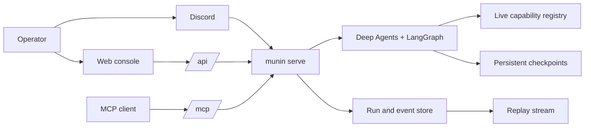

<p align="center">
  
</p>

# Munin

> What was once seen is never forgotten.

Munin is a durable, operator-governed agent runtime for authorised security
research, threat intelligence and controlled red-team work. It keeps an
operation's objective, evidence, tool activity, approvals and recovery state in
one place while offering web, MCP and Discord control surfaces.

Munin is built for work that is too long, too consequential or too connected to
be treated as a disposable chat. The operator remains responsible for scope,
credentials, impact and publication.

## Why Munin

- **A run survives its window.** Conversations have stable LangGraph threads,
  durable events, checkpoints and renewable leases. A browser reconnects to the
  same run; it does not start a second one.
- **Human approval is part of execution.** A sensitive step pauses at a durable
  graph interrupt. Approval resumes that exact action; rejection and expiry do
  not silently turn into a different call.
- **The agent sees the live capability surface.** Native tools, enabled
  generated capabilities and bounded specialist profiles are composed at run
  time instead of copied into a static prompt.
- **It can extend itself without confusing a file with a capability.** A
  generated tool or subgraph must have a narrow contract, validation,
  registration and the same policy checks as a native capability.
- **Observability is replayable.** Assistant text, provider-emitted reasoning,
  tool lifecycle and output, delegations, artifacts and approvals are separate
  timeline events rather than one reconstructed status message.

## One control plane, three ways in



The web UI is the best place to inspect a complete timeline. MCP exposes the
same live capability contracts to other clients. Discord is an optional remote
window into the same server-side run, not a separate executor. Policy, identity
and approval validation live on the server in every case.

## How an operation progresses

1. An operator creates or continues a conversation and provides an objective,
   authorised scope and desired evidence.
2. Munin loads the conversation's stable thread, relevant evidence and current
   capability registry, then starts or resumes the run.
3. The runtime can answer, delegate a bounded task, call an authorised tool,
   request approval or stop with an evidence-backed result.
4. The event log records visible progress as it happens. A reconnect replays
   those events; it never asks the model to recreate the past.
5. Completed, failed and cancelled runs are persisted. Expired running leases
   may be recovered from their checkpoint. A run waiting for human approval
   stays paused until an authorised decision is made.

### Long-running work without losing the plot

LangGraph checkpoints preserve executable state. Context compaction keeps the
model input within its context window. The durable timeline preserves what the
operator needs to audit: messages, evidence, tool results, artifacts and human
decisions. These are complementary mechanisms, not substitutes for one
another.

## Capabilities, skills and Hugin

Munin separates **knowledge** from **authority**.

The live capability registry decides which server-side tools and specialist
profiles are available for a run. The agent can only use capabilities that are
registered and permitted for that run. Generated capabilities use the
`gen__*` namespace so their origin remains visible, and their presence never
grants scope or approval.

[Hugin](https://github.com/PrinceOfPwn/Hugin) is Munin's knowledge sibling: a
passive graph of source-linked security research and relationships. Munin ships
the reviewed `hugin-research` Deep Agents skill in
`munin/agent_skills/hugin-research`; it directs the agent to retrieve and
validate a small, relevant, provenance-labelled research subset for a bounded
task. An externally generated folder of Hugin cards is not loaded implicitly.

That distinction matters:

| Hugin and skills provide | Munin provides |
| --- | --- |
| Research context, relationships, technique references and hypotheses | Conversation state, policy enforcement, tools, execution, evidence capture and human approval |
| A reason to investigate further | The controlled path for deciding whether a target-specific action may run |

Skill content is selected deliberately; a folder of `SKILL.md` files is not
automatically prompt context, a tool, evidence of a vulnerability or permission
to act. Source material should be traced back to its Hugin identifier and
validated against the authorised target.

### Add a reviewed skill

1. Create `munin/agent_skills/<skill-name>/SKILL.md` with Agent Skills YAML
   frontmatter containing a matching `name` and a concise `description`.
2. Keep supporting material inside that same directory and reference it from
   `SKILL.md`; Deep Agents discovers direct child packages only.
3. Commit and review the package. The supervisor exposes reviewed packages as
   read-only. A custom subagent receives one only when its `SubagentSpec`
   explicitly lists the skill name.

Do not point the runtime at an unreviewed nested prompt tree or assume a skill
can execute tools. Tool access, scope and approvals remain separate Munin
controls.

## Human approval and visibility

A human request is a hard execution boundary. It includes the exact proposed
action and waits for an authenticated operator decision before LangGraph is
resumed. Web and Discord can render or submit a decision, but neither can mint
an approval or bypass server policy.

The timeline distinguishes:

- final assistant text;
- explicit provider reasoning, when the model provider actually emits it;
- operational activity and specialist handoffs;
- tool intent, streamed output, completion and failure;
- artifacts; and
- human requests and their resolution.

Munin preserves explicit `reasoning_content`, `thinking` and `<think>`-style
provider output as its own event type. It does not fabricate hidden reasoning
from internal graph state or logs.

## Start locally

1. Copy `.env.example` to `.env` and configure an LLM endpoint, a strong
   `MUNIN_MASTER_KEY`, `MUNIN_MCP_AUTH_TOKEN` and an allowed local origin.
2. Start the unified server:

   ```bash
   poetry install
   poetry run munin serve --host 127.0.0.1 --port 8787
   ```

3. In another terminal, start the web interface:

   ```bash
   cd app
   npm ci
   npm run dev
   ```

4. Open `http://localhost:3000`. MCP clients connect to
   `http://127.0.0.1:8787/mcp/` using the configured bearer token.

Keep the local server bound to loopback unless a protected reverse proxy,
explicit origin policy and persistent storage have been configured.

### Before an operational session

1. Confirm `/health` and authenticated web access.
2. Verify that the intended LLM provider completes a structured tool-call
   round trip.
3. Inspect the live capability surface rather than relying on a copied list.
4. Confirm written authorisation, target boundaries and required preflight.
5. Use persistent hot and checkpoint storage when the run must survive restart.
6. Know who can approve, reject and cancel a human request.

## Storage and recovery

SQLite is the fast transactional store for active conversations, runs and
events. LangGraph checkpoints use persistent SQLite by default. A libSQL/Turso
archive can mirror durable records for long-lived continuity. Production
deployments must persist both the hot store and checkpoint path; a disposable
filesystem cannot recover in-flight state after a host restart.

## Documentation map

- [Architecture](ARCHITECTURE.md) — system boundaries and invariants.
- [Runtime architecture](docs/architecture.md) — execution and event contracts.
- [Persistence](docs/architecture-persistence.md) — recovery and storage roles.
- [System guide](docs/munin-system-guide.md) — how to frame and follow a run.
- [Operator guide](docs/operator-guide.md) — deployment and operating practice.
- [Capability reference](docs/tools_reference.md) — discovery, tools, skills and generated extensions.
- [Provider contract](docs/llm-providers.md) — model endpoint expectations.
- [Security notes](docs/security-notes.md) — boundaries and review checklist.
- [GitHub Actions guide](docs/github-actions-tutorial.md) — temporary live sessions.

## Validate before use

```bash
poetry run pytest
cd app && npm run build
```

A healthy server or polished UI does not establish authorisation for a target.
Use isolated fixtures for integration tests and review the exact capability,
arguments and evidence before approving impactful work.
