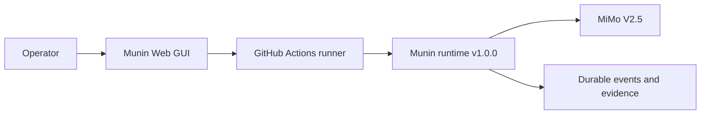
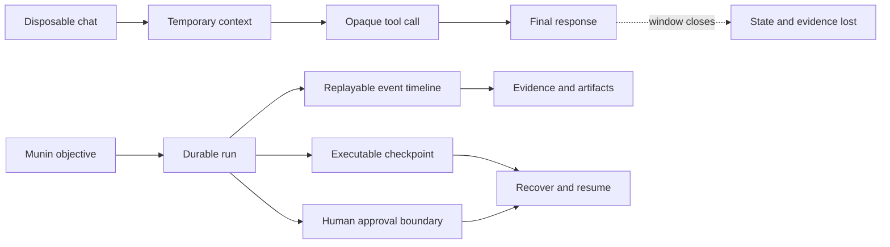
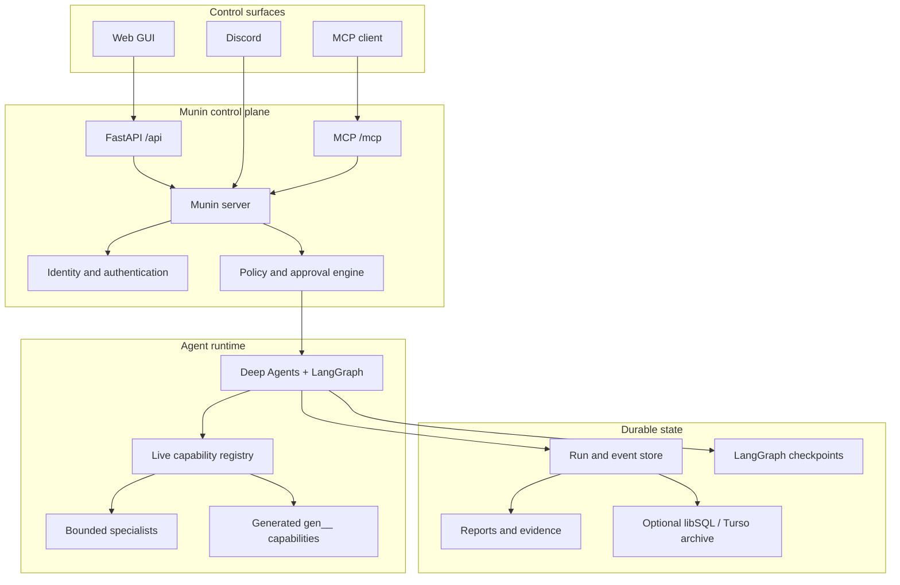
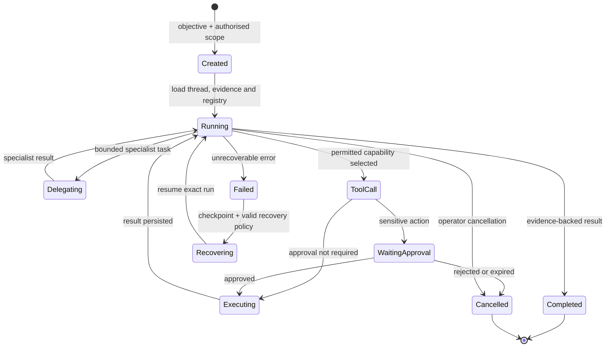
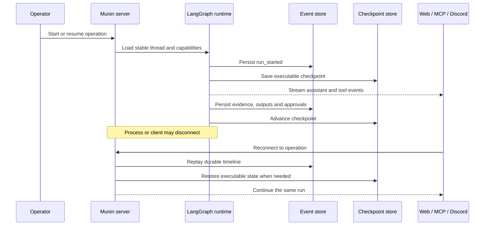
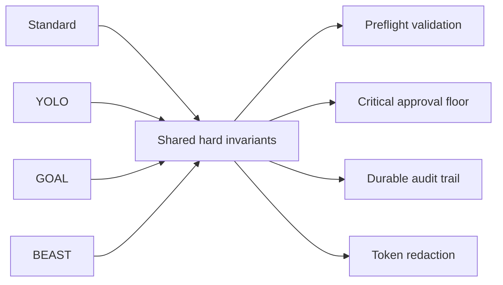
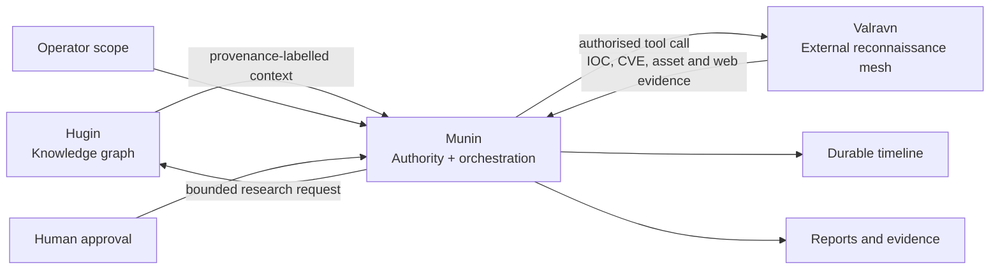
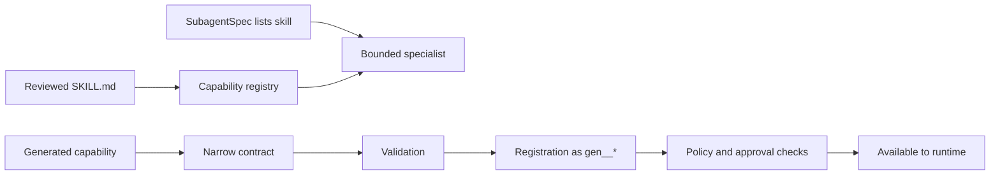

<p align="center">
  
</p>

<h1 align="center">Munin</h1>

<p align="center">
  <strong>A durable, operator-governed runtime for autonomous security operations.</strong>
</p>

<p align="center">
  Threat intelligence, authorised red-team work, evidence capture, human approval and long-running agent execution in one control plane.
</p>

<p align="center">
  <strong>English</strong> ·
  <a href="README.es.md">Español</a> ·
  <a href="README.pt-BR.md">Português (BR)</a> ·
  <a href="README.zh-CN.md">简体中文</a>
</p>

<p align="center">
  <a href="https://www.python.org/"></a>
  <a href="https://fastapi.tiangolo.com/"></a>
  <a href="https://langchain-ai.github.io/langgraph/"></a>
  <a href="https://modelcontextprotocol.io/"></a>
  <a href="https://nextjs.org/"></a>
  <a href="https://www.typescriptlang.org/"></a>
  <a href="https://www.sqlite.org/"></a>
  <a href="LICENSE"></a>
</p>

<p align="center">
  <a href="#verified-v100-configuration"><strong>Verified setup</strong></a> ·
  <a href="#architecture"><strong>Architecture</strong></a> ·
  <a href="#operation-lifecycle"><strong>Lifecycle</strong></a> ·
  <a href="#operation-modes"><strong>Modes</strong></a> ·
  <a href="#quick-start"><strong>Quick start</strong></a>
</p>

> **Authorised use only.** Munin is designed for legitimate security research, threat intelligence and controlled red-team operations. You are responsible for obtaining permission, defining scope, protecting credentials, reviewing impact and complying with applicable law. A healthy server or successful tool call does not establish authorisation.

## Verified v1.0.0 configuration

> [!IMPORTANT]
> The tested and verified operating configuration for **Munin v1.0.0** is the **web GUI running through GitHub Actions with MiMo V2.5** as the model.
>
> Other providers, models, deployment targets and control surfaces may work, but they are not part of the v1.0.0 verified configuration unless explicitly documented.

| Component | Verified configuration |
| --- | --- |
| Version | **Munin v1.0.0** |
| Interface | **Web GUI** |
| Execution environment | **GitHub Actions** |
| Model | **MiMo V2.5** |



## Why Munin exists

Most agent systems are built around a temporary chat window. Security operations are not. They last hours or days, cross tools and models, and require evidence, approvals, recovery, auditability and a reliable account of what the agent actually did.

**Munin turns that work into a durable operation instead of a disposable conversation.**

| Disposable agent loop | Munin operation |
| --- | --- |
| Context disappears when the session ends | Stable conversations, checkpoints and replayable events |
| Tool calls are reconstructed from logs | Tool intent, output, artifacts and failures are first-class events |
| Approval is an informal prompt | Sensitive actions pause at durable graph interrupts |
| Capabilities are copied into a static prompt | The live registry composes tools and specialists at runtime |
| Reconnects risk duplicate execution | Renewable leases and persisted run state protect continuity |
| Long tasks become opaque | Operators can follow progress across web, MCP and Discord |



## What Munin gives you

### Durable autonomous operations

LangGraph checkpoints preserve executable state while a separate timeline records messages, evidence, tools, artifacts, approvals and operator decisions. A reconnect returns to the same operation instead of silently creating another one.

### Human control at the execution boundary

Approval is part of the runtime, not a suggestion inside the prompt. Sensitive actions pause with the exact capability and arguments. Approval resumes that action; rejection or expiry cannot silently mutate into something else.

### One runtime, multiple control surfaces

The web console, MCP clients and Discord all reach the same server-side identity, policy, state and approval layer.

### Live capability composition

Munin composes native tools, reviewed skills, generated capabilities and bounded specialists at runtime. Generated tools use the `gen__*` namespace and must pass validation, registration and the same policy checks as native capabilities.

### Evidence-first observability

Assistant messages, provider-emitted reasoning, tool lifecycle, streamed output, delegations, artifacts and human requests remain separate, replayable events.

## Architecture



Munin keeps four concerns separate:

| Layer | Responsibility |
| --- | --- |
| **Knowledge** | Research context, relationships, references and hypotheses |
| **Authority** | Scope, identity, approvals and policy enforcement |
| **Execution** | Tools, delegation, generated capabilities and agent state |
| **Evidence** | Events, artifacts, outputs, decisions and recovery history |

## Operation lifecycle



## Persistence and recovery



SQLite is the fast transactional store for active conversations, runs and events. LangGraph checkpoints use persistent SQLite by default. A libSQL or Turso archive can mirror durable records for longer-lived continuity.

## Operation modes

| Mode | Best for | Approval behaviour |
| --- | --- | --- |
| **Standard** | Careful interactive operations | Per-action approvals |
| **YOLO** | Fast work inside a trusted, bounded environment | Skips routine approvals; critical actions remain protected |
| **GOAL** | Persistent objectives that survive refreshes or restarts | Durable goal, TODO state and scheduled re-evaluation |
| **BEAST** | Deep planning and specialist delegation | Expanded budgets with explicit scope and anti-runaway controls |



## Hugin and Valravn



[Hugin](https://github.com/PrinceOfPwn/Hugin) is Munin's knowledge sibling: a passive graph of source-linked security research and relationships.

[Valravn](munin/valravn/) is the external reconnaissance mesh, exposing IOC/CVE enrichment, asset search, historical-web pivots, routing and RPKI context, dark-web search and browser evidence capture through `valravn_*` tools.

Neither research context nor tool availability grants permission to act. Scope and approval remain independent runtime controls.

## Quick start

### Requirements

- Python 3.11+
- Poetry
- Node.js and npm
- An OpenAI-compatible LLM endpoint

### 1. Configure

```bash
cp .env.example .env
```

Set a strong `MUNIN_MASTER_KEY`, `MUNIN_MCP_AUTH_TOKEN`, an allowed local origin and your model provider configuration.

### 2. Start the server

```bash
poetry install
poetry run munin serve --host 127.0.0.1 --port 8787
```

### 3. Start the GUI

```bash
cd app
npm ci
npm run dev
```

Open `http://localhost:3000`. MCP clients connect to `http://127.0.0.1:8787/mcp/` with the configured bearer token.

> Keep Munin bound to loopback unless you have configured a protected reverse proxy, explicit origin policy, authentication and persistent storage.

## Skills and self-extension



A `SKILL.md` file provides instructions and context; it does not become executable authority simply by existing on disk.

## Validation

```bash
poetry run pytest
cd app && npm run build
```

## Documentation

| Guide | Purpose |
| --- | --- |
| [Architecture](ARCHITECTURE.md) | System boundaries and invariants |
| [Runtime architecture](docs/architecture.md) | Execution and event contracts |
| [Persistence](docs/architecture-persistence.md) | Recovery and storage roles |
| [System guide](docs/munin-system-guide.md) | Framing and following a run |
| [Operator guide](docs/operator-guide.md) | Deployment and operating practices |
| [Capability reference](docs/tools_reference.md) | Tools, skills and generated extensions |
| [Provider contract](docs/llm-providers.md) | Model endpoint expectations |
| [Security notes](docs/security-notes.md) | Boundaries and review checklist |
| [GitHub Actions guide](docs/github-actions-tutorial.md) | Temporary live sessions |
| [Valravn](docs/VALRAVN.md) | Reconnaissance mesh and providers |

## License

Munin is distributed under the [PolyForm Noncommercial License 1.0.0](LICENSE).

You may inspect, study, research, experiment with and modify the source for permitted noncommercial purposes. Commercial use—including paid products or services, consulting engagements, internal commercial operations or anticipated commercial applications—requires a separate commercial licence from the copyright holder.

Because commercial use is restricted, Munin is **source-available**, not open source under the Open Source Initiative definition.

---

<p align="center"><em>What was once seen is never forgotten.</em></p>
