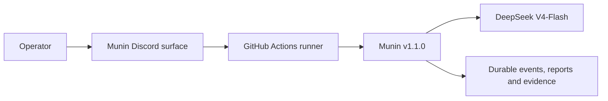
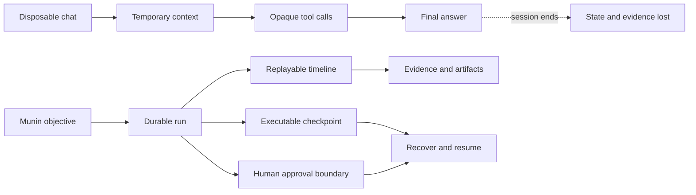
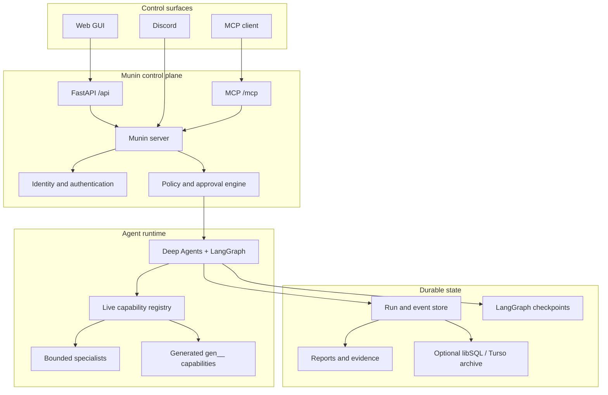
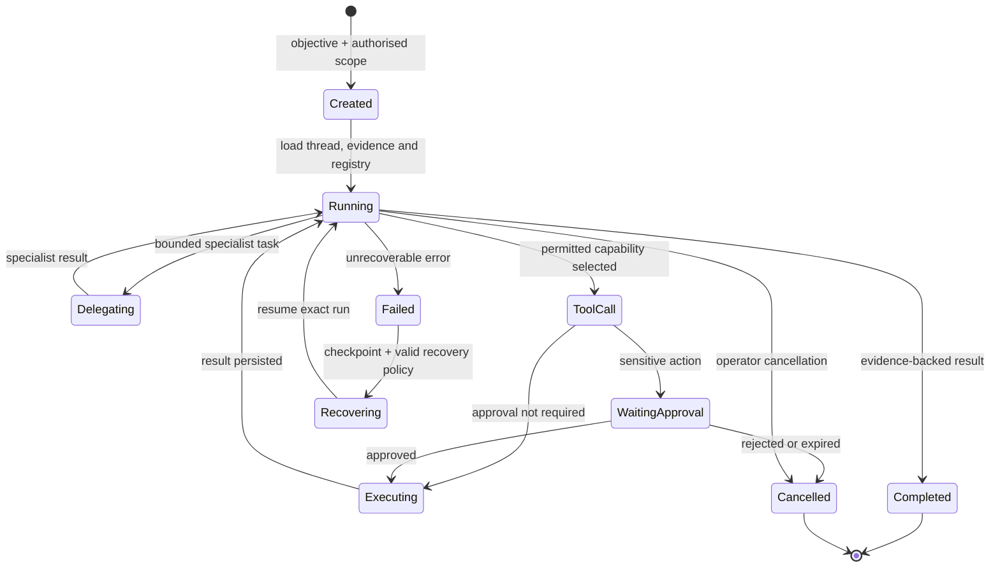
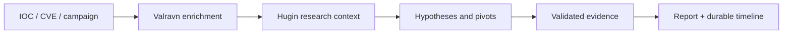
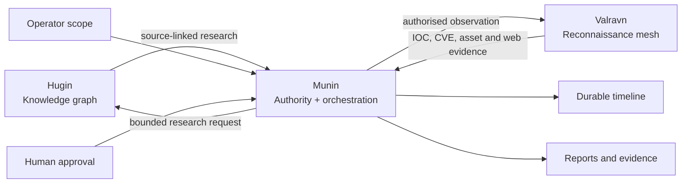
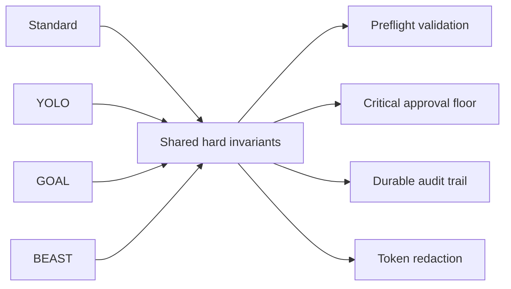
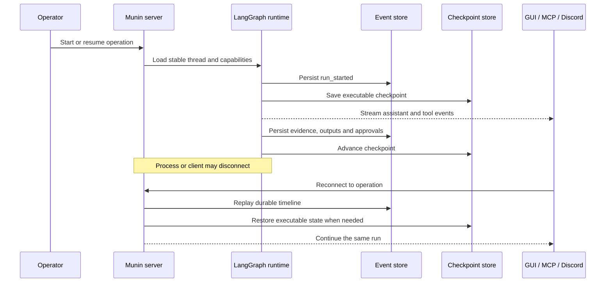
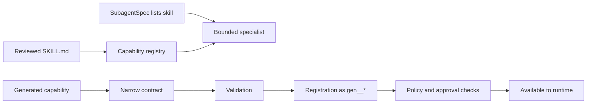

<p align="center">
  
</p>

<h1 align="center">Munin</h1>

<p align="center">
  <strong>A durable, operator-governed runtime for autonomous security operations.</strong>
</p>

<p align="center">
  Threat intelligence, authorised red-team work, evidence capture, human approval and long-running agent execution in one control plane.
</p>

<p align="center">
  <strong>English</strong> ·
  <a href="README.es.md">Español</a> ·
  <a href="README.pt-BR.md">Português (BR)</a> ·
  <a href="README.zh-CN.md">简体中文</a> ·
  <a href="README.ru.md">Русский</a> ·
  <a href="README.ko.md">한국어</a>
</p>

<p align="center">
  <a href="https://www.python.org/"></a>
  <a href="https://fastapi.tiangolo.com/"></a>
  <a href="https://langchain-ai.github.io/langgraph/"></a>
  <a href="https://modelcontextprotocol.io/"></a>
  <a href="https://nextjs.org/"></a>
  <a href="https://www.typescriptlang.org/"></a>
  <a href="https://www.sqlite.org/"></a>
  <a href="LICENSE"></a>
</p>

<p align="center">
  <a href="#verified-v100-configuration"><strong>Verified setup</strong></a> ·
  <a href="#why-munin"><strong>Why Munin</strong></a> ·
  <a href="#architecture"><strong>Architecture</strong></a> ·
  <a href="#use-cases"><strong>Use cases</strong></a> ·
  <a href="#quick-start"><strong>Quick start</strong></a> ·
  <a href="#faq"><strong>FAQ</strong></a>
</p>

> [!WARNING]
> **Authorised use only.** Munin is designed for legitimate security research, threat intelligence and controlled red-team operations. You are responsible for obtaining permission, defining scope, protecting credentials, reviewing impact and complying with applicable law. A working deployment or successful tool call does not establish authorisation.

## Prompt design and ROGUE laboratory profile

Munin's research prompts use **ROGUE mode by default**: an intentionally aggressive profile for testing planning, delegation, tool use, persistence and recovery inside isolated, explicitly authorised laboratories. ROGUE changes prompt posture, not authority—written scope, runtime policy, approvals and audit controls remain binding.

Parts of the internal control language are written in **Simplified Chinese** because it offers compact human-readable instructions and can align naturally with Chinese-developed model families used during testing. This is an empirical design choice, not a claim that Chinese is always cheaper in tokens or universally better. See [Prompt design, validation matrix and references](README.PROMPTS.md).

## Verified v1.1.0 configuration

> [!IMPORTANT]
> The tested and verified operating configuration for **Munin v1.1.0** is the **Discord community adapter running through GitHub Actions with DeepSeek V4-Flash** (`deepseek-v4-flash`) as the model.
>
> **Discord is the stable operator surface today.** The Web GUI is the target
> long-term interface, but live-session testing exposed frontend bugs that are
> still being fixed; until the GUI repair loop passes end-to-end, Discord is the
> reference surface for full operations.
>
> Other providers, models, deployment targets and control surfaces may work, but they are not part of the verified v1.1.0 configuration unless explicitly documented.

| Component | Verified configuration |
| --- | --- |
| Version | **Munin v1.1.0** |
| Interface | **Discord community adapter** (Web GUI under repair) |
| Execution environment | **GitHub Actions** |
| Model | **DeepSeek V4-Flash** (`deepseek-v4-flash`) |



## Why Munin

Most agent systems are built around a temporary chat window. Security operations are not. They last hours or days, cross tools and models, require evidence and approvals, and must survive disconnects, process restarts and changing operator context.

**Munin turns an agent conversation into a durable, inspectable operation.**

| Disposable agent loop | Munin operation |
| --- | --- |
| Context disappears when the session ends | Stable conversations, checkpoints and replayable events |
| Tool activity is reconstructed from loose logs | Intent, output, artifacts and failures are first-class events |
| Approval is an informal sentence in a prompt | Sensitive actions pause at durable execution boundaries |
| Capabilities are copied into static context | A live registry composes tools and specialists at runtime |
| Reconnects risk duplicate execution | Persisted state and renewable leases protect continuity |
| Long tasks become opaque | Operators follow progress across GUI, MCP and Discord |
| Final answers hide the process | Evidence, decisions and artifacts remain independently auditable |



## What Munin is — and what it is not

| Munin is | Munin is not |
| --- | --- |
| An operator-governed runtime | A permissionless autonomous hacker |
| A durable orchestration and evidence layer | Just another chat UI |
| A system for bounded delegation | A guarantee that every model will behave correctly |
| A policy and approval boundary | A substitute for written authorisation |
| A live capability registry | A folder where every file becomes executable |
| A source-available research project | Commercially unrestricted open source |

## Core capabilities

### Durable autonomous operations

LangGraph checkpoints preserve executable state while a separate event timeline records messages, evidence, tools, artifacts, approvals and operator decisions. Reconnecting returns to the same operation instead of silently starting another one.

### Human control at the execution boundary

Approval is part of the runtime, not a suggestion inside the prompt. Sensitive actions pause with the exact capability and arguments. Approval resumes that action; rejection or expiry cannot silently mutate into something else.

### One runtime, multiple control surfaces

The web GUI, MCP clients and Discord reach the same server-side identity, policy, state and approval layer. They are windows into one operation, not separate executors.

### Live capability composition

Munin composes native tools, reviewed skills, generated capabilities and bounded specialists at runtime. Generated tools use the `gen__*` namespace and must pass validation, registration and the same policy checks as native capabilities.

### Evidence-first observability

Assistant messages, provider-emitted reasoning, tool lifecycle, streamed output, delegations, artifacts and human requests remain separate, replayable events. Munin does not fabricate hidden reasoning or collapse an operation into a vague status line.

## Architecture



Munin keeps four concerns separate:

| Layer | Responsibility |
| --- | --- |
| **Knowledge** | Research context, relationships, references and hypotheses |
| **Authority** | Scope, identity, approvals and policy enforcement |
| **Execution** | Tools, delegation, generated capabilities and agent state |
| **Evidence** | Events, artifacts, outputs, decisions and recovery history |

## Operation lifecycle



## Use cases

### Threat intelligence investigation

Start from an IOC, vulnerability, campaign or organisation. Munin can coordinate enrichment, collect source-attributed evidence, maintain hypotheses, delegate bounded research tasks and produce a report without losing the investigative timeline.



### Authorised red-team operation

Define scope, objectives and approval requirements. Munin can plan, delegate specialists, invoke permitted capabilities and stop at human approval boundaries before sensitive actions.

### Long-running autonomous objective

Use GOAL or BEAST mode for work that must survive browser refreshes, runner transitions or process restarts. Durable TODO state and checkpoints keep the operation coherent.

### Evidence-heavy security research

Capture tool intent, streamed output, screenshots, artifacts, model observations and operator decisions as separate events that can be replayed and reviewed later.

### Capability prototyping

Create narrow generated tools, validate them, register them under visible provenance and expose them only through the same policy and approval controls as native tools.

## The Munin ecosystem



- **Hugin** supplies passive, provenance-labelled knowledge.
- **Valravn** supplies external observations and reconnaissance evidence.
- **Munin** owns orchestration, state, policy, approval and evidence continuity.

Neither knowledge nor tool availability grants permission to act.

## Operation modes

| Mode | Best for | Approval behaviour |
| --- | --- | --- |
| **Standard** | Careful interactive operations | Per-action approvals |
| **YOLO** | Fast work inside a trusted, bounded environment | Skips routine approvals; critical actions remain protected |
| **GOAL** | Persistent objectives that survive refreshes or restarts | Durable goal, TODO state and scheduled re-evaluation |
| **BEAST** | Deep planning and specialist delegation | Expanded budgets with explicit scope and anti-runaway controls |



## Persistence and recovery



SQLite stores active conversations, runs and events. LangGraph checkpoints use persistent SQLite by default. A libSQL or Turso archive can mirror durable records for longer-lived continuity.

## Quick start

### Requirements

- Python 3.11+
- Poetry
- Node.js and npm
- An OpenAI-compatible model endpoint

### 1. Configure

```bash
cp .env.example .env
```

Set a strong `MUNIN_MASTER_KEY`, `MUNIN_MCP_AUTH_TOKEN`, an allowed local origin and your model provider configuration.

### 2. Start the server

```bash
poetry install
poetry run munin serve --host 127.0.0.1 --port 8787
```

### 3. Start the GUI

```bash
cd app
npm ci
npm run dev
```

Open `http://localhost:3000`. MCP clients connect to `http://127.0.0.1:8787/mcp/` with the configured bearer token.

> [!TIP]
> Keep Munin bound to loopback unless you have configured a protected reverse proxy, explicit origin policy, authentication and persistent storage.

## Before an operational session

- Confirm `/health` and authenticated GUI access.
- Verify that the selected model completes a structured tool-call round trip.
- Inspect the live capability surface instead of relying on a copied list.
- Confirm written authorisation and target boundaries.
- Decide who can approve, reject and cancel sensitive actions.
- Persist both hot state and checkpoint storage.
- Review the exact capability and arguments before impactful execution.

## Skills and self-extension



A `SKILL.md` file provides instructions and context; it does not become executable authority simply by existing on disk.

## Validation

```bash
poetry run pytest
cd app && npm run build
```

## Documentation

| Guide | Purpose |
| --- | --- |
| [Architecture](ARCHITECTURE.md) | System boundaries and invariants |
| [Runtime architecture](docs/architecture.md) | Execution and event contracts |
| [Persistence](docs/architecture-persistence.md) | Recovery and storage roles |
| [System guide](docs/munin-system-guide.md) | Framing and following a run |
| [Operator guide](docs/operator-guide.md) | Deployment and operating practices |
| [Capability reference](docs/tools_reference.md) | Tools, skills and generated extensions |
| [Provider contract](docs/llm-providers.md) | Model endpoint expectations |
| [Prompt design](README.PROMPTS.md) | ROGUE laboratory profile, Chinese control language and model validation matrix |
| [Security notes](docs/security-notes.md) | Boundaries and review checklist |
| [GitHub Actions guide](docs/github-actions-tutorial.md) | Temporary live sessions |
| [Valravn](docs/VALRAVN.md) | Reconnaissance mesh and providers |

## FAQ

### Is Munin fully autonomous?

It can execute long-running objectives and delegate work, but authority remains bounded by operator scope, policy and approval requirements.

### Is Munin open source?

The source is publicly available, but the PolyForm Noncommercial licence restricts commercial use. It is source-available rather than OSI-defined open source.

### Can companies use Munin internally?

Not under the noncommercial licence when the use has a commercial application. A separate commercial licence is required.

### Does a skill automatically gain tool access?

No. Skills provide context and instructions. Tool access, scope and approval are separate runtime controls.

### Can I use a model other than DeepSeek V4-Flash?

Potentially. However, the verified v1.1.0 configuration is the Discord adapter on GitHub Actions with DeepSeek V4-Flash (`deepseek-v4-flash`).

### Does Munin replace analyst judgement?

No. It preserves evidence, state and decisions so analysts can review and govern the operation more effectively.

## Active development

The `v1.1.0` contract above is the verified baseline. Work in progress lives
on the `feat/discord-community-adapter` branch ([PR #52](https://github.com/PrinceOfPwn/Munin/pull/52)),
which adds a Discord community/DM control surface alongside the web GUI and
ships a hotfix for post-approval resume amnesia:

- **HITL resume amnesia fix** (commit `f686766`): MiMo V2.5 lost thread after
  an operator approved a tool via the HITL surface. Munin now uses a hybrid
  resume — `Command(resume={"decisions": [...]}, update={"messages": [HumanMessage(...)]})`
  — so the model sees both the checkpointed graph state (deepagents way)
  and an explicit continuation directive naming the original objective
  (opencode-style projected-history reload). See `changes.md`.
- **Compaction raised to 170K tokens** (commit `69af42f`): Munin keeps full
  long-context runs instead of compacting at the 60K framework default and
  losing tool evidence mid-campaign.

## License

Munin is distributed under the [PolyForm Noncommercial License 1.0.0](LICENSE).

You may inspect, study, research, experiment with and modify the source for permitted noncommercial purposes. Commercial use—including paid products or services, consulting engagements, internal commercial operations or anticipated commercial applications—requires a separate commercial licence from the copyright holder.

Because commercial use is restricted, Munin is **source-available**, not open source under the Open Source Initiative definition.

---

<p align="center"><em>Знание переживает битву.</em></p>
<p align="center"><sub>Knowledge outlives the battle.</sub></p>