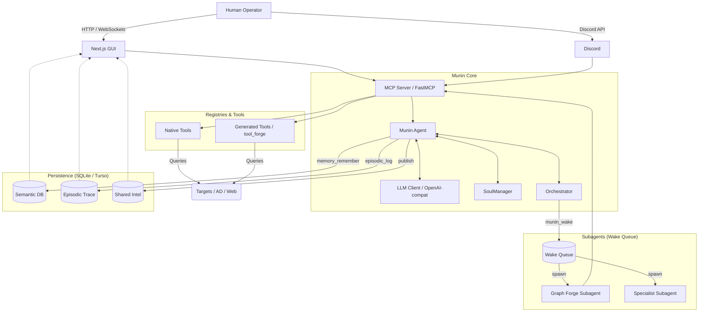

<p align="center">
  
</p>

<br>

# Munin

> *What was once seen is never forgotten.*

<br>

## 📖 What is Munin

Munin is a comprehensive threat intelligence, red teaming, and agent evaluation orchestration platform built on the **Model Context Protocol (MCP)**. It is governed at all times by a **human operator as the final authority**.

Designed for authorized laboratories, internal exercises, and explicitly authorized red team environments, Munin provides:

- 🧠 **ReAct Coordinator**: An autonomous core agent capable of multi-step reasoning loops, self-diagnostics, and task delegation.

- 💾 **Durable Persistence**: Real-time state synchronization using local SQLite or cloud Turso, ensuring the agent never loses context between sessions.

- 📜 **Semantic and Episodic Memory**: Retention of key facts (semantic) and an immutable ledger of every step and decision (episodic).

- 🛠️ **Native Tools and Subagents**: A built-in catalog of offensive, passive, and administrative capabilities.

- 🚀 **Governed Self-Extension**: Creation of new Python tools (`tool_forge`) and subagents (`graph_forge`) on the fly (within secure sandboxes).

- 🐦 **The Brother Hugin**: Native integration with Hugin (Odin's other raven, Thought), which acts as a RAG system over cybersecurity knowledge graphs.

- 🖥️ **Multiple Interfaces**: Modern Next.js Graphical User Interface (GUI), Discord integration, and GitHub Actions infrastructure.

- 🛑 **Human-in-the-loop (HITL)**: Strict security circuits where the agent halts when facing ambiguity, unauthorized scopes, or destructive actions, requiring manual approval.

<br>

## ⚡ Core Capabilities

| Category | Description | Implemented Tools / Modules |
| :--- | :--- | :--- |
| **MCP & HTTP Transport** | Asynchronous FastMCP server (`/mcp`) exposing all tools using Bearer tokens and HTTP state control. | `munin/mcp/main.py`, FastMCP, `streamable-http`. |
| **ReAct Agent** | Reasoning loop (System Prompt, thought, action, observation) interacting with the dynamic tool catalog. | `munin_chat`, `munin_self_diagnose`. |
| **Soul** | Markdown-based versioned agent identity (goals, identity, principles, skills). Controls behavior. | `soul_propose_edit` → PR (human merge). |
| **Memory** | Persistent storage of semantic knowledge (facts) and episodic knowledge (events/traces). | `memory_remember`, `memory_recall`, `episodic_query`. |
| **Shared Intel** | Asynchronous sharing of findings among agents in the same campaign. | `publish_shared_intel`, `query_shared_intel`. |
| **Hugin (RAG & Graphs)** | Query structured attack plans and hypotheses from the knowledge repository sibling. | `hugin_search`, `hugin_rag_search`, `hugin_plan_for`, `hugin_neighbors`, `hugin_node_detail`. |
| **Recon & Security** | Native catalog integrating leading offensive security tools. | `nmap_scan`, `httpx_probe`, `nuclei_scan`, `ffuf_scan`, `feroxbuster_scan`, `sqlmap_scan`, `netexec_scan`, `hydra_attack`, `smbmap_scan`. |
| **Passive Intelligence** | Enrichment with public sources and vulnerability dictionaries (NVD/EPSS). | `cve_lookup`, `cve_search`, `cve_enrich`, `exploit_search`, `package_vuln_lookup`. |
| **Active Directory / LDAP** | Safe queries against AD/OpenLDAP using filters with `escape_filter_chars`. | `ldap_search`, `ldap_who_am_i`, `find_domain_admins`, `find_kerberoastable_users`, `find_asrep_roastable_users`, `get_user_groups`, `get_current_user_info`, `dump_domain_structure`. |
| **Tool Forge** | Writing, validating (AST), and executing new Python tools on demand (`gen__*`). | `tool_forge`, `disable_generated_tool`, `describe_generated_tool`. |
| **Graph Forge** | Generation of specialized subagents with restricted tool whitelists (ReAct sandboxing). | `graph_forge`, `describe_generated_graph`. |
| **Delegation (Wake Queue)** | Concurrency architecture where the orchestrator wakes isolated subprocesses for forged tasks. | `munin_wake`, `subagent_trace`, `claim_shared_task`, `list_shared_tasks`, `complete_shared_task`. |
| **Diagnostics & Infra** | Internal tools for agent health, VPN status, and ad-hoc command execution. | `health_check`, `vpn_status`, `execute_command`, `shared_state_overview`. |
| **Operator Interaction** | Discord and GUI bridge, screenshot uploads, and inter-agent notifications. | `post_agent_message`, `fetch_agent_messages`, `ack_agent_message`, `web_evidence_screenshotter`. |
| **Turso & Persistence** | Unified SQLite/Turso database maintaining real cross-session and multi-agent state. | `munin/mcp/shared_state.py`, `turso`/`libsql`. |
| **Extension (Git/PR)** | Pull Request creation for agent evolution (requires explicit HITL approval). | `extension_forge`, `extension_open_pr`, `wiki_git_syncer`. |

> [!TIP]
> **Recommended Exercise Planner**: For maximum efficiency during security exercise planning and tool execution, we invite operators to use the fine-tuned [OFFX-Qwen3.5-9B Track A (DoRA Planner)](https://www.kaggle.com/code/emilianoperalta/offx-qwen35-9b-track-a-dora-planner-w10-20260701) model. See [LLM Providers](docs/llm-providers.md) for deployment instructions.

<br>

## 🏗️ Architecture

Munin's workflow is organized around a **centralized orchestrator** that receives instructions, queries the LLM, delegates tasks to subagents, logs evidence, and stores it in SQLite/Turso.



<br>

### 🔄 Flow of a `munin_chat` Request

1. **Reception**: A request arrives at the `/mcp` endpoint via the web client or Discord.

2. **Context Loading**: The agent loads its identity (`Soul`), the consolidated semantic memory, the current tool catalog, and Hugin context.

3. **Decision**: The LLM evaluates the prompt and decides whether to reply directly, delegate to a subagent, or call a specific tool.

4. **Execution**: The action runs (e.g., an `nmap_scan` or `ldap_search`).

5. **Persistence**: The call, parameters, and output are logged into the episodic trace.

6. **Iteration**: The LLM receives the observation (evidence) and iterates until it achieves its goal or requires *Human-in-the-loop*.

7. **Presentation**: Episodic traces are streamed to the GUI for auditing.

<br>

## 🧩 ReAct and Coordination

Munin uses the **ReAct** (Reasoning + Acting) paradigm.

Tools can be:

- **Native**: Implemented in Python in the codebase (e.g., `ldap_search`).
- **Generated**: Created at runtime by `tool_forge` and stored in the dynamic catalog (`gen__*`).
- **Native Subagents**: Predefined ReAct logic in `munin/subagents/`.
- **Forged Graphs**: Purpose-specific subagents created by `graph_forge`.
- **Asynchronous Jobs**: Long-running scans (e.g., Nuclei, Nmap) handled without blocking the main thread.

The conversation with Munin is persistent. Unlike an ephemeral script, Munin remembers every finding and keeps it in mind for future iterations through its memory.

<br>

## ✨ Soul and Prompts

Munin's behavior and personality are defined in the `soul/` directory, consisting of Markdown files:

- `soul/identity.md`: Who Munin is (the agent's role).
- `soul/goals.md`: What it must attempt to achieve and what to protect.
- `soul/principles.md`: Hard rules on OPSEC, security, and formatting.
- `soul/skills.md`: Summary of the agent's cognitive capabilities.

**Linguistic Policy (`MUNIN_OPERATOR_LANGUAGE`)**:

- Internal LLM coordination, deep reasoning (hidden *thinking*), and processing may use *High-Density Simplified Chinese* or the model's native language for maximum efficiency.

- All generated code, tool names, JSON parameters, schemas, logs, and source code are **strictly in English**.

- The **final response** to the operator is in the configured preferred language (`auto`, `en`, `es`).

<br>

## 💾 Memory and Persistence

Munin maintains state between restarts. All its memory is durable and uniformly managed:

- **Semantic Memory**: Important facts (`memory_remember`, `memory_recall`).
- **Episodic Memory**: Every action, tool call, and result is logged to `episodic_query` to build an immutable trace.
- **Shared Intel**: Team-wide shared findings (`publish_shared_intel`, `query_shared_intel`).
- **Wake Queue**: Queue system for subprocesses (subagents).

**Supported Backends:**

- **SQLite (Local)**: Default, ideal for development and testing. (Located at `data/shared_state.sqlite`).

- **Turso (libsql / Cloud)**: By configuring `MUNIN_DB_URL`, Munin connects to a distributed database. **Recommended for real exercises, online sessions in GitHub Actions, and Multi-Agent architectures.**

> [!WARNING]
> **Security Warning**: Never persist discovered credentials, session tokens, or plaintext passwords in semantic, episodic, or shared intel memory.

<br>

## 🧠 Hugin (The Knowledge Brother)

If Munin is Memory and Execution, **Hugin** (Thought) is the structured static repository (Knowledge Graph) providing TTPs, methodologies, and attack vectors.

Natively integrated Hugin tools include:

- `hugin_search`: Simple textual search across the graph.
- `hugin_rag_search`: Hybrid search for attack context.
- `hugin_plan_for`: Requests structured attack plans (steps) for a target.
- `hugin_neighbors`: Explores relations (e.g., what tools mitigate which vulnerability).
- `hugin_node_detail`: Fetches deep descriptions of a technique.
- `hugin_refresh`: Invalidates the local Hugin cache.

**Typical Hugin Flow**:
`Target → hugin_search → Relations → hugin_node_detail → Attack Hypothesis → Validation with Munin Tools → Persisted Finding`

> [!NOTE]
> Hugin **does not execute anything**. It only provides knowledge. Munin does not use Hugin to "authorize" an action; authorization always relies on the human operator and Munin's system rules. *(See repository: https://github.com/PrinceOfPwn/Hugin)*.

<br>

## 🗄️ LDAP and Active Directory

Munin features a comprehensive and secure suite to enumerate Active Directory or OpenLDAP environments. All tools use `escape_filter_chars` from `ldap3` to prevent LDAP Injections, and implement a Schema-Tolerant layer to dynamically adapt if AD attributes (e.g., `sAMAccountName`) do not exist (like in OpenLDAP).

Actual implemented tools (`munin/mcp/tools/ldap_tools.py`):

1. `ldap_who_am_i`: Verifies directory connection credentials.
2. `get_current_user_info`: Returns attributes of the authenticated user.
3. `get_user_groups`: Enumerates a user's groups (accepts uid, sAMAccountName, cn).
4. `ldap_search`: Parametric search using secure filter templates (e.g., `filter_template` and `params_json`).
5. `find_kerberoastable_users`: Discovers accounts with an SPN (Kerberoasting candidates).
6. `find_asrep_roastable_users`: Discovers accounts with `DONT_REQ_PREAUTH` (AS-REP Roasting candidates).
7. `find_domain_admins`: Enumerates members of privileged groups (Domain Admins).
8. `dump_domain_structure`: Extracts the topology (OUs, Containers).

> [!CAUTION]
> Never build an LDAP filter by concatenating strings from the operator or LLM without using the parametric `ldap_search` or native abstractions.

<br>

## 🔭 Reconnaissance and Security Tools

Munin exposes standard offensive security binaries wrapped as MCP tools (see `munin/mcp/main.py`).

- **Network Discovery**: `nmap_scan`, `nmap_advanced_scan`.
- **Web Enumeration**: `httpx_probe`, `feroxbuster_scan`, `ffuf_scan`, `katana_crawl`.
- **Vulnerabilities & Exploitation**: `nuclei_scan`, `sqlmap_scan`.
- **SMB & AD (Active)**: `netexec_scan`, `smbmap_scan`.
- **Credentials**: `hydra_attack`.
- **Graphic Evidence**: `web_evidence_screenshotter`.
- **Diagnostics & Control**: `execute_command` (requires extreme OPSEC privilege), `health_check`, `vpn_status`.

> [!IMPORTANT]
> **Authorization and Preflight**: All these tools are categorized as "active". Depending on `PREFLIGHT_POLICY`, they require strict scope validation, operator authorization, and confirmation that the target IP (Egress) falls within the authorized scope.

<br>

## 🛠️ Tool Forge (`tool_forge`)

Munin can extend itself by writing secure Python code.

1. **Identify Gap**: Munin detects it lacks a tool for a task.

2. **Call `tool_forge`**: Generates a Python script. The contract must be written in **English**.

3. **AST Validation**: The system checks the generated code, blocking disallowed imports, `exec`, `eval`, and complex classes.

4. **Sandbox**: Executes the code in a restricted environment.

5. **Registration**: If it passes, it's dynamically registered as `gen__<slug>`.

6. **Persistence**: Stored in the `procedural` table in SQLite/Turso.

7. **Inspection / Execution**: The operator can review it with `describe_generated_tool` or watch Munin invoke it during normal flow.

8. **Deactivation**: If the tool is flawed, the operator or Munin can call `disable_generated_tool`.

> [!TIP]
> *Common Forge Failures*: Missing or invalid source, missing tool registration (`return`), disallowed dependencies by the AST Guard.

<br>

## 🕸️ Graph and Subagent Forge (`graph_forge`)

When a task is too extensive for a single conversation thread, Munin uses `graph_forge` to create a specialized subagent "configuration".

- **Generation**: Calls `graph_forge` defining a purpose, a specialized system prompt, and a strict tool whitelist (including Hugin tools if necessary).

- **Persistence**: The definition is saved in the `generated_graphs` table. **These are not new Python files**, but restricted instances of the ReAct runner.

- **Waking (`munin_wake`)**: Munin sends the task to the `Wake Queue`. The orchestrator spins up an isolated subprocess.

- **Traceability (`subagent_trace`)**: Munin (or the operator) can monitor what the subagent is doing asynchronously.

- **Handoff**: The subagent returns its results (or requests human intervention) via the message inbox.

<br>

## ✋ Human-in-the-loop (HITL)

The operator is the **final authority**. Munin is programmed to halt and request review under these conditions:

- Ambiguous scope or target.
- Irreversible destructive actions or actions outside the lab.
- Deep modification of its own source code.
- Identity (Soul) changes.
- Final publication of critical findings or opening Pull Requests (`extension_open_pr`).
- Use of high-privilege compromised credentials in active environments.

The operator can observe every thought, tool call, and trace from the GUI or Discord.

<br>

## 💻 GUI (Graphical User Interface)

Located in the `app/` folder, built with Next.js 14+ and Tailwind CSS.
Start the GUI with:
```bash
cd app && npm ci && npm run dev
```

The interface features:

- **Chat**: Main terminal to converse with Munin and review evidence.
- **Tools**: Visual explorer of the 70+ tool catalog (native and `gen__*`).
- **Memory**: Viewer for semantic memories, episodic traces, and Turso tables.
- **Soul**: Inspector for the Markdown files defining its personality.
- **Agents**: Real-time monitoring of subagents in the Wake Queue, `agent_presence` state.
- **MCP Status / Settings**: HTTP transport connection, Bearer token, timeout settings.
- **Artifacts**: Viewer for generated artifacts (Markdown, JSON, Python).

<br>

## 👾 Discord

Munin can operate 24/7 in a private Discord server.

- **Configuration**: Variables `MUNIN_DISCORD_TOKEN`, `MUNIN_DISCORD_CHANNEL_ID`, `MUNIN_DISCORD_ALLOWED_USER_IDS`.
- **Operation**: Listens for the `munin,` prefix. Only responds to explicitly allowed IDs in the `ALLOW_LIST`.
- **Security**: All OPSEC rules, preflight checks, iteration limits, and authorizations apply exactly as in the CLI or GUI. Never exposes configuration secrets over chat.

<br>

## ☁️ GitHub Actions and Online Sessions

For ephemeral deployments or remote exercises, Munin can run entirely in GitHub Actions, backed by Turso.

1. **Repo Secrets**: Configure `LLM_BASE_URL`, `LLM_API_KEY`, `MUNIN_MCP_AUTH_TOKEN`, `MUNIN_DB_URL` (Turso), and `MUNIN_DB_AUTH_TOKEN`. (Never commit these to code).

2. **Execution**: Workflow > `Munin Live Session` > Run.

3. **Parameters**:
   - `open_web_gui`: Spawns the Next.js interface and exposes the URL via 3 possible tunnel providers (`ngrok`, `cloudflared`, or `localhost-run`). The `auto` mode prefers ngrok if a token is configured.
   - `persist_state`: Enables durable persistence to Turso.
   - `duration_minutes`: Limits the Runner's session duration.

4. **Connection**: The Action's "Job Summary" will display the public GUI URL. Access it and authenticate using the `MUNIN_MCP_AUTH_TOKEN`.

> [!TIP]
> *To troubleshoot failures, check the Runner logs in the "Actions" tab.*

<br>

## ⚙️ Configuration (`.env.example`)

Quick variable documentation:

- **LLM**: `LLM_BASE_URL`, `LLM_API_KEY`, `LLM_MODEL`, `LLM_TIMEOUT_FLOOR/CEILING`. (Required).
- **Language**: `MUNIN_OPERATOR_LANGUAGE` (`auto`, `en`, `es`).
- **MCP Auth**: `MUNIN_MCP_AUTH_TOKEN` (Required, HTTP Bearer authentication), host/port.
- **Turso/Persistence**: `MUNIN_DB_URL`, `MUNIN_DB_AUTH_TOKEN`. (Optional for SQLite, required for Cloud Turso).
- **LDAP**: `LDAP_URI`, `LDAP_BASE_DN`, `LDAP_BIND_DN`, `LDAP_PASSWORD`. (For the Active Directory lab).
- **Hugin**: `HUGIN_URL` (Raw URL to `graph.json`).
- **Discord**: `MUNIN_DISCORD_TOKEN`, `MUNIN_DISCORD_CHANNEL_ID` (Optional).
- **Self-Extension / Git**: `MUNIN_AUTO_COMMIT`, `MUNIN_AUTO_PR`.
- **Security**: `PREFLIGHT_POLICY`, `OFFX_EXPECTED_EGRESS_IP`.

<br>

## 🛡️ Security and OPSEC

Munin is designed as a weapon with the safety on:

- **Authorization and Preflight**: Aggressive tools (nmap, nuclei, sqlmap) consult the network OPSEC policy before firing.
- **Egress Limits**: Scanning IPs outside the scope is prohibited (`OFFX_FORBIDDEN_EGRESS_IP`).
- **Secrecy**: Munin does not "leak" passwords or internal CoT in logs or on Discord (except when findings are explicitly reported in secure mode).
- **Sandboxing**: `tool_forge` blocks the execution of insecure calls (`os.system` without control) via an AST.

> [!NOTE]
> Read more in `docs/security-notes.md`.

<br>

## 🚑 Troubleshooting

- **HTTP 403 on the GUI**: Check that the **Bearer Token** (`MUNIN_MCP_AUTH_TOKEN`) in *Settings* matches the server.
- **HTTP 404 / Turso Issues**: Ensure you are using `libsql://` or `https://` in the Turso URL and that the Auth Token is valid.
- **"stream not found" / "EOF"**: The MCP server restarted or the timeout expired. Restart communication from the GUI.
- **`tools/call` timeout**: Adjust `LLM_TIMEOUT_CEILING` or `MUNIN_MAX_ITERATIONS`. Long tools should be executed in subagents (Wake Queue) or `async` mode.
- **Hugin cache unavailable**: Verify network access to `HUGIN_URL`. Try using `hugin_refresh`.
- **`ModuleNotFoundError` when forging tools**: Ensure dependencies are imported conditionally; Munin only allows libraries in its current environment.
- **Generated tool missing source (`gen__*`)**: The tool failed to register or the `procedural` database didn't save. Run `munin reset` and forge again.
- **Invalid Soul path**: Verify that `MUNIN_SOUL_PATH` points to `./soul` from the root.
- **Discord without events**: Make sure Intents are enabled in the Discord Developer Portal, and you are sending the `munin,` prefix.

<br>

## 🔬 Development and Testing

- **Installation**: `poetry install` (Python 3.11+).
- **Start server**: `poetry run munin mcp --transport streamable-http`.
- **Unit / Integration Testing**: `poetry run pytest tests/`
- **Linting**: `poetry run ruff check .`

> [!TIP]
> To run against a real Turso DB in dev, configure `MUNIN_DB_URL` and run `pytest tests/test_shared_state.py`.
> Do not commit secrets to the repo in local tests.

<br>

## 📁 Repository Structure

```text
munin/
├── app/                   # Next.js GUI (Dashboard, control terminal)
├── data/                  # Local SQLite persistent state (git-ignored)
├── docs/                  # Guides, architecture manuals, and operator guide
├── munin/                 # Platform Core (Python)
│   ├── core/              # ReAct Loop, Orchestrator, Prompting
│   ├── mcp/               # FastMCP Server, native tools, registry
│   ├── rag/               # Hugin RAG Logic
│   └── subagents/         # Wake Queue, AST sandbox, tool_forge, graph_forge
├── scripts/               # Utilities, LDAP mock
├── soul/                  # Markdown Identity (goals, identity, principles)
├── tests/                 # Platform tests
├── .env.example           # Secrets template
├── Dockerfile             # OpenLDAP lab container
└── pyproject.toml         # Poetry dependencies
```

<br>

## 📚 Related Documentation

- [Operator Guide](docs/operator-guide.md)
- [Munin System Guide](docs/munin-system-guide.md)
- [Core Architecture](docs/architecture.md)
- [Persistence Architecture (SQLite/Turso)](docs/architecture-persistence.md)
- [Tools Inventory](docs/tools_reference.md)
- [Prompt Architecture](docs/prompt-architecture.md)
- [Security Notes](docs/security-notes.md)
- [GitHub Actions Tutorial](docs/github-actions-tutorial.md)
- [24/7 Server Operation](docs/operator-24x7.md)
- [GUI README](app/README.md)
- [Hugin Knowledge Repo](https://github.com/PrinceOfPwn/Hugin)

<br>

## ⚖️ License & Disclaimer

**License**: This project is provided under a **Proprietary - Non-Commercial** license. You may use, study, and modify Munin for personal, academic, or internal authorized laboratory purposes, but **commercialization, resale, or provision of Munin as a commercial service is strictly prohibited**.

> *Disclaimer: The current version of Munin has been primarily tested and validated using the Next.js GUI. Other interfaces (such as Discord or pure CLI) may have undiscovered edge cases.*
