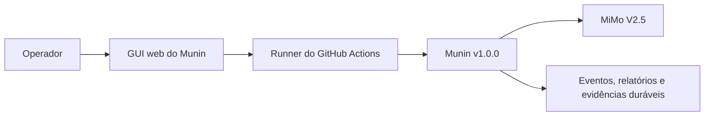
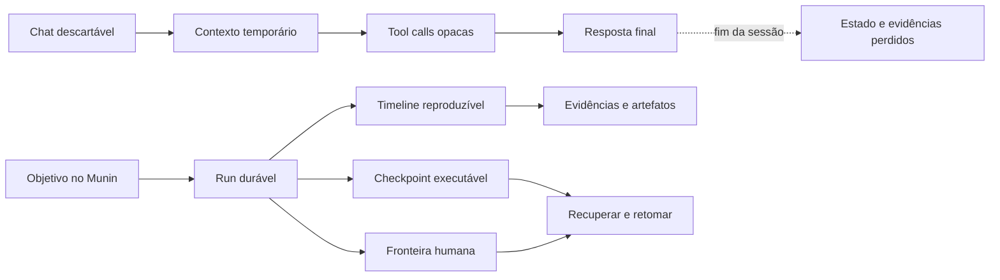
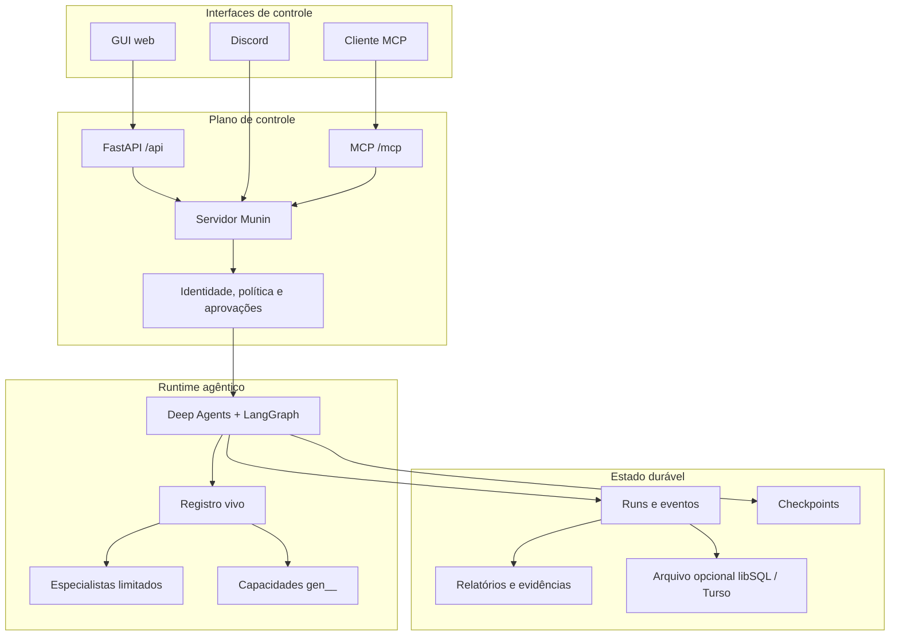
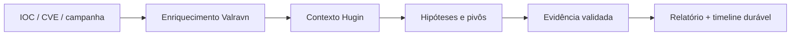
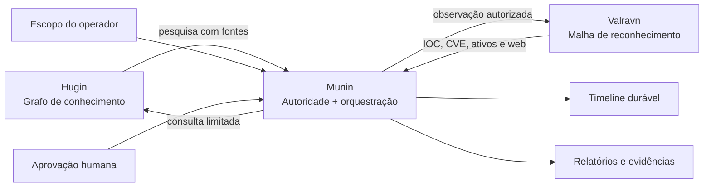

<p align="center">
  
</p>

<h1 align="center">Munin</h1>

<p align="center"><strong>Um runtime durável, governado por operadores, para operações autônomas de segurança.</strong></p>

<p align="center">Threat intelligence, red team autorizado, captura de evidências, aprovação humana e execução prolongada de agentes em um único plano de controle.</p>

<p align="center">
  <a href="README.md">English</a> ·
  <a href="README.es.md">Español</a> ·
  <strong>Português (BR)</strong> ·
  <a href="README.zh-CN.md">简体中文</a>
</p>

<p align="center">
  
  
  
  
  
  
</p>

> [!WARNING]
> **Somente para uso autorizado.** Munin foi criado para pesquisa legítima de segurança, inteligência de ameaças e operações controladas de red team. O operador é responsável por obter autorização, definir escopo, proteger credenciais, avaliar impacto e cumprir a legislação aplicável.

## Configuração verificada da v1.0.0

> [!IMPORTANT]
> A configuração testada e verificada para **Munin v1.0.0** é a **GUI web executada por GitHub Actions usando MiMo V2.5** como modelo.
>
> Outros provedores, modelos, destinos de implantação e interfaces podem funcionar, mas não fazem parte da configuração verificada da v1.0.0 salvo documentação explícita.

| Componente | Configuração verificada |
| --- | --- |
| Versão | **Munin v1.0.0** |
| Interface | **GUI web** |
| Ambiente de execução | **GitHub Actions** |
| Modelo | **MiMo V2.5** |



## Por que o Munin existe

A maioria dos agentes é construída em torno de uma janela de chat temporária. Operações de segurança não funcionam assim: duram horas ou dias, atravessam ferramentas e modelos, exigem aprovações, evidências, recuperação e uma explicação confiável do que o agente fez.

**Munin transforma uma conversa com um agente em uma operação durável, inspecionável e recuperável.**

| Agente descartável | Operação com Munin |
| --- | --- |
| O contexto desaparece ao encerrar a sessão | Conversas estáveis, checkpoints e eventos reproduzíveis |
| Tool calls são reconstruídas a partir de logs soltos | Intenção, saída, artefatos e falhas são eventos de primeira classe |
| Aprovação é apenas uma frase no prompt | Ações sensíveis param em fronteiras duráveis |
| Capacidades ficam presas em contexto estático | Um registro vivo compõe tools e especialistas em runtime |
| Reconectar pode duplicar execuções | Estado persistido e leases preservam continuidade |
| Trabalhos longos ficam opacos | O operador acompanha GUI, MCP ou Discord |



## O que o Munin é — e o que não é

| Munin é | Munin não é |
| --- | --- |
| Um runtime governado por operadores | Um hacker autônomo sem autorização |
| Uma camada durável de orquestração e evidências | Apenas outra interface de chat |
| Um sistema de delegação limitada | Uma garantia de que todo modelo agirá corretamente |
| Uma fronteira de política e aprovação | Um substituto para autorização formal |
| Um registro vivo de capacidades | Uma pasta onde qualquer arquivo vira executável |
| Um projeto source-available | Open source sem restrições comerciais |

## Principais capacidades

### Operações autônomas duráveis

LangGraph preserva estado executável enquanto uma timeline separada registra mensagens, tools, resultados, aprovações, artefatos e decisões do operador. Reconectar retorna à mesma operação.

### Controle humano real

Ações sensíveis pausam mostrando a capacidade e os argumentos exatos. Aprovar retoma essa ação; rejeitar ou deixar expirar não pode transformá-la silenciosamente em outra coisa.

### Um runtime, várias interfaces

GUI web, MCP e Discord compartilham identidade, política, estado e aprovações no servidor. São janelas para a mesma operação, não executores separados.

### Composição viva de capacidades

Munin combina tools nativas, skills revisadas, capacidades geradas e especialistas limitados. Tools geradas usam o namespace `gen__*` e passam por validação, registro, política e aprovação.

### Observabilidade orientada por evidências

Mensagens, raciocínio emitido pelo provedor, ciclo de vida de tools, output em streaming, delegações, artefatos e solicitações humanas permanecem como eventos separados e auditáveis.

## Arquitetura



| Camada | Responsabilidade |
| --- | --- |
| **Conhecimento** | Contexto, relações, referências e hipóteses |
| **Autoridade** | Escopo, identidade, aprovação e política |
| **Execução** | Tools, delegação, capacidades e estado agêntico |
| **Evidência** | Eventos, outputs, artefatos, decisões e recuperação |

## Casos de uso

### Investigação de threat intelligence

Comece com um IOC, CVE, campanha ou organização. Munin pode coordenar enriquecimento, manter hipóteses, delegar pesquisa limitada, preservar fontes e produzir um relatório sem perder o histórico da investigação.



### Operação de red team autorizada

Defina escopo, objetivos e requisitos de aprovação. Munin pode planejar, delegar especialistas, executar capacidades permitidas e parar antes de ações sensíveis.

### Objetivos autônomos de longa duração

GOAL e BEAST suportam trabalhos que precisam sobreviver a refresh, troca de runner ou reinício do processo, preservando TODOs, checkpoints e contexto operacional.

### Pesquisa centrada em evidências

Capture intenção, output, screenshots, artefatos, observações do modelo e decisões humanas como eventos independentes.

### Prototipagem de capacidades

Crie tools pequenas e específicas, valide, registre com procedência visível e exponha sob os mesmos controles de uma tool nativa.

## Ecossistema Munin



- **Hugin** fornece conhecimento passivo e rastreável.
- **Valravn** fornece observações externas e reconhecimento.
- **Munin** controla orquestração, estado, política, aprovação e continuidade.

## Modos operacionais

| Modo | Melhor para | Aprovações |
| --- | --- | --- |
| **Standard** | Operações interativas cuidadosas | Aprovação por ação |
| **YOLO** | Trabalho rápido em ambiente confiável e limitado | Ignora aprovações rotineiras; protege ações críticas |
| **GOAL** | Objetivos persistentes | Objetivo e TODO duráveis com reavaliação |
| **BEAST** | Planejamento profundo e delegação | Mais orçamento com escopo explícito e controles anti-runaway |

Os invariantes rígidos —preflight, aprovação crítica, auditoria e redação de tokens— permanecem em todos os modos.

## Início rápido

```bash
cp .env.example .env
poetry install
poetry run munin serve --host 127.0.0.1 --port 8787
```

Em outro terminal:

```bash
cd app
npm ci
npm run dev
```

Abra `http://localhost:3000`. Clientes MCP conectam em `http://127.0.0.1:8787/mcp/` com o bearer token configurado.

## Antes de uma operação

- Confirme `/health` e acesso autenticado à GUI.
- Verifique uma rodada completa de tool calling com o modelo escolhido.
- Inspecione as capacidades vivas.
- Confirme autorização formal e escopo.
- Defina quem pode aprovar, rejeitar e cancelar.
- Persista armazenamento ativo e checkpoints.
- Revise capacidade e argumentos antes de execuções sensíveis.

## Validação

```bash
poetry run pytest
cd app && npm run build
```

## Perguntas frequentes

### Munin é completamente autônomo?

Pode executar objetivos prolongados e delegar trabalho, mas a autoridade continua limitada por escopo, política e aprovações.

### É open source?

O código é público, mas a PolyForm Noncommercial restringe uso comercial. É source-available.

### Uma empresa pode usá-lo internamente?

Não sob a licença não comercial quando há aplicação comercial. É necessária uma licença separada.

### Uma skill recebe tools automaticamente?

Não. Skills fornecem contexto e instruções. Tool access, escopo e aprovação são controles separados.

### Posso usar outro modelo?

Possivelmente, mas a configuração verificada da v1.0.0 é GUI + GitHub Actions + MiMo V2.5.

## Licença

Munin é distribuído sob a [PolyForm Noncommercial License 1.0.0](LICENSE). Usos não comerciais permitidos são aceitos; qualquer uso comercial exige uma licença separada.

Como o uso comercial é restrito, Munin é **source-available**, não open source segundo a Open Source Initiative.

---

<p align="center"><em>O que foi visto uma vez nunca é esquecido.</em></p>
