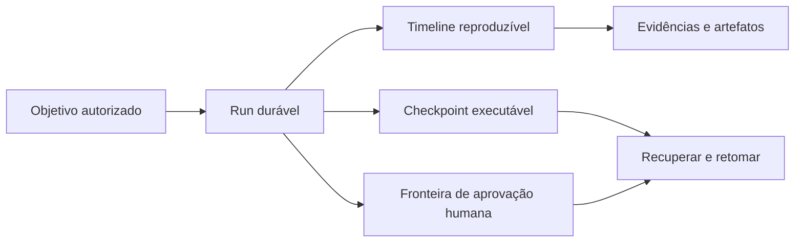
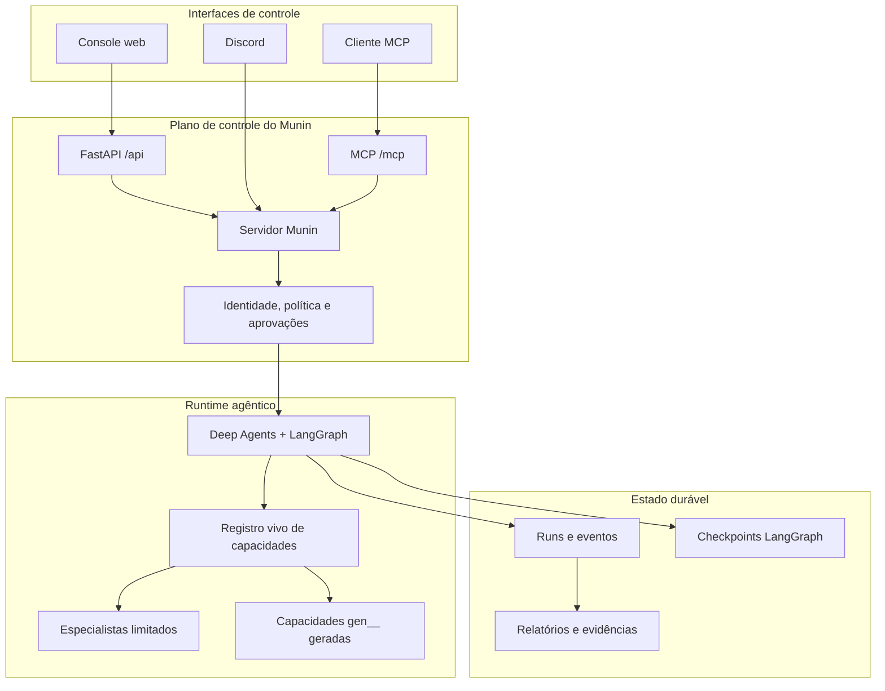
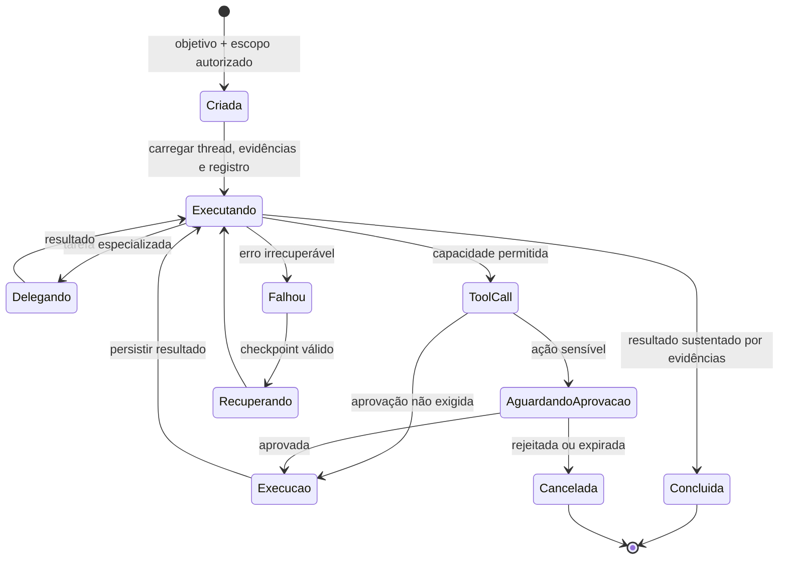

<p align="center">
  
</p>

<h1 align="center">Munin</h1>

<p align="center"><strong>Um runtime durável, governado por operadores, para operações autônomas de segurança.</strong></p>

<p align="center">
  <a href="README.md">English</a> ·
  <a href="README.es.md">Español</a> ·
  <strong>Português (BR)</strong> ·
  <a href="README.zh-CN.md">简体中文</a>
</p>

> **Somente para uso autorizado.** Munin foi criado para pesquisa legítima de segurança, inteligência de ameaças e operações controladas de red team. O operador é responsável por obter autorização, definir o escopo, proteger credenciais, revisar o impacto e cumprir a legislação aplicável.

> **Configuração verificada para o Munin v1.0.0:** interface gráfica web (**GUI**) executada por **GitHub Actions**, usando **MiMo V2.5** como modelo. Outras combinações podem funcionar, mas não fazem parte da configuração verificada da versão 1.0.0.

## Por que o Munin existe

A maioria dos agentes é construída em torno de uma janela de chat temporária. Operações de segurança não funcionam assim: podem durar horas ou dias, atravessam ferramentas e modelos e exigem evidências, aprovações, recuperação e rastreabilidade.

**Munin transforma esse trabalho em uma operação durável, não em uma conversa descartável.**

| Agente descartável | Operação com Munin |
| --- | --- |
| O contexto desaparece quando a sessão termina | Conversas estáveis, checkpoints e eventos reproduzíveis |
| Tool calls são reconstruídas a partir de logs | Intenção, saída, artefatos e falhas são eventos de primeira classe |
| Aprovação é apenas uma instrução no prompt | Ações sensíveis param em interrupções duráveis |
| Capacidades ficam copiadas em um prompt estático | O registro vivo compõe tools e especialistas em runtime |
| Reconexões podem duplicar execuções | Leases renováveis e estado persistido preservam continuidade |



## Principais capacidades

- **Operações duráveis:** LangGraph preserva o estado executável enquanto uma timeline separada registra mensagens, ferramentas, resultados, aprovações e artefatos.
- **Controle humano real:** ações sensíveis pausam com a capacidade e os argumentos exatos antes da execução.
- **Um runtime, várias interfaces:** GUI web, MCP e Discord compartilham política, identidade, estado e aprovações.
- **Registro vivo de capacidades:** ferramentas nativas, skills revisadas, subagentes e capacidades geradas `gen__*` são compostas em runtime.
- **Observabilidade orientada por evidências:** raciocínio emitido pelo provedor, ciclo de vida de tools, delegações e artefatos permanecem separados e auditáveis.

## Arquitetura



## Ciclo de uma operação



## Modos operacionais

| Modo | Melhor uso | Aprovações |
| --- | --- | --- |
| **Standard** | Operações interativas cuidadosas | Aprovação por ação |
| **YOLO** | Trabalho rápido em ambiente confiável e limitado | Ignora aprovações rotineiras; protege ações críticas |
| **GOAL** | Objetivos persistentes que sobrevivem a refresh e reinícios | Objetivo e TODO duráveis, com reavaliação |
| **BEAST** | Planejamento profundo e delegação | Mais orçamento com escopo explícito e controles anti-runaway |

Os invariantes rígidos —preflight, aprovação crítica, auditoria e redação de tokens— permanecem ativos em todos os modos.

## Hugin e Valravn

[Hugin](https://github.com/PrinceOfPwn/Hugin) é o componente de conhecimento: um grafo passivo de pesquisa de segurança com fontes e relações.

[Valravn](munin/valravn/) é a malha de reconhecimento externo: enriquecimento IOC/CVE, busca de ativos, pivôs históricos, RPKI, dark web e captura de evidências por meio das ferramentas `valravn_*`.

Nem o conhecimento nem a disponibilidade de uma ferramenta concedem autorização. Escopo e aprovação continuam sendo controles independentes.

## Início rápido

```bash
cp .env.example .env
poetry install
poetry run munin serve --host 127.0.0.1 --port 8787
```

Em outro terminal:

```bash
cd app
npm ci
npm run dev
```

Abra `http://localhost:3000`. Clientes MCP conectam em `http://127.0.0.1:8787/mcp/` usando o bearer token configurado.

## Validação

```bash
poetry run pytest
cd app && npm run build
```

## Licença

Munin é distribuído sob a [PolyForm Noncommercial License 1.0.0](LICENSE).

É permitido inspecionar, estudar, pesquisar, experimentar e modificar o código para usos não comerciais autorizados. O uso comercial —incluindo produtos ou serviços pagos, consultoria, operações comerciais internas ou aplicações com expectativa comercial— exige uma licença separada do titular dos direitos autorais.

Como o uso comercial é restrito, Munin é **source-available**, não open source segundo a definição da Open Source Initiative.

---

<p align="center"><em>O que foi visto uma vez nunca é esquecido.</em></p>
