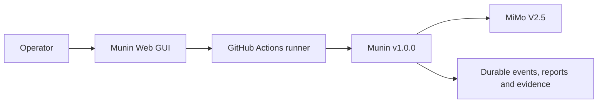
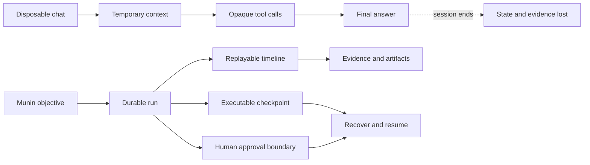
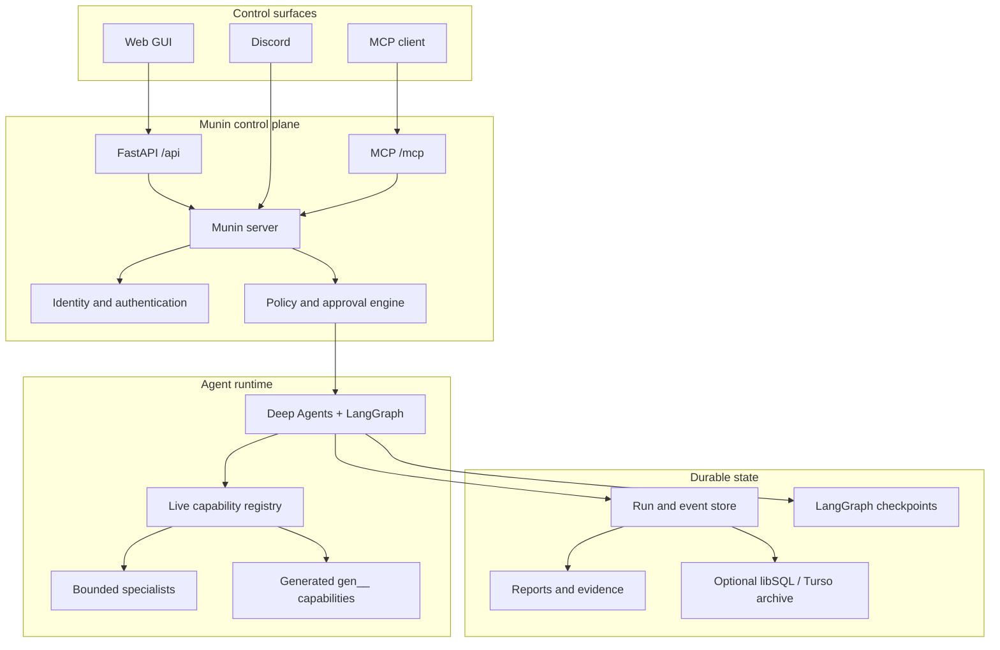
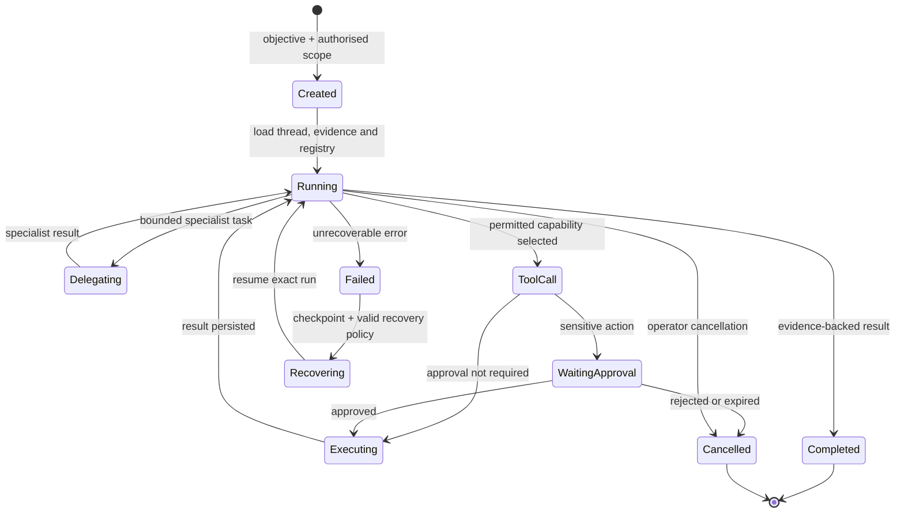
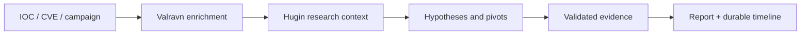
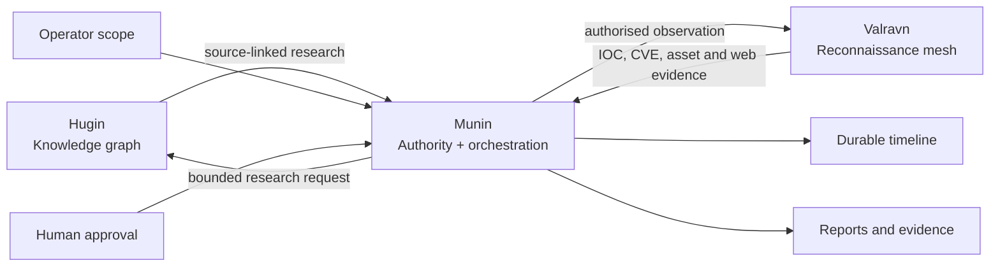
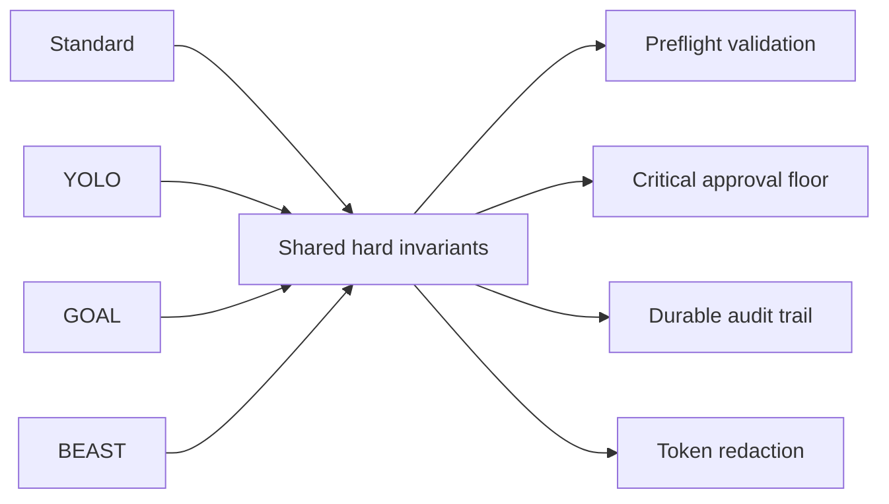
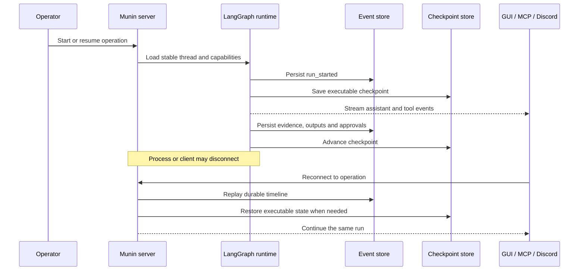
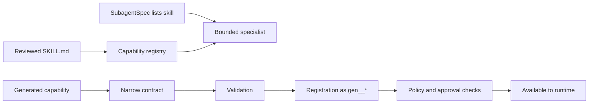

<p align="center">
  
</p>

<h1 align="center">Munin</h1>

<p align="center">
  <strong>Надежная среда исполнения под управлением оператора для автономных операций по безопасности.</strong>
</p>

<p align="center">
  Анализ угроз, санкционированные операции red-team, сбор доказательств, согласование человеком и долговременное исполнение агентов в едином плане управления.
</p>

<p align="center">
  <a href="README.md">English</a> ·
  <a href="README.es.md">Español</a> ·
  <a href="README.pt-BR.md">Português (BR)</a> ·
  <a href="README.zh-CN.md">简体中文</a> ·
  <strong>Русский</strong> ·
  <a href="README.ko.md">한국어</a>
</p>

<p align="center">
  <a href="https://www.python.org/"></a>
  <a href="https://fastapi.tiangolo.com/"></a>
  <a href="https://langchain-ai.github.io/langgraph/"></a>
  <a href="https://modelcontextprotocol.io/"></a>
  <a href="https://nextjs.org/"></a>
  <a href="https://www.typescriptlang.org/"></a>
  <a href="https://www.sqlite.org/"></a>
  <a href="LICENSE"></a>
</p>

<p align="center">
  <a href="#verified-v100-configuration"><strong>Проверенная конфигурация</strong></a> ·
  <a href="#why-munin"><strong>Почему Munin</strong></a> ·
  <a href="#architecture"><strong>Архитектура</strong></a> ·
  <a href="#use-cases"><strong>Сценарии использования</strong></a> ·
  <a href="#quick-start"><strong>Быстрый старт</strong></a> ·
  <a href="#faq"><strong>FAQ</strong></a>
</p>

> [!WARNING]
> **Только для санкционированного использования.** Munin предназначен для легитимных исследований в области безопасности, анализа угроз и контролируемых операций red-team. Вы несете ответственность за получение разрешения, определение рамок (scope), защиту учетных данных, оценку воздействия и соблюдение применимого законодательства. Работающее развертывание или успешный вызов инструмента не являются подтверждением санкционирования.

## Verified v1.0.0 configuration

> [!IMPORTANT]
> Протестированной и проверенной рабочей конфигурацией для **Munin v1.0.0** является **веб-интерфейс (GUI), работающий через GitHub Actions с моделью MiMo V2.5**.
>
> Другие провайдеры, модели, целевые среды развертывания и интерфейсы управления могут работать, но они не входят в проверенную конфигурацию v1.0.0, если это не задокументировано явно.

| Компонент | Проверенная конфигурация |
| --- | --- |
| Версия | **Munin v1.0.0** |
| Интерфейс | **Web GUI** |
| Среда исполнения | **GitHub Actions** |
| Модель | **MiMo V2.5** |



## Why Munin

Большинство агентских систем построены вокруг временного окна чата. Операции по безопасности устроены иначе. Они длятся часы или дни, охватывают множество инструментов и моделей, требуют доказательств и согласований и должны выдерживать обрывы связи, перезапуски процессов и смену контекста оператора.

**Munin превращает диалог с агентом в надежную, инспектируемую операцию.**

| Одноразовый цикл агента | Операция Munin |
| --- | --- |
| Контекст исчезает после завершения сеанса | Стабильные диалоги, контрольные точки (checkpoints) и воспроизводимые события |
| Действия инструментов восстанавливаются из разрозненных логов | Намерения, результаты, артефакты и сбои являются событиями первого класса |
| Согласование — это неформальная фраза в промпте | Чувствительные действия приостанавливаются на надежных границах исполнения |
| Возможности копируются в статический контекст | Живой реестр компонует инструменты и специалистов во время выполнения |
| Повторные подключения грозят дублированием исполнения | Сохраняемое состояние и возобновляемые аренды (leases) защищают непрерывность |
| Длительные задачи становятся непрозрачными | Операторы следят за прогрессом через GUI, MCP и Discord |
| Итоговые ответы скрывают процесс | Доказательства, решения и артефакты остаются доступными для независимого аудита |



## What Munin is — and what it is not

| Munin — это | Munin — это не |
| --- | --- |
| Среда исполнения под управлением оператора | Автономный хакер без ограничений прав |
| Надежный слой оркестрации и сбора доказательств | Просто еще один интерфейс чата |
| Система ограниченного делегирования | Гарантия того, что любая модель будет вести себя корректно |
| Граница политик и согласований | Замена письменного разрешения |
| Живой реестр возможностей | Папка, где каждый файл становится исполняемым |
| Исследовательский проект с доступным исходным кодом (source-available) | Открытый исходный код (open source) без коммерческих ограничений |

## Core capabilities

### Durable autonomous operations

Контрольные точки LangGraph сохраняют исполняемое состояние, пока отдельная временная шкала событий фиксирует сообщения, доказательства, инструменты, артефакты, согласования и решения оператора. Повторное подключение возвращает к той же операции вместо незаметного запуска новой.

### Human control at the execution boundary

Согласование является частью среды исполнения, а не рекомендацией внутри промпта. Чувствительные действия приостанавливаются с указанием точной возможности и аргументов. Одобрение возобновляет действие; отклонение или истечение срока не могут незаметно превратиться во что-то другое.

### One runtime, multiple control surfaces

Веб-интерфейс, клиенты MCP и Discord обращаются к единому серверному слою идентичности, политик, состояния и согласований. Они представляют собой окна в одну операцию, а не отдельные исполнители.

### Live capability composition

Munin компонует встроенные инструменты, проверенные навыки (skills), сгенерированные возможности и ограниченных специалистов во время выполнения. Сгенерированные инструменты используют пространство имен `gen__*` и должны проходить валидацию, регистрацию и те же проверки политик, что и встроенные возможности.

### Evidence-first observability

Сообщения ассистента, рассуждения провайдера, жизненный цикл инструментов, потоковый вывод, делегирования, артефакты и запросы человека остаются отдельными, воспроизводимыми событиями. Munin не фабрикует скрытые рассуждения и не сводит операцию к неясной строке состояния.

## Architecture



Munin разделяет четыре ключевые сферы ответственности:

| Слой | Зона ответственности |
| --- | --- |
| **Знания** | Исследовательский контекст, связи, ссылки и гипотезы |
| **Полномочия** | Рамки (scope), идентичность, согласования и соблюдение политик |
| **Исполнение** | Инструменты, делегирование, сгенерированные возможности и состояние агента |
| **Доказательства** | События, артефакты, результаты, решения и история восстановления |

## Operation lifecycle



## Use cases

### Threat intelligence investigation

Начните с IOC, уязвимости, кампании или организации. Munin может координировать обогащение данных, собирать доказательства с привязкой к источникам, поддерживать гипотезы, делегировать ограниченные исследовательские задачи и формировать отчет без потери временной шкалы расследования.



### Authorised red-team operation

Определите рамки, цели и требования к согласованию. Munin может планировать, делегировать задачи специалистам, вызывать разрешенные возможности и останавливаться на границах согласования человеком перед чувствительными действиями.

### Long-running autonomous objective

Используйте режим GOAL или BEAST для работы, которая должна сохраняться при обновлении браузера, смене среды выполнения (runner) или перезапуске процесса. Сохраняемое состояние задач (TODO) и контрольные точки обеспечивают целостность операции.

### Evidence-heavy security research

Фиксируйте намерения инструментов, потоковый вывод, скриншоты, артефакты, наблюдения модели и решения оператора как отдельные события, которые можно воспроизвести и проверить позже.

### Capability prototyping

Создавайте узкоспециализированные сгенерированные инструменты, проверяйте их, регистрируйте с видимым происхождением и предоставляйте к ним доступ только через те же средства контроля политик и согласований, что и для встроенных инструментов.

## The Munin ecosystem



- **Hugin** предоставляет пассивные знания с маркировкой происхождения.
- **Valravn** предоставляет внешние наблюдения и данные разведки.
- **Munin** отвечает за оркестрацию, состояние, политики, согласование и непрерывность доказательств.

Ни наличие знаний, ни доступность инструментов не дают разрешения на выполнение действий.

## Operation modes

| Режим | Назначение | Поведение при согласовании |
| --- | --- | --- |
| **Standard** | Осторожные интерактивные операции | Согласование каждого действия |
| **YOLO** | Быстрая работа в доверенной ограниченной среде | Пропуск рутинных согласований; критические действия остаются защищенными |
| **GOAL** | Долговременные цели, сохраняющиеся при перезапусках | Сохраняемая цель, состояние задач (TODO) и плановая переоценка |
| **BEAST** | Глубокое планирование и делегирование специалистам | Расширенные бюджеты с явными рамками и защитой от бесконтрольного выполнения |



## Persistence and recovery



SQLite хранит активные диалоги, запуски и события. Контрольные точки LangGraph по умолчанию используют персистентный SQLite. Архив libSQL или Turso может дублировать надежные записи для более длительного сохранения непрерывности.

## Quick start

### Требования

- Python 3.11+
- Poetry
- Node.js и npm
- Эндпоинт модели, совместимый с OpenAI

### 1. Настройка

```bash
cp .env.example .env
```

Установите надежный `MUNIN_MASTER_KEY`, `MUNIN_MCP_AUTH_TOKEN`, разрешенный локальный origin и конфигурацию провайдера моделей.

### 2. Запуск сервера

```bash
poetry install
poetry run munin serve --host 127.0.0.1 --port 8787
```

### 3. Запуск GUI

```bash
cd app
npm ci
npm run dev
```

Откройте `http://localhost:3000`. Клиенты MCP подключаются к `http://127.0.0.1:8787/mcp/` с настроенным токеном Bearer.

> [!TIP]
> Оставляйте привязку Munin к loopback, если вы не настроили защищенный обратный прокси-сервер, явную политику origin, аутентификацию и персистентное хранилище.

## Before an operational session

- Подтвердите доступность `/health` и аутентифицированный доступ к GUI.
- Убедитесь, что выбранная модель успешно выполняет полный цикл структурированного вызова инструментов.
- Проверьте живой состав возможностей вместо использования скопированного списка.
- Подтвердите наличие письменного разрешения и границы целей.
- Определите, кто может одобрять, отклонять и отменять чувствительные действия.
- Обеспечьте сохраняемость как активного состояния, так и хранилища контрольных точек.
- Проверьте точную возможность и аргументы перед выполнением действий, имеющих последствия.

## Skills and self-extension



Файл `SKILL.md` содержит инструкции и контекст; он не приобретает статус исполняемых полномочий только из-за своего существования на диске.

## Validation

```bash
poetry run pytest
cd app && npm run build
```

## Documentation

| Руководство | Назначение |
| --- | --- |
| [Architecture](ARCHITECTURE.md) | Границы системы и инварианты |
| [Runtime architecture](docs/architecture.md) | Контракты исполнения и событий |
| [Persistence](docs/architecture-persistence.md) | Роли восстановления и хранения |
| [System guide](docs/munin-system-guide.md) | Формирование и отслеживание запуска |
| [Operator guide](docs/operator-guide.md) | Практики развертывания и эксплуатации |
| [Capability reference](docs/tools_reference.md) | Инструменты, навыки и сгенерированные расширения |
| [Provider contract](docs/llm-providers.md) | Требования к эндпоинтам моделей |
| [Security notes](docs/security-notes.md) | Границы и контрольный список проверки |
| [GitHub Actions guide](docs/github-actions-tutorial.md) | Временные живые сеансы |
| [Valravn](docs/VALRAVN.md) | Разведывательная сеть и провайдеры |

## FAQ

### Является ли Munin полностью автономным?

Он может выполнять долговременные цели и делегировать работу, однако полномочия остаются ограниченными рамками оператора, политикой и требованиями к согласованию.

### Является ли Munin программой с открытым исходным кодом?

Исходный код доступен публично, но лицензия PolyForm Noncommercial ограничивает коммерческое использование. Это проект с доступным исходным кодом (source-available), а не открытый исходный код по определению OSI.

### Могут ли компании использовать Munin для внутренних нужд?

Не под некоммерческой лицензией, если использование имеет коммерческое применение. Требуется отдельная коммерческая лицензия.

### Получает ли навык автоматический доступ к инструментам?

Нет. Навыки предоставляют контекст и инструкции. Доступ к инструментам, рамки и согласование являются отдельными элементами управления среды исполнения.

### Могу ли я использовать модель, отличную от MiMo V2.5?

Потенциально да. Однако проверенная конфигурация v1.0.0 — это веб-интерфейс на GitHub Actions с MiMo V2.5.

### Заменяет ли Munin суждение аналитика?

Нет. Он сохраняет доказательства, состояние и решения, чтобы аналитики могли более эффективно проверять и управлять операцией.

## License

Munin распространяется по лицензии [PolyForm Noncommercial License 1.0.0](LICENSE).

Вы можете инспектировать, изучать, исследовать, экспериментировать и модифицировать исходный код в разрешенных некоммерческих целях. Коммерческое использование — включая платные продукты или услуги, консалтинговые услуги, внутренние коммерческие операции или планируемое коммерческое применение — требует отдельной коммерческой лицензии от правообладателя.

Поскольку коммерческое использование ограничено, Munin является **source-available**, а не открытым исходным кодом по определению Open Source Initiative.

---

<p align="center"><em>Знание переживает битву.</em></p>
<p align="center"><sub>Знание переживает битву.</sub></p>
