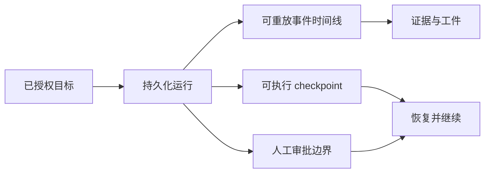
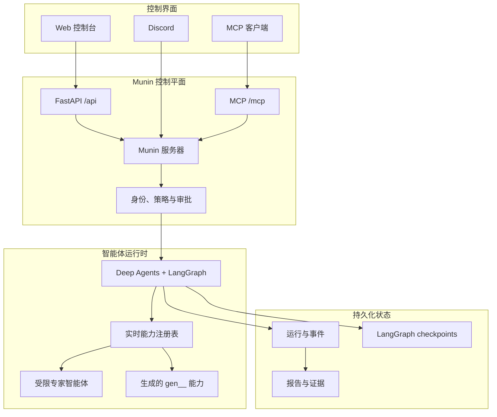
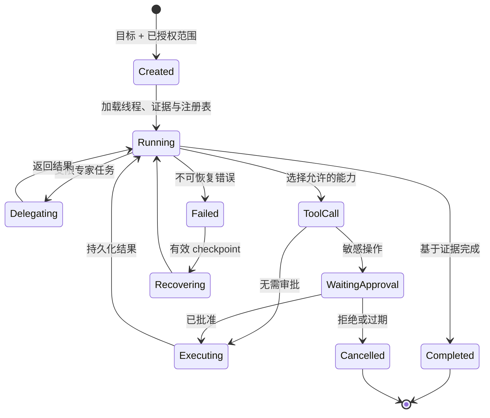

<p align="center">
  
</p>

<h1 align="center">Munin</h1>

<p align="center"><strong>一个由操作员治理、面向自主安全行动的持久化运行时。</strong></p>

<p align="center">
  <a href="README.md">English</a> ·
  <a href="README.es.md">Español</a> ·
  <a href="README.pt-BR.md">Português (BR)</a> ·
  <strong>简体中文</strong>
</p>

> **仅限授权用途。** Munin 面向合法的安全研究、威胁情报和受控红队行动。操作员必须负责获得授权、定义范围、保护凭据、评估影响并遵守适用法律。

> **Munin v1.0.0 已验证配置：** 通过 **GitHub Actions** 运行 Web 图形界面（**GUI**），并使用 **MiMo V2.5** 作为模型。其他组合可能可以工作，但不属于 v1.0.0 的已验证配置。

## 为什么需要 Munin

多数智能体系统围绕临时聊天窗口构建，但安全行动并不是一次性对话。它们可能持续数小时甚至数天，跨越多种工具、模型和界面，并且需要证据、审批、恢复能力和完整审计记录。

**Munin 将这些工作变成可恢复、可审计的持久化行动，而不是一次性聊天。**

| 一次性智能体 | Munin 行动 |
| --- | --- |
| 会话结束后上下文消失 | 稳定会话、checkpoint 和可重放事件 |
| 从日志中重建工具调用 | 意图、输出、工件和失败都是一等事件 |
| 审批只是 prompt 中的一句话 | 敏感操作在持久化中断点暂停 |
| 能力被复制进静态 prompt | 实时注册表在运行时组合工具与专家 |
| 重连可能导致重复执行 | 可续租 lease 与持久化状态保证连续性 |



## 核心能力

- **持久化自主行动：** LangGraph 保存可执行状态，独立时间线记录消息、工具、结果、审批和工件。
- **真实的人工控制：** 敏感操作会在执行前显示确切能力与参数并暂停。
- **一个运行时，多种界面：** Web GUI、MCP 与 Discord 共享同一套策略、身份、状态与审批层。
- **实时能力注册表：** 原生工具、已审查 skills、子智能体以及生成的 `gen__*` 能力都在运行时组合。
- **证据优先的可观测性：** 模型提供商输出的推理、工具生命周期、委派和工件保持分离并可审计。

## 架构



## 行动生命周期



## 运行模式

| 模式 | 最适合 | 审批行为 |
| --- | --- | --- |
| **Standard** | 谨慎的交互式行动 | 每个操作单独审批 |
| **YOLO** | 可信且边界明确的快速行动 | 跳过常规审批，但关键操作仍受保护 |
| **GOAL** | 需要跨刷新和重启持续存在的目标 | 持久化目标、TODO 与重新评估 |
| **BEAST** | 深度规划和专家委派 | 更高预算，同时保留明确范围与防失控机制 |

所有模式都保留硬性约束：preflight、关键审批底线、持久化审计和 token 脱敏。

## Hugin 与 Valravn

[Hugin](https://github.com/PrinceOfPwn/Hugin) 是知识组件：一个带来源和关系的被动安全研究知识图谱。

[Valravn](munin/valravn/) 是外部侦察网格：提供 IOC/CVE 富化、资产搜索、历史 Web pivot、RPKI、暗网搜索以及通过 `valravn_*` 工具进行证据捕获。

知识或工具可用性本身并不授予执行权限。范围与审批始终是独立控制。

## 快速开始

```bash
cp .env.example .env
poetry install
poetry run munin serve --host 127.0.0.1 --port 8787
```

在另一个终端中：

```bash
cd app
npm ci
npm run dev
```

打开 `http://localhost:3000`。MCP 客户端使用配置好的 bearer token 连接到 `http://127.0.0.1:8787/mcp/`。

## 验证

```bash
poetry run pytest
cd app && npm run build
```

## 许可证

Munin 使用 [PolyForm Noncommercial License 1.0.0](LICENSE)。

允许在许可的非商业用途下查看、学习、研究、实验和修改源码。商业使用——包括付费产品或服务、咨询、企业内部商业运营或预期商业应用——需要版权所有者单独授权。

由于限制商业使用，Munin 属于 **source-available**，而不是 Open Source Initiative 定义下的开源软件。

---

<p align="center"><em>凡所见者，永不遗忘。</em></p>
