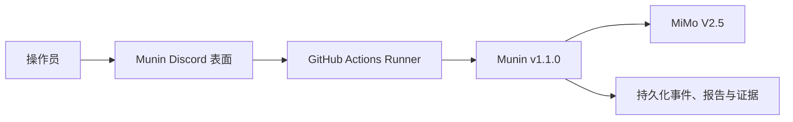
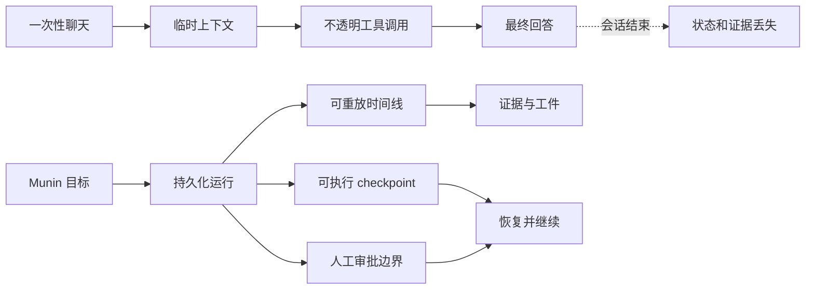
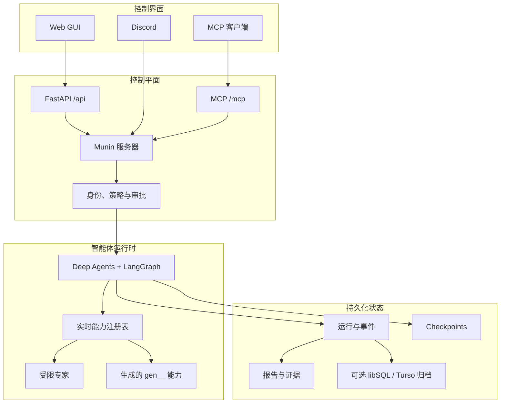
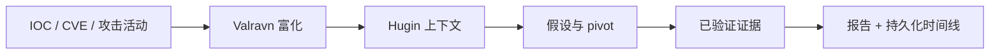
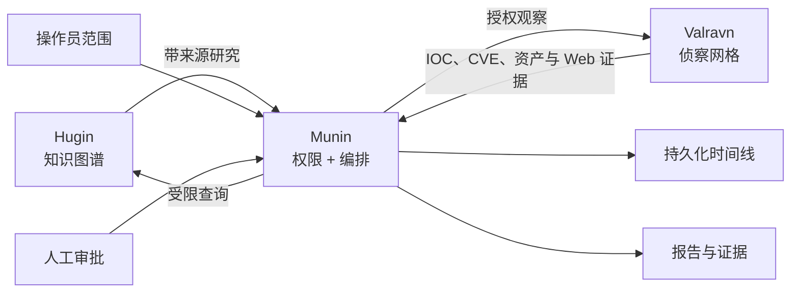

<p align="center">
  
</p>

<h1 align="center">Munin</h1>

<p align="center"><strong>一个由操作员治理、面向自主安全行动的持久化运行时。</strong></p>

<p align="center">将威胁情报、授权红队行动、证据采集、人工审批和长时间智能体执行统一到一个控制平面中。</p>

<p align="center">
  <a href="README.md">English</a> ·
  <a href="README.es.md">Español</a> ·
  <a href="README.pt-BR.md">Português (BR)</a> ·
  <strong>简体中文</strong> ·
  <a href="README.ru.md">Русский</a> ·
  <a href="README.ko.md">한국어</a>
</p>

<p align="center">
  
  
  
  
  
  
</p>

> [!WARNING]
> **仅限授权用途。** Munin 面向合法的安全研究、威胁情报和受控红队行动。操作员必须负责获得授权、定义范围、保护凭据、评估影响并遵守适用法律。

## v1.1.0 已验证配置

> [!IMPORTANT]
> **Munin v1.1.0** 已测试和验证的配置是：通过 **GitHub Actions** 运行 **Discord 操作员适配器**，并使用 **MiMo V2.5** 作为模型。
>
> **Discord 是当前稳定的操作面。** Web GUI 是长期目标界面，但实时会话测试发现的
> 前端 bug 仍在修复中；在修复循环通过之前，Discord 是完整操作的参考表面。
>
> 其他模型、提供商、部署环境和控制界面可能可以工作，但除非明确记录，否则不属于 v1.1.0 的已验证配置。

| 组件 | 已验证配置 |
| --- | --- |
| 版本 | **Munin v1.1.0** |
| 界面 | **Discord 操作员适配器**（Web GUI 修复中） |
| 执行环境 | **GitHub Actions** |
| 模型 | **MiMo V2.5** |



## 为什么需要 Munin

多数智能体系统围绕临时聊天窗口构建，但安全行动并不是一次性对话。它们可能持续数小时甚至数天，跨越多种工具和模型，并且需要审批、证据、恢复能力以及对智能体行为的可靠解释。

**Munin 将智能体对话转化为可恢复、可检查、可审计的持久化行动。**

| 一次性智能体 | Munin 行动 |
| --- | --- |
| 会话结束后上下文消失 | 稳定会话、checkpoint 和可重放事件 |
| 从零散日志中重建工具调用 | 意图、输出、工件和失败都是一等事件 |
| 审批只是 prompt 中的一句话 | 敏感操作在持久化执行边界暂停 |
| 能力被复制进静态上下文 | 实时注册表在运行时组合工具与专家 |
| 重连可能导致重复执行 | 持久化状态和 lease 保护连续性 |
| 长任务变得不可见 | 操作员可通过 GUI、MCP 或 Discord 跟踪进展 |



## Munin 是什么 — 又不是什么

| Munin 是 | Munin 不是 |
| --- | --- |
| 由操作员治理的运行时 | 无授权的自主黑客 |
| 持久化编排与证据层 | 另一个普通聊天界面 |
| 有边界的任务委派系统 | 对所有模型行为的保证 |
| 策略与审批边界 | 正式授权的替代品 |
| 实时能力注册表 | 任何文件都能自动执行的目录 |
| source-available 研究项目 | 可自由商业使用的开源软件 |

## 核心能力

### 持久化自主行动

LangGraph 保存可执行状态，独立时间线记录消息、工具、结果、审批、工件和操作员决定。重新连接会返回同一个行动，而不是偷偷创建新的运行。

### 真实的人工控制

敏感操作会显示准确能力和参数并暂停。批准只恢复该操作；拒绝或过期不会静默变成其他调用。

### 一个运行时，多种界面

Web GUI、MCP 和 Discord 共享服务器端身份、策略、状态和审批层。它们是同一行动的不同窗口，而不是独立执行器。

### 实时能力组合

Munin 在运行时组合原生工具、已审查 skills、生成能力和受限专家。生成工具使用 `gen__*` 命名空间，并经过验证、注册、策略和审批流程。

### 证据优先的可观测性

消息、模型提供商输出的推理、工具生命周期、流式输出、委派、工件和人工请求都会保持为独立、可重放事件。

## 架构



| 层 | 职责 |
| --- | --- |
| **知识** | 上下文、关系、引用和假设 |
| **权限** | 范围、身份、审批和策略 |
| **执行** | 工具、委派、生成能力和智能体状态 |
| **证据** | 事件、输出、工件、决定和恢复历史 |

## 使用场景

### 威胁情报调查

从 IOC、CVE、攻击活动或组织开始。Munin 可以协调富化、维护假设、委派受限研究任务、保留来源并输出报告，同时不丢失调查历史。



### 授权红队行动

定义范围、目标和审批要求。Munin 可以规划、委派专家、调用允许的能力，并在敏感操作前暂停等待人工批准。

### 长时间自主目标

GOAL 和 BEAST 适合需要跨页面刷新、runner 切换或进程重启继续执行的工作，并保留 TODO、checkpoint 和行动上下文。

### 证据密集型研究

将工具意图、输出、截图、工件、模型观察和人工决定保存为独立事件，方便之后重放和审计。

### 能力原型设计

创建小而明确的工具，完成验证和注册，保留可见来源，并在与原生工具相同的控制下暴露给运行时。

## Munin 生态系统



- **Hugin** 提供被动、可追溯的知识。
- **Valravn** 提供外部观察和侦察证据。
- **Munin** 管理编排、状态、策略、审批和证据连续性。

知识或工具可用性本身并不授予执行权限。

## 运行模式

| 模式 | 最适合 | 审批行为 |
| --- | --- | --- |
| **Standard** | 谨慎的交互式行动 | 每个操作单独审批 |
| **YOLO** | 可信且边界明确的快速行动 | 跳过常规审批，但关键操作仍受保护 |
| **GOAL** | 持久化目标 | 持久化目标、TODO 和重新评估 |
| **BEAST** | 深度规划和专家委派 | 更高预算，同时保留明确范围与防失控机制 |

所有模式都保留硬性约束：preflight、关键审批底线、持久化审计和 token 脱敏。

## 快速开始

```bash
cp .env.example .env
poetry install
poetry run munin serve --host 127.0.0.1 --port 8787
```

在另一个终端中：

```bash
cd app
npm ci
npm run dev
```

打开 `http://localhost:3000`。MCP 客户端使用配置好的 bearer token 连接到 `http://127.0.0.1:8787/mcp/`。

## 行动前检查

- 确认 `/health` 和已认证 GUI 访问。
- 验证所选模型能完成结构化工具调用。
- 检查实时能力表，而不是依赖复制的清单。
- 确认正式授权和目标范围。
- 明确谁可以批准、拒绝和取消。
- 持久化活动存储和 checkpoint。
- 在敏感执行前检查具体能力和参数。

## 验证

```bash
poetry run pytest
cd app && npm run build
```

## 常见问题

### Munin 是完全自主的吗？

它可以执行长时间目标并委派任务，但权限仍受范围、策略和审批约束。

### Munin 是开源软件吗？

源码公开，但 PolyForm Noncommercial 限制商业使用，因此它是 source-available。

### 企业可以内部使用吗？

如果存在商业应用，则不能直接依据非商业许可证使用，需要单独商业授权。

### Skill 会自动获得工具权限吗？

不会。Skill 只提供上下文和说明；工具权限、范围和审批是独立控制。

### 可以使用其他模型吗？

可能可以，但 v1.1.0 的已验证配置是 Discord 适配器 + GitHub Actions + MiMo V2.5。

## 许可证

Munin 使用 [PolyForm Noncommercial License 1.0.0](LICENSE)。允许许可范围内的非商业使用；任何商业使用都需要版权所有者单独授权。

由于限制商业使用，Munin 属于 **source-available**，而不是 Open Source Initiative 定义下的开源软件。

---

<p align="center"><em>Знание переживает битву.</em></p>
<p align="center"><sub>知识超越战场，历久弥存。</sub></p>
