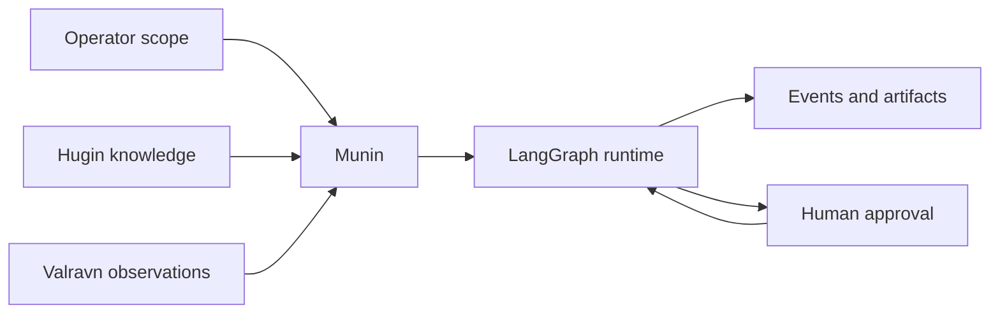

# Munin complete handbook

[Español](../es/handbook.md) · [Português BR](../pt-BR/handbook.md) · [简体中文](../zh-CN/handbook.md)

## Overview

Munin is a durable, operator-governed runtime for autonomous security
operations. It combines the Discord operator surface, authenticated API, MCP,
evolving Web GUI, LangGraph execution, durable events, checkpoints, human
approvals, live capability composition, Hugin knowledge and Valravn
reconnaissance.

The verified v1.1.0 configuration is **Discord adapter + GitHub Actions +
DeepSeek V4-Flash**. The Web GUI is the target long-term interface but is under repair
after live-session frontend bugs; treat GUI-only claims as unverified until the
repair loop passes. Other models and deployments may work but remain
experimental until documented.

## Core model

Munin separates knowledge, authority, execution and evidence. Knowledge can
suggest a path; only server policy and operator scope authorize execution.
Tools perform work; events and artifacts preserve what happened.

## Interfaces

Discord is the stable v1.1.0 operator surface: presence, commands, threads and
approvals. The Web GUI remains in active development. `/api/*` serves
authenticated application operations. `/mcp/` exposes the live capability
surface. None of these clients owns independent authority.

## Runs, events and recovery

A conversation owns a stable LangGraph thread. A run holds a renewable lease.
Events are append-oriented and replayable. Checkpoints preserve executable graph
state. After process loss, safe recovery can resume the exact thread without
asking the model to recreate history. Pending human requests remain paused.

## Operation modes

- **Standard:** per-action approvals.
- **YOLO:** fewer routine approvals inside trusted scope; critical controls stay.
- **GOAL:** durable objective and TODO state.
- **BEAST:** deeper planning and delegation with larger guarded budgets.

Modes never remove audit, critical approval, secret redaction or server policy.

## Capability system

The live registry can include native tools, Valravn, reviewed skills, bounded
specialists, autonomy-kernel tools and generated `gen__*` capabilities. Runtime
discovery is authoritative. A skill or file does not become executable merely
because it exists.

## Hugin and Valravn

Hugin provides passive, source-linked security knowledge. Valravn collects
external IOC, CVE, asset, historical-web, routing, dark-web and browser evidence.
Both are untrusted research inputs until validated for the authorized target.

## Soul profiles

The bundled Soul is a specialized CTF/lab characterization. It is not the
recommended default. Production and defensive users should adopt a neutral or
organization-specific profile through the human-reviewed Soul proposal flow.
Soul never grants authorization, tools or scope.

## Operating checklist

1. Confirm written authorization and scope.
2. Validate health, authentication and allowed origins.
3. Test a complete structured tool-call loop.
4. Inspect the live capability registry.
5. Persist hot and checkpoint storage.
6. Define approvers and cancellation authority.
7. Review evidence and exact tool arguments throughout the run.

## Deployment

For v1.1.0, the tested path is the Discord adapter on GitHub Actions with
DeepSeek V4-Flash. The Web GUI follows once its repair loop passes.
Ephemeral runners require explicit persistence through artifacts or remote
storage. Production deployments need durable volumes, protected ingress,
strong secrets, strict origins and retention controls.

## Security model

The server owns identity, policy, approval and run state. External content,
provider results, Hugin cards and web pages are untrusted data. Generated tools
must pass validation and the same policy boundary as native tools. A successful
tool call does not prove authorization or mission success.

## Licensing

Munin uses PolyForm Noncommercial 1.0.0. Noncommercial research and study are
permitted under the license. Commercial products, services, consulting and
internal commercial applications require a separate license.

**Знание переживает битву.** — Knowledge outlives the battle.
