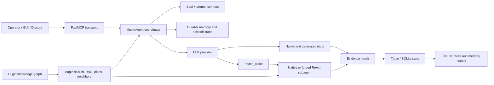

# Munin: operating model

Munin is an operator-governed security orchestration system, not only a chat
interface. It combines a ReAct coordinator, durable state, a capability
registry, native and forged subagents, a knowledge graph bridge to Hugin, and a
web/Discord control surface.

This document is the canonical map of how those pieces fit together.

## The system in one picture



The coordinator owns the campaign. Subagents execute bounded assignments and
return evidence. Hugin supplies contextual knowledge and relationship evidence;
it never grants authorization or silently changes scope.

## What happens during `munin_chat`

The current coordinator is a bounded ReAct loop:

```text
operator request
  -> compose Soul, memory, Hugin context, and tool catalog
  -> LLM decision and optional observable decision summary
  -> one tool call or one delegation
  -> persist the complete result and episodic event
  -> feed the observation back to the LLM
  -> stop on evidence-backed completion, blocker, approval request, or limit
```

Tools can themselves be asynchronous jobs and subagents can continue after the
HTTP request has returned. The UI exposes the run and trace identifiers so an
operator can follow long-running work without losing continuity.

## Persistence and continuity

Turso is the preferred online authority for shared state. The storage layer
contains semantic facts, episodic events, shared intelligence, agent presence,
wake queue items, generated tool metadata/source, generated graph definitions,
cache entries, and conversation artifacts. SQLite remains a compatible local
backend for development and isolated tests.

Every meaningful action should have a stable `run_id` and, where applicable, a
`trace_id`, `tool_call_id`, `finding_id`, or graph identifier. These IDs connect
the operator view, agent handoff, evidence, and post-run audit.

## The capability layers

### Native tools

Native MCP tools cover LDAP/OpenLDAP, passive intelligence, Hugin, memory,
shared-state coordination, diagnostics, jobs, Soul, and forge operations.
Active reconnaissance tools are subject to target scope, authorization and
OPSEC gates.

### Generated tools

`tool_forge` produces an English Python artifact with a typed contract. Munin
validates imports and syntax, executes it in the sandbox, registers it as
`gen__<slug>`, persists its source and metadata, and should invoke it as part
of the same campaign to prove the closed loop. A generated file on disk is only
a cache; the durable registry is the source of truth.

### Native subagents

`ldap_agent`, `tool_forge`, and `graph_forge` are implemented specialists.
`munin_wake` places a bounded task on the durable wake queue. The runner claims
the task, loads shared context, executes its ReAct loop, posts a compact
handoff, and records presence and trace events.

### Forged graphs

`graph_forge` creates a persisted specialist configuration: English identity and
contract fields, a Chinese internal system prompt, an effective tool list, and
an execution contract. The whitelist supplied by the operator is an initial
recommendation; the forge may add an already registered capability when the
declared purpose requires it, then deduplicates by exact name and contract.
The resulting graph is still executed by the common ReAct runner; it is not a
new Python class.

## Hugin inside Munin

Hugin is Munin's knowledge sibling and evidence layer. Munin downloads the
published graph, normalises nodes and edges, stores the cache in shared state,
and exposes several levels of retrieval:

| Tool | Use it for | Output role |
| --- | --- | --- |
| `hugin_search` | Exact/substring/regex lookup across node fields | Raw matching entities |
| `hugin_rag_search` | Ranked question-oriented retrieval | Scored evidence candidates |
| `hugin_neighbors` | Relationship expansion around a node | Connected nodes and edges |
| `hugin_node_detail` | Inspect one node and its sources | Evidence detail and provenance |
| `hugin_plan_for` | Compare candidate evidence for a goal | Ordered, scope-gated candidates |
| `hugin_refresh` | Recover an absent or stale cache | Refresh status and source URL |

Use Hugin when a task involves an unfamiliar technology, CVE or exploit-chain
question, relationship traversal, or a non-trivial multi-step plan. Use memory
or a direct native tool first for a simple lookup already supported by durable
evidence. Hugin results are hypotheses and references, not proof of exposure,
authorization, or exploitability. Confirm relevant node IDs, source URLs,
freshness, and target-specific evidence before acting.

The bounded refresh policy is deliberate: one refresh and one retry at most;
then record degraded mode instead of looping on an unavailable upstream.

## Evidence mesh and handoffs

Agents share evidence through semantic memory, episodic events, shared intel,
and parent messages. A good handoff contains:

```json
{
  "objective": "one bounded task",
  "observed": ["confirmed facts"],
  "evidence": [{"tool": "tool_name", "id": "finding-or-node-id"}],
  "inferred": ["explicitly labelled inference"],
  "unknown": ["what remains unverified"],
  "next_step": "one recommended action or blocker"
}
```

Internal coordination uses compact Simplified Chinese; tool names, JSON keys,
code and schemas remain English; operator-facing output follows the operator's
language preference. Private chain-of-thought is not persisted or displayed;
short observable decision summaries and tool/evidence traces are.

## Human-in-the-loop boundaries

Munin should pause and ask the operator when scope is unclear, a tool is active
or irreversible, credentials would be used, a graph/tool proposal changes
capability materially, or a result is going to be externally published. The UI
and Discord bridge are control surfaces for those decisions, not alternate
authorization systems.

## Operational notes

- Forged graphs are persistent configurations over a shared runner.
- Hugin is passive evidence and relationship context; it does not perform scans
  or prove a vulnerability by itself.
- A long synchronous MCP request can outlive a client's HTTP timeout; use async
  jobs, wake queues, and live traces for long campaigns.
