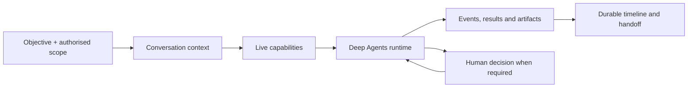

# Munin system guide

Munin keeps an authorised operation coherent from question to evidence-backed
handoff. It is not a chat UI over security scripts: it combines a durable agent
thread, live capability selection, evidence-aware state and a human execution
boundary.

## The operating model

One **conversation** is the durable workspace. Each message can start a
**run**. The conversation's **thread** is the stable LangGraph identity used
for checkpoints. The **timeline** is the replayable record of assistant text,
provider-emitted reasoning, activity, tools, artifacts, delegations and human
decisions.

## What a good request contains

Frame a task with:

1. an objective;
2. the written authorised scope and exclusions;
3. the evidence or artifact you want back; and
4. limits such as allowed methods, credentials, time or impact.

For example: “Within the authorised lab range, inventory HTTP service versions
and status codes; do not authenticate or modify state.” This lets the runtime
choose the smallest relevant capability and lets the operator judge every next
step against a known boundary.

## During a run

The runtime loads the stable thread, relevant facts and artifacts, checkpoint
state and the active capability registry. It may answer from evidence, retrieve
passive research, invoke a permitted tool, delegate a narrow objective or pause
for a human decision.

Follow the timeline rather than only the final prose. It separates what was
observed, what a tool returned, what the provider explicitly emitted and what
the agent inferred. A tool card with no terminal result is unfinished work, not
evidence of success.

If a browser is disconnected, reopen the conversation. The server replays the
existing run events and follows the live run when it is still active. Do not
submit the same objective again merely to restore the view.

## Capabilities and specialists

The exact tool surface is derived from the live registry. Native tools are the
foundation. Generated `gen__*` capabilities and specialist profiles extend the
surface only after their contracts, registration and policy state have been
checked.

A specialist gets a bounded objective and the minimum capability set needed to
complete it. Delegation does not expand the authorised target set or turn a
specialist into an independent control plane.

### Self-extension

When a repeatable, real gap exists, Munin can propose a focused tool or subgraph.
The intended sequence is:

1. describe the missing, repeatable capability;
2. define a small input/output contract and allowed tools;
3. validate and sandbox the generated artifact;
4. register and inspect it; and
5. invoke it only through the normal policy and approval path.

Creating source code, a graph description or a `SKILL.md` file is not the same
as creating an enabled capability.

## Hugin and skills

Hugin is a passive knowledge and evidence source. Its graph relationships,
ranked retrieval and source-linked skill material can improve an investigation
plan or research hypothesis. They cannot establish target-specific facts, grant
authorisation, or cause a tool to run.

The Hugin-oriented skill material is used selectively: retrieve a small,
provenance-labelled subset for the active subtask, inspect it in a controlled
reader and keep its source identifiers with the resulting notes. The Hugin
Librarian profile is intended for that narrow research role. It is not an
executor and does not bypass scope or HITL.

## Approval boundaries

Use HITL whenever scope, credentials, impact, target interpretation, material
capability changes or publication are ambiguous. A human request records the
exact action and pauses execution at a graph interrupt. Approval resumes that
same action; rejection ends it. An approval is not a reusable session-wide
permit.

## Long-running work

LangGraph checkpoints let a recoverable run continue with its original thread.
Context compaction keeps long conversations usable for the model. The timeline
and artifact records remain durable so an operator can still inspect the source
of a conclusion.

On a process failure, an expired running lease can be recovered. A
`waiting_for_human` run remains paused until an authorised person decides. See
the [persistence guide](architecture-persistence.md) for the storage
requirements.

## Closing an operation

A useful handoff distinguishes:

- observed facts and their evidence references;
- provider or tool output from operator conclusions;
- inferences and their confidence;
- unresolved gaps or blockers;
- the approval that enabled any sensitive step; and
- one safe next action, if one exists.

That separation makes a run useful to the next operator without granting them
permission to repeat it in a different environment.
