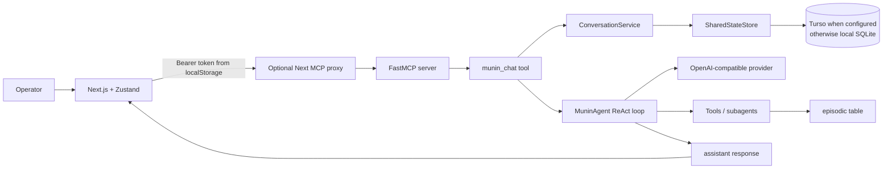
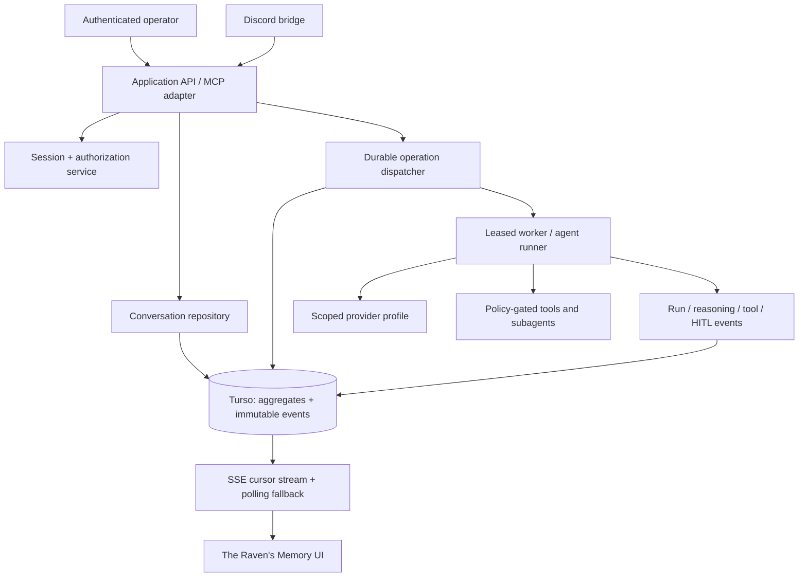
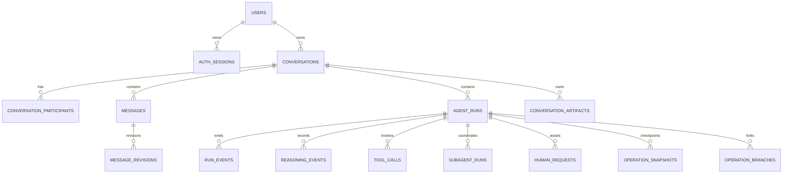

# Munin Production Suite — Initial Audit and Target Architecture

> Status: pre-refactor baseline. This document records the observed implementation
> and the migration contract for the Production Suite. It is deliberately specific
> about what is currently durable and what is not.

## Evidence and scope

The audit covered the Python MCP runtime, `SharedStateStore`, conversation
service, ReAct loop, job manager, subagent runner, Hugin/RAG, Discord bridge,
provider configuration, extension forge, browser MCP proxy, Zustand store,
React views, assets, workflows, test suite, Docker configuration, and the
existing persistence/operator documentation. The tracked branch baseline is
`origin/main` at `501ea9e`.

The workspace also contains untracked `munin.zip`, `site/`, and two BYOK files.
They predate this workstream and are deliberately excluded from this PR.

### Reproduced baseline behaviour

`python -m pytest -q` reaches 100% of collected tests but did not exit before
the 60-second command budget. This is recorded as a lifecycle/cleanup failure:
the in-process `ThreadPoolExecutor` in `munin.mcp.jobs.JobManager` has no
shutdown lifecycle. The implementation stores jobs only in its process-local
`records` dictionary, so a runner restart necessarily loses every active and
completed job record.

### Current request path

## Observed architecture

### What is durable today

- `SharedStateStore` can address Turso/libSQL directly when `MUNIN_DB_URL` is
  `libsql://...`; public conversation tools reject non-Turso backends.
- `conversations`, `conversation_messages`, and `conversation_artifacts` hold
  a minimal transcript, rolling summary, and fenced-code artifacts.
- Shared intel, episodic memory, semantic key/value memory, generated graph
  specifications, procedural tools, wake queue, agent presence, and active
  task leases are stored through the same state abstraction.
- The wake queue and active-task ownership use useful optimistic/CAS-style
  operations; they are not a durable operation/run model.
- The browser can list and load old conversation messages from the server.

### What exists only in a browser or runner

| State | Current location | Result on reload/restart |
| --- | --- | --- |
| MCP URL and static bearer token | Browser `localStorage` | Token is exposed to browser storage; no user session exists. |
| Active conversation selection | Zustand memory only | `loadConversations` chooses the newest record, not the last active conversation. |
| Optimistic user/assistant placeholders | Zustand memory only | Disappear on reload before the final response persists. |
| `JobManager.records`, futures, progress and cancellation | Python process memory | Lost on runner restart; `job_status` returns not found. |
| ReAct iteration/LLM/tool stream | Call stack plus final response metadata | No ordered run/event stream to rehydrate. |
| Discord conversation identity | None | The bridge calls `MuninAgent.respond` directly, creating no shared conversation/run. |
| Browser polling state | React/Zustand memory | No resume cursor or durable event watermark. |

### Why chats and active replies disappear

1. `sendChatMessage` appends browser-only user and assistant records first.
2. `runMuninChatJob` asks `munin_chat` to submit a job. `JobManager` creates a
   random in-memory job id and stores the only mutable state in `records`.
3. `munin_chat` persists the user message in `prepare_turn`, but it does not
   atomically create an `agent_run` and assistant placeholder with it.
4. Only after the in-memory worker returns does `complete_turn` append a new
   assistant message. A reload, navigation, process death, duplicate click, or
   transport ambiguity during that interval has no durable placeholder or run
   to recover.
5. `job_status` can reconstruct nothing after restart; the UI shows a blank
   local placeholder or chooses a different recent conversation.

### Why Turso cannot recover complete conversations

Turso is being used as a generic SQLite endpoint, not as the source of truth
for an operation aggregate. The schema has no users, participants, ownership,
session identity, message revision, run, event, tool-call, reasoning,
subagent, HITL, snapshot, branch, idempotency, or soft-delete tables. Tool
calls are embedded only in assistant-message JSON metadata. The conversation
read endpoint caps messages, has no cursor, no search, no filtering, no
authorization, and no consistent snapshot across related reads.

`ConversationService._refresh_summary` is deterministic string truncation; it
does not record provenance, source ranges, model, confidence, entities,
findings, decisions, or open tasks. It cannot support trusted context
selection or audit/replay.

### Consistency and recovery risks

- No transaction spans user message, run, assistant placeholder, and
  idempotency key; retries can create two logical turns.
- Assistant results are append-only new messages, rather than an update to the
  run-associated placeholder. Old workers can therefore overwrite operator
  expectations with late final messages.
- `conversation_get` issues related queries without a stable aggregate version.
- No runner lease/heartbeat is connected to chat jobs. A dead runner leaves no
  persisted status transition to `interrupted`.
- `JobManager` and UI tool calls use different state machines (`succeeded`
  versus the requested operation states) and neither is event sourced.
- The frontend uses polling only while the mounted component retains the job
  id; it has no event cursor, SSE resubscribe, deduplication, or restart claim.
- `agent_wake_queue` and `active_tasks` solve parts of subagent coordination,
  but are disconnected from a parent conversation and operation run.

### Authentication and secret risks

FastMCP protects HTTP using a single shared Bearer token. The frontend stores
that token in `localStorage` and can forward it directly through the proxy.
There is no login, user, role, server-side conversation authorization, session
rotation/revocation, CSRF protection, rate limit, or security-header policy.
The existing provider-profile table uses symmetric encryption helpers but has
no owner/scope/profile-use model, envelope key version, rotation lifecycle, or
authorization boundary. Browser-side configuration remains a privileged path.

### Product and UX gap

The current GUI is a responsive MCP workbench with a chat pane, tool explorer,
memory, soul, and agent panels. It has no login, briefing, command center,
operation model, durable reasoning stream, HITL inbox, graph, replay, agent
hierarchy, provider administration, or accessible mobile inspector. The
visible `thinking…` is a local spinner—not provider reasoning nor a persisted
operational summary.

## Production target

Turso is the authoritative transactional store for every operator-facing
conversation and operation. Browser cache is acceleration only. MCP, GUI, and
Discord call the same application services with an authenticated actor and an
explicit conversation/run id.

### Required aggregate boundaries

### Turn protocol

For a client-supplied idempotency key, one database transaction creates (or
returns) the conversation, persists the user message, creates the run, creates
the assistant placeholder, and records the initial immutable event. The
transaction returns only after commit. A dispatcher then claims the queued run
with a lease and emits ordered events. Final output updates the same
placeholder by optimistic version; all attempts remain visible. A recovery
worker marks expired leases as `interrupted` and permits an explicit retry that
creates a linked new attempt.

### Security contract

- Bootstrap exactly one admin from a one-time server secret; subsequent
  identities use Argon2id hashes, opaque random session tokens hashed in Turso,
  short idle and absolute expiries, rotation, revocation, HttpOnly/Secure/
  SameSite cookies, CSRF origin/token checks, rate limits, CSP, and audit logs.
- Authorization is evaluated server-side for conversation, agent, tool,
  provider profile, scope, and action. UI controls reflect policy but never
  replace it.
- Provider credentials use versioned envelope encryption. Turso stores only
  ciphertext/fingerprint; the browser and logs never receive plaintext.
- Every stored user, tool, provider, artifact, and reasoning payload passes
  secret redaction before write and render. Native provider reasoning is labeled
  as such; operational summaries are labeled distinctly and are never presented
  as hidden chain-of-thought.

### Delivery phases

1. Characterization tests, versioned migrations, repositories, and event APIs.
2. Auth and server-side application surface.
3. Durable turn/run/reasoning protocol, leases, recovery, rehydration, and
   E2E cleanup isolation.
4. BYOK, context compaction, memory provenance, agent profiles, long-running
   operations, and HITL.
5. Hugin/Strix retrieval, governed Page Agent, extension framework, and the
   Flight Deck redesign.
6. Raven Replay, observability, action hardening, documentation, and release
   validation.

No raw events are deleted by compaction. Replays consume immutable redacted
events and default to recorded outputs; forks require a sandbox or explicit
human authorization before real-world actions.
