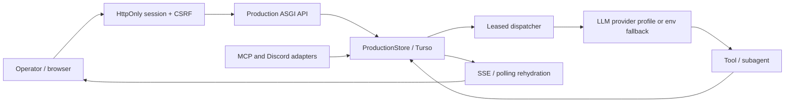
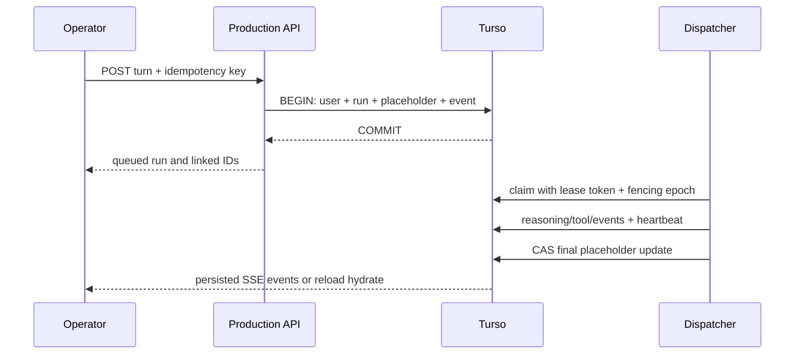
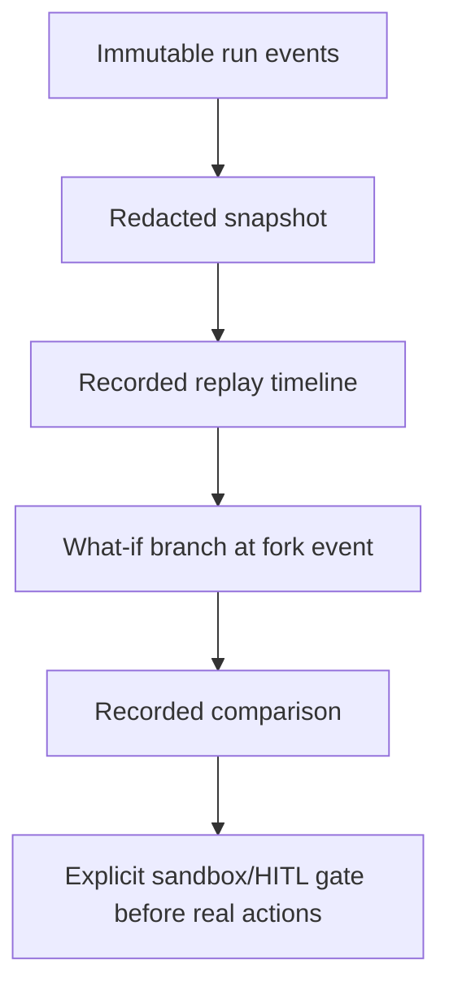

# Munin Production Suite operations guide

## What changed

The legacy user path was a browser-held MCP bearer, process-local job map, and
three small persistence tables. A reload could select the newest conversation
but could not recover an in-memory job. The production path has a separate,
session-authenticated API and a Turso-authoritative aggregate. MCP and Discord
remain adapters; they must create the same conversations, runs, events and
artifacts through `ProductionStore`, rather than becoming alternate sources of
truth.

## Durable turn protocol

`create_turn` uses one explicit `BEGIN IMMEDIATE` transaction. It writes the
redacted user message, creates the run, creates the assistant placeholder,
writes `run.queued`, then commits before a dispatcher claims work. Its unique
constraint is `(conversation_id, actor_id, idempotency_key)` and its request
hash rejects accidental key reuse with different content.

Leases are heartbeated and carry a fencing epoch/token. Expired work becomes
`interrupted`, never indefinitely `running`; retry makes a new attempt with a
parent run, while retaining all events of the original attempt. Cancellation
also fences an active worker before it can publish a late completion.

## Security boundary

- Passwords use Argon2id. Session and CSRF tokens are random opaque values;
  only SHA-256 hashes are stored. Cookies are `HttpOnly`, `Secure` by default,
  and `SameSite=Strict`.
- Unsafe API requests require a configured same-origin `Origin`,
  `Sec-Fetch-Site`, and `X-CSRF-Token`. Login has persistent backoff/rate
  limiting. Password recovery stores a one-use hash and has no token-returning
  browser API; a deployment connects it to an approved delivery adapter.
- Provider keys use AES-GCM envelope encryption: a random DEK encrypts the key,
  a master KEK wraps that DEK, and owner/profile/provider form AAD. The browser
  receives only label, status and fingerprint.
- Redaction is applied before events, reasoning, tools, exports and artifacts
  are persisted or rendered. Native provider reasoning is recorded only when a
  provider returns it and persistence is enabled. Operational summaries are
  clearly labelled; Munin never manufactures provider chain-of-thought.

## Memory, agents and governance

Raw messages/events are retained. Summaries include source IDs/range/hash,
model/prompt version, confidence, entities, findings, decisions and open tasks.
Context selection scores recency, relevance, importance and scope under a token
budget. The declarative roster defines Recon, Web, AD/LDAP, Cloud, SAST,
validation, automation, forge, graph, Hugin, reporting and OPSEC profiles.

HITL is a durable request with redacted evidence/scope, expiry and one-use
nonce. Shadow Council votes can advise a coordinator but cannot grant scope or
consume a HITL decision.

## Raven Replay

Recorded replay disables tool egress. A branch persists parent run, fork event,
mode and redacted hypothesis. It is a draft until a future sandbox and explicit
approval evaluate it; no replay can silently perform a destructive action.

## Hugin, Strix, Page Agent, extensions

Strix synchronization is metadata-first and demands a pinned commit plus an
explicit accepted license. Retrieval is capped at five skills. External content
is untrusted data, never a system instruction.

Page Agent is disabled unless `MUNIN_PAGE_AGENT_ENABLED=1`. Its authenticated
backend validates typed allowlisted UI actions; mutable-form preparation still
requires confirmation and every plan is audited. It does not give page content
authority over permissions or privileged endpoints.

Frontend widgets use typed slots and feature flags. They lazy-load in isolated
extension paths and can read permitted data or propose a diff, but cannot obtain
credentials, mutate production, or alter authentication.

## Deployment prerequisites

1. Set `MUNIN_DB_URL` to a dedicated `libsql://`/`libsqls://` Turso database
   and `MUNIN_DB_AUTH_TOKEN`; the production API refuses `file:` storage.
2. Put a 32-byte `MUNIN_MASTER_KEY` in the deployment secret manager, never an
   image, browser variable, log, or PR.
3. Set the exact `MUNIN_ALLOWED_ORIGINS`, enable secure cookies, and keep the
   API private behind the Next.js same-origin proxy.
4. Run `munin production-api --host 127.0.0.1 --port 8787`; configure the
   server-only `MUNIN_PRODUCTION_API_URL` for the frontend.
5. Set up an approved password-recovery delivery adapter before enabling the
   public recovery request UI.

The Docker Compose `munin-production-api` runtime service fails fast when the
required origin/master-key values are absent. It does not persist SQLite files
inside the repository.
