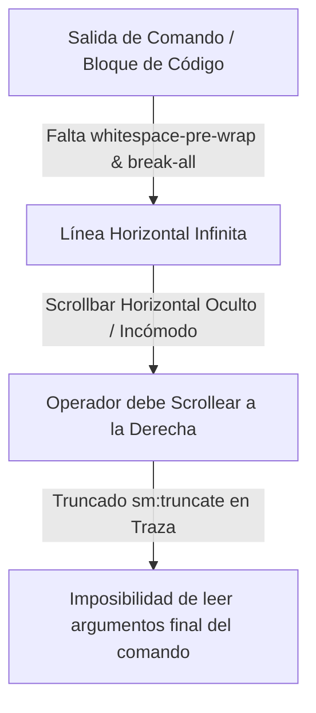

# Reporte de Ergonomía UX / UI y Diseño de Interfaz: Munin Web GUI

Este informe presenta el diagnóstico técnico y de usabilidad enfocado en la experiencia del operador, evaluando la visualización de **terminales, comandos largos, salidas de herramientas y responsive del layout** en `app/src/components/`.

---

## 1. Problema Principal: Comandos Largos Desbordados Hacia la Derecha (Sin Text Wrap)

### Diagnóstico Técnico por Componentes

1. **Bloques de Código en Markdown (`app/src/components/Markdown.tsx` — Líneas 91-97)**:
   - **Causa Raíz**: El elemento `<pre>` utiliza `white-space: pre` por defecto sin la clase `whitespace-pre-wrap` ni reglas de ruptura de palabras (`break-all` o `[overflow-wrap:anywhere]`).
   - **Efecto**: Comandos largos (ej. `nmap -sV -sC -p- 10.10.10.x...`, `curl` con múltiples headers o tokens Base64) se extienden en una **línea horizontal infinita hacia la derecha**, obligando al operador a hacer scroll horizontal permanente dentro de cada bloque de código.
2. **Salida de JSON de Herramientas (`ToolInvocationPart.tsx` — Líneas 76-80)**:
   - **Causa Raíz**: `<pre className="mt-1 max-h-72 overflow-auto ...">` carece de `whitespace-pre-wrap`. Las rutas largas de archivos y payloads JSON se desbordan del margen derecho de la tarjeta.
3. **Salidas de Terminal (`CommandOutputPart.tsx` — Líneas 53-58)**:
   - **Causa Raíz**: Utiliza `break-words` (`overflow-wrap: break-word`). En CSS, `break-words` **sólo rompe texto en espacios**.
   - **Efecto**: Tokens contiguos largos de ciberseguridad (hashes SHA256, Base64, URLs codificadas, flags `--param=valor_largo`) no se rompen con `break-words`, forzando barras de desplazamiento horizontal. Se requiere `break-all` o `[overflow-wrap:anywhere]`.

---

## 2. Recorte de Comandos y Cajas de Desplazamiento Restringidas

1. **Truncado Prematuro en Trazas Operacionales (`OperationalTracePart.tsx` — Línea 23)**:
   - La traza operacional aplica `sm:truncate` a partir de pantallas de escritorio (`sm:`).
   - **Impacto**: En pantallas de escritorio donde el operador supervisa las herramientas en tiempo real, **los comandos largos y rutas de archivo se cortan silenciosamente con puntos suspensivos (...)**, impidiendo ver qué comando está ejecutando el agente.
2. **Cajas de Desplazamiento Asfixiantes (192px / 288px)**:
   - `CommandOutputPart.tsx` limita la altura con `max-h-48` (192px) y `ToolInvocationPart.tsx` con `max-h-72` (288px).
   - **Impacto**: Las salidas de terminal (`nmap`, `gobuster`, lecturas de archivos) quedan atrapadas en cuadros diminutos de 192px, obligando al operador a un scroll vertical constante dentro de visores restringidos.

---

## 3. Ausencia de Botones de Copiar, Expandir y Maximizar

1. **Cero Botones de "Copiar al Portapapeles" (Copy to Clipboard)**:
   - Ni `CommandOutputPart.tsx`, ni `ToolInvocationPart.tsx`, ni los bloques de código preformateados en `Markdown.tsx` cuentan con un botón de **Copiar**.
   - **Impacto**: El operador debe seleccionar texto manualmente con el mouse dentro de recuadros con scroll horizontal y vertical simultáneo, arriesgando selecciones incompletas de hashes o comandos.
2. **Sin Botón para Expandir o Pantalla Completa**:
   - Ninguna salida de comando ofrece un control para expandir a modal o pantalla completa, obligando a inspeccionar logs extensos en cajas fijas de 192px.

---

## 4. Colapso de Layout y Comportamiento Responsive

1. **Bloqueo Total en Pantallas < 1024px (Móviles / Ventana Dividida)**:
   - `ConversationSidebar.tsx` utiliza `hidden lg:flex` y desaparece en pantallas `< 1024px`.
   - **Defecto**: **No existe ningún botón de menú hamburguesa ni drawer** en el header para alternar la barra lateral en pantallas pequeñas. El usuario queda 100% imposibilitado de cambiar de chat o cerrar sesión si la ventana se encoge.
2. **Conflicto de Tooltip en el Título de la Consola (`AgentConsole.tsx` — Líneas 750-756)**:
   - El botón del título tiene `title="Rename conversation"`. Cuando un título largo se trunca con `...`, al pasar el mouse aparece el texto *"Rename conversation"* en lugar de mostrar el título completo de la conversación.

---

## 5. Matriz de Soluciones Recomendadas para UX / UI

| Componente | Ajuste CSS / React Recomendado | Resultado de Usabilidad |
| :--- | :--- | :--- |
| **`Markdown.tsx`** | Reemplazar `overflow-x-auto` por `whitespace-pre-wrap break-all [overflow-wrap:anywhere]` en `<pre>`. | El comando se ajusta automáticamente al ancho de pantalla sin scrollbar horizontal. |
| **`ToolInvocationPart.tsx`** | Agregar `whitespace-pre-wrap break-all` al subcomponente `JsonBlock`. | Los JSONs y argumentos de herramientas se leen completos verticalmente. |
| **`CommandOutputPart.tsx`** | Cambiar `break-words` por `break-all` y agregar botón de **Copy** y **Fullscreen/Expand**. | Lectura cómoda de terminal y copiado en un clic. |
| **`OperationalTracePart.tsx`** | Remover `sm:truncate` o envolver en `<Tooltip>` con el comando completo. | Visibilidad 100% de la herramienta que ejecuta el agente. |
| **`AppShell.tsx` & `AgentConsole.tsx`** | Agregar botón de menú hamburguesa y Drawer lateral para pantallas `< 1024px`. | Interfaz 100% utilizable en móviles, tablets y ventanas divididas. |
